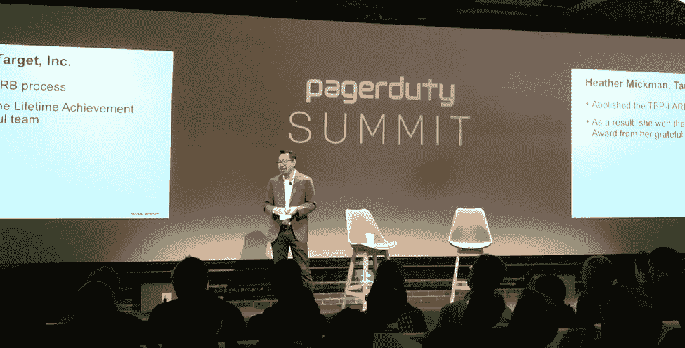

# 数字化转型是 2016 年 PagerDuty 峰会的重中之重

> 原文：<https://devops.com/digital-transformation-top-mind-pagerduty-summit-2016/>

数字化转型可能看起来像是当前的企业技术流行语，但在首届 PagerDuty 峰会上，它完全变成了现实。首席执行官、行业领袖、开发人员和 IT 运营人员齐聚一堂，讨论公司为何以及如何以成熟和卓越的运营方式驾驭我们的数字世界。

PagerDuty 峰会被描述为一个拥挤的日子，挤满了令人印象深刻的演讲者、小组成员和行业领袖，包括作家、研究员和 it 革命创始人 Gene Kim 梅纳德·韦伯，雅虎董事会主席！；以及来自谷歌、IBM、Airbnb、网飞、Splunk 等公司的高管和 ITOps。

## 数字依赖性

PagerDuty 的首席执行官詹妮弗·特哈达在会议开始时做了开场发言，指出数字不再仅仅是一种便利，而是一种依赖。根据观众的一系列推文，她关于向消费者提供数字体验的重要性以及 DevOps 如何融入更大图景的信息引起了高管、风投、IT 经理和工程师等观众的共鸣。特哈达指出，在一个赌注比以往任何时候都高的世界里，微时刻的重要性是多么重要，如果应用程序或服务宕机，最终用户的体验会受到多大影响。

## 把关键的 DevOps 部分做好

不久后，Gene Kim 上台分享了他在数字化转型方面的五大 DevOps 惊喜和收获，并发表了他 17 年来研究高绩效技术组织的重要见解。当他注意到 DevOps 的商业价值比想象的更高时，他正在向唱诗班布道，所有人都同意他为度量代码部署交付时间的重要性提供了一个令人信服的案例。Kim 清单上的第五个惊喜是 DevOps 不只是为独角兽设计的；也是为了马。DevOps 为各行各业的公司，无论是传统企业还是敏捷创业公司，提供动态的学习型组织，以及同样重要的数字化转型本身。

 Twitter 活动清楚地表明，与会者特别高兴收到了金的新书《[《devo PS 手册》](https://www.amazon.com/DevOps-Handbook-World-Class-Reliability-Organizations/dp/1942788002)》的预发本，这本书的制作历时五年。

## 突出显示新功能

没有新功能的发布，任何活动都是不完整的。当 PagerDuty 上台演示并分享有关新平台功能的详细信息以使事件管理和响应比以往任何时候都更好时，有一些积极的报道，包括:

*   **工作流扩展:**基于超过 175 个原生集成的 PagerDuty 生态系统，组织现在可以在 PagerDuty 和其他第三方服务之间配置操作工作流。这种双向信息流有助于跨团队和服务提供一致的信息，从而更快地解决事件。
*   **实时呼叫路由:**该功能允许组织内的任何人只需拨打一个号码就可以直接联系到运营团队报告问题。呼叫通过相同的随叫随到计划和升级策略进行路由，并且实时报告事件的能力有助于更快地恢复服务。
*   **响应说明:**此功能可确保所有与事件相关的上下文和人为生成的数据都被捕获并打上时间戳，从而为所采取的行动和所涉及的人员创建一个清晰的时间表。Response Notes 提供了事件当前状态的清晰可见性和事后分析的历史记录，从而减少了未来的解决时间。

## 结束 2016 年 PagerDuty 峰会

从与 Maynard Webb 讨论云战争、容器和他对未来五年行业走向的看法的炉边谈话，到关于所有 ITOps 事物的鼓舞人心的分组会议，第一次 PagerDuty 峰会从各方面来看都是信息丰富和深刻的。与会者表示，它讲述了 DevOps 和卓越运营如何构成成功的数字计划和转型的支柱，并且所有与会者都提出了适应不断发展的数字环境的战略、最佳实践和使用案例。

要更深入地了解 2016 年寻呼机工作峰会，请访问博客:[https://www.pagerduty.com/blog/pdsummit16-event-recap/](https://www.pagerduty.com/blog/pdsummit16-event-recap/)。

Joe Franscella 是 DevOps.com 的定期撰稿人，也是 Bhava Communications 的全职员工。PagerDuty 是 Bhava Communications 的客户，但 Joe Franscella 并不在该公司的账户上工作。

— [乔·弗兰切拉](https://devops.com/author/joef/)