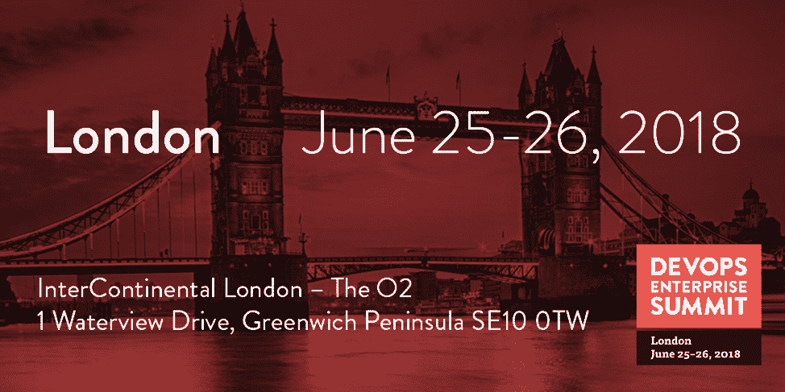

# 伦敦 2018:激动人心的时刻正在到来

> 原文：<https://devops.com/does-london-2018-the-excitement-is-building/>

伦敦 2018 年奥运会即将来临。你准备好了吗？

天哪！我们距离 2018 年伦敦 devo PS 企业峰会只有几周时间，我无法形容我对我们在欧洲的第三次活动有多兴奋。我从来没有像在 DevOps Enterprise 的日子里那样在短时间内学到这么多东西。这是我所见过的一些最勇敢和最激动人心的变革故事发生的地方，今年的会议也不会有什么不同！

如此多的 [主持人](https://events.itrevolution.com/eur/speakers/) 和相关组织正在开创将在 10 年内成为商业惯例的做法。除了为期两天展示大型复杂组织的领导者的精彩经验报告(分享他们的所作所为、所学及其成果)之外，我们还将继续记录几个企业和领导者年复一年的转型历程。我希望你能在伦敦加入我们的下一章！如果你还没有注册，请使用下面的“基因之友”代码！

**代码为“FOG20”的 DOES18 伦敦注册可享受八折优惠**

[伦敦:2018 年 6 月 25 日至 26 日](https://events.itrevolution.com/eur/register/)

为了培养高水平的、令人兴奋的交流机会，并创建一个与世界上一些最佳实践者和主题专家交流见解的论坛，我们制定了一系列目标，我认为这些目标有望使今年的伦敦 DevOps 企业峰会成为迄今为止最好的会议。

**编程目标:**

*   获得出色的体验报告，并重复体验报告。
*   提升对下一代运营和基础设施的关注。
*   帮助与会者实现他们的目标。
*   提升对跨越业务/技术鸿沟的关注。
*   从我们需要的领域获得最好的主题专家。

## **下一代运营和基础设施**

华特·迪士尼公司的系统工程总监 Jason Cox 是 DevOps 企业峰会编程委员会的成员，自从 2013 年认识他以来，我一直依赖他的建议。我还在《DevOps 手册》 中大量引用了他的话

自第一届 DevOps 企业峰会以来的四年中，Jason 一直告诉我，“这是一次很棒的会议，但它对于开发人员来说比对于运营人员来说更好。”我每年都向他承诺，我们会做得更好，选择更好的 Ops 会谈，最后我邀请他加入会议 [编程委员会](https://events.itrevolution.com/eur/about/) 。

今年，我们将 [议程](https://events.itrevolution.com/eur/schedule/) 的近四分之一专门用于讨论“下一代运营和基础设施实践”，专门针对运营领导层，并成立了一个独立的小组委员会，专注于多年路线图，以正确定义问题空间，并寻求会谈来帮助定义解决方案的方向。

当我们回顾今年在伦敦举行的 DevOps 企业峰会的精彩演讲时，Jason 和我都对所展示的运营观点感到惊讶和非常满意，这与往年完全不同。Jason 最好地描述了这一重点的原因，他说:

> “今年的会议计划将帮助 Ops 领导人朝着我们的发展伙伴也在努力实现的目标而努力。这些讲座应该会引起运营领导层几乎所有人的强烈共鸣，帮助他们不仅参与开发运维之旅，而且成为其中的积极领导者。”

在许多情况下，这些问题是 DevOps 转型“全程”的障碍，最终可能是高绩效者和一般绩效者或低绩效组织之间的差异。这些会议包括来自以下机构的经验报告和专家讲座:

**杰森·考克斯**，*华特·迪士尼公司系统工程总监*

**杰弗里·斯诺弗**，*微软技术研究员*

**科妮莉亚·戴维斯**，*高级技术总监，举足轻重*

**达蒙·爱德华兹**，*联合创始人，Rundeck*

**抢英**和**樱桃 Vu** *，蓝绿色独角兽*

**杰恩·格罗**，*devo PS 研究所首席执行官*

**尼克漏斗**， *GTIS 首席技术官巴克莱发展实践主管*

**汤姆·克拉克**，*iTV 公共平台负责人*

**约翰·Rzeszotarski**， *SVP，持续交付与反馈总监，KeyBank*

**Shaun Norris** ，渣打银行*云基础设施服务部全球总监*

## **跨越科技与商业的鸿沟** 

技术领导者在大型复杂组织中面临的障碍越来越多地出现在技术价值流之外。今年，我对我们如何能够指出这些障碍感到非常兴奋。这不仅仅是开发人员对运营人员的问题。它还将探索技术价值流如何与项目管理、融资模式、信息安全、产品所有者和产品经理等相关联。简而言之，我们在伦敦有一些关于“跨越商业和技术鸿沟”的精彩演讲和专家

我们通过让技术领导者与他们的业务合作者共同出席来做到这一点。而且，我们要让全心全意的代言对话在舞台上展开给大家看。

我的朋友兼编程委员会成员达蒙·爱德华兹指出，没有什么东西是孤立存在的。当你从更大的角度看一个企业时，自动化等东西会有所帮助，但移动这些小东西与组织的成功没有多大关系。更重要的是组织如何构建，人们如何受到激励，他们如何看待自己的工作，以及他们如何与周围真正决定成败的系统互动。你会注意到这些都是业务功能，而不是技术功能。

因此，我们举行了多次会谈来展示这些模式，并让业务方利益相关者参与进来，讲述业务方如何从根本上理解并推动转型之旅。这是我非常兴奋的三个演示，您可以通过 **[这里> > >](https://youtu.be/CzQFl0qr9Xk?t=23m55s)** 了解更多信息。

**威瑞森企业
约翰·斯科特，IT 经理；奥利弗·康托，产品战略副总监；EMEA 首席信息官 Sanjeev Jain**

**耐克 EMEA** 兰迪里昂，EMEA 耐克数字工程高级总监；EMEA 耐克直销首席财务官 Michele Power

**Capital One** 高级工程高级经理 Aimee Bechtle 约翰·施密特，产品管理总监

## **创建联系社区** 

对于 DevOps 企业峰会的组织者来说，帮助与会者取得更好的成果是非常重要的，我们正试图通过解决与会者的三个常见现象来实现这一目标:

1.  “天鹅绒绳子”问题，有一个人或一群人，你真的很想和他们说话，但由于这样或那样的原因，你无法接近他们。或者更糟的是，你必须决定是排队等候与某人交谈，还是完全错过，前往你日程上的下一个会议。
2.  其他情况下，你周围都是人，但不知道你应该和谁说话。如果你和我一样，在过去我决定最好的利用我的时间去做其他事情，比如检查我的电子邮件，而不是和我的同事互动。回想起来，这可能是我做过的最愚蠢的事情。
3.  每个人都要去吃午饭，他们按餐馆名称组织，但你真正想知道的是讨论的主题是什么。

与 Jeff Gallimore 一起，我们致力于建立不同的方法，为人们创造机会，尽可能多地提问和回答问题。毕竟，观众的质量是我们认为 DevOps 企业峰会区别于其他活动的一个方面！因此，我们在现场培养的自发对话和互动越多，对每个人都越好。那么，我们如何努力做到这一点呢？读下面你也可以听杰夫讲一下 **[这里> > >](https://youtu.be/CzQFl0qr9Xk?t=10m25s)** 。

*   **宽松的工作空间！**在 DevOps 企业峰会上，我们将拥有自己的 Slack 工作空间！有史以来第一次，每个与会者都有机会加入共享工作区，与演讲者、与会者和赞助商互动。甚至会有一个新工作机会的“谁在招聘”频道。更重要的是，这个频道甚至会在大会结束后开放，以便我们在 6 月 26 日之后继续与人对话和互动。
*   **问演讲者！**我们正在为与会者创造机会，让他们有专门的时间和地点向全体会议发言人提问，以深入了解他们当天上午早些时候介绍的信息。我们将为每一位与会者开放一个 Slack 频道，直接向演讲者和其他与会者提交问题。在“向演讲者提问”环节中，我们将使用这个存储库来突出最受欢迎的问题，并为与会者提供直接与演讲者交流的不同方式。
*   **精益咖啡会议！**我们希望帮助与会者以另一种半结构化的形式与他们的同行交流和学习。在会议的两天里，我们将举办由多米尼克·德格兰迪斯主持的精益咖啡会议。这将由 10 张足够大的桌子组成，10 个人可以在桌子上谈论与主题相关的相似兴趣。希望，这提供了另一个机会来学习很多东西，并建立一些有价值的新联系。
*   午餐时间到了！与会者还可以选择几种不同的午餐:
    *   与演讲者共进午餐将是先到先得的原则。这将让你有机会与演讲者面对面坐下来，在一个更加个人化的环境中更深入地探讨他们演讲的主题和经历。
    *   与其他与会者在自助餐台周围的高桌共进午餐，那里有带种子问题的笔记卡，可以开始讨论。
*   **行业党！**签名售书、赞助商赠品、食物和饮料，以及与其他与会者和演讲者继续对话的绝佳机会。这是一些最有趣的对话发生的地方，去年我在那里听到了一些令人惊奇的故事。

## **领导人谈论他们旅程的延续**

另一件让我非常高兴的事情是，编程人员不断地寻找我们在 DevOps 企业峰会上听到的令人惊叹的案例研究。捷豹路虎的克里斯·希尔就是这一事实的证明，我们真的很期待他成为今年计划的一部分。我们在最近的一次 YouTube 直播中采访了克里斯，他在这里为我们预览了他的一些演讲**[>>>](https://youtu.be/CzQFl0qr9Xk?t=27m2s)**。

> “DevOps 企业峰会对我来说是一件非常重要的事情，因为我参加了 2016 年在旧金山举行的第一次活动，在那里我带着我转变组织所需的书籍和动力离开了会议。就我们如何开始我们的 DevOps 转型而言，这实际上是会议的有机组成部分。”—克里斯·希尔，捷豹路虎

我们今年有一些优秀的重复演讲者谈论他们的旅程的继续，包括 Topo Pal，Capital One 的技术研究员；Hiscox 首席技术官乔纳森·弗莱彻(Jonathan Fletcher)；CSG 首席技术官 Scott Prugh 旁边是 CSG 的执行董事埃里卡·莫里森；巴克莱工作方式主管乔纳森·斯马特。

我们还有多位博士来介绍我们需要帮助我们实现目标的领域专业知识的主题专家讲座。以下是我们在今年的 DevOps 企业峰会上获得的专业知识:

*   俄亥俄州立大学的科学家理查德·库克将在今年发表演讲，他可能是过去十年中对约翰·奥斯鲍的思想影响最大的人。我迫不及待地想听他强调一种新的运营思维方式的演讲。
*   我有幸与 DevOps Research and Assessment 的首席执行官 Nicole Forsgren 合作多年，共同完成了 Puppet 的“DevOps 状态”报告，现在与 Google Cloud 合作。她将分享从这项研究中获得的最新知识和经验。
*   Tasktop 的首席执行官 Mik Kersten 将讲述他从项目融资模型到产品融资模型的工作。

如你所见，今年的大会有很多让我兴奋的事情！要观看 devo PS Enterprise Summit London 2018 的完整预览讨论并了解更多关于会议的信息，请观看我们与《DevOps.com》主编 Alan Shimel 的 YouTube 直播活动；Rundeck 联合创始人达蒙·爱德华兹；Jeff Gallimore，Excella 合伙人；捷豹路虎信息娱乐系统工程主管克里斯·希尔。

感谢阅读，期待在伦敦与大家见面！

## **参加 DevOps 企业峰会**

[伦敦:2018 年 6 月 25 日至 26 日](https://events.itrevolution.com/eur/)

— [吉恩·金](https://devops.com/author/realgenekim/)