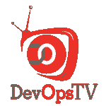

# 《旧金山 2016:阿德里安·科克罗夫特谈留住人才》

> 原文：<https://devops.com/does-san-francisco-2016-adrian-cockroft-on-retaining-talent/>

我们在 2016 年 DevOps 企业峰会上做的 50 多个视频采访中的另一个是我们与 Adrian Cockroft 的讨论。阿德里安是 DOES 今年最后的主持人之一，但这是一个足够好的理由坚持到最后。Adrian 的演讲是关于高科技组织留住人才的挑战。

[https://www.youtube.com/embed/hmWIL3VBAmw](https://www.youtube.com/embed/hmWIL3VBAmw)

在我们深入人才话题之前，Adrian 谈了一下他自己在网飞的经历，在那里他开创了我们今天在 DevOps 市场上看到的许多东西。在网飞毕业后，Adrian 加入了 Battery Ventures，在那里他有机会拜访了许多大型组织，了解他们的工作方式和面临的挑战。他能够利用这些信息来帮助指导他们应该投资哪些公司，以增加他们投资组合。在 Battery 工作了几年后，Adrian 最近加入了 AWS，他将再次作为云架构副总裁直接参与其中。

但正如我之前所说的，阿德里安的演讲(说实话，他只有一张幻灯片左右，更多的是他在发言)是关于缺乏足够合格的人来填补这一行列。这种压力导致成功的公司不得不“培养”他们现有的人才。但正如阿德里安指出的那样，正是这种让人才成长的行为也让他们继续前进。随着他们在该领域变得更加突出，他们更有可能被招聘走。那么如何留住人才呢？Adrian 告诉我们网飞为了留住他们的工程师所做的一些事情。当然，网飞的做法并不适用于许多传统组织。

显然，金钱补偿帮助很大。但(有时候)还有钱以外的东西。比如授予人们杰出工程师的头衔。

Adrian 还提到了凤凰项目中 Brent 的例子。如何通过给他一个不同的角色，你不仅消除了瓶颈，而且让他在新的角色中保持快乐。

像往常一样，倾听和向阿德里安学习是很棒的。他作为 DevOps 领域领军人物之一的声誉是实至名归的。享受谈话！

 你可以在我们的 YouTube 频道上看到我们在 DOES 2016 上做的 50 多个视频采访， [DevOpsTV](https://www.youtube.com/playlist?list=PLotLY1RC8HosMx1xRUorxeyLVx4ppSi8a) 。

— [Alan Shimel](https://devops.com/author/ashimmy/)