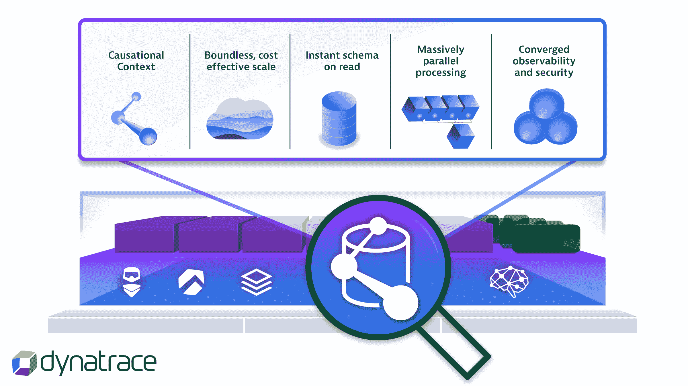

# Dynatrace 将 Grail 数据湖屋添加到可观测性平台

> 原文：<https://devops.com/dynatrace-adds-grail-data-lakehouse-to-observability-platform/>

Dynatrace 今天宣布，它已经在 Dynatrace 软件智能平台中添加了一个名为 [Grail](https://www.dynatrace.com/news/press-release/dynatrace-launches-grail/) 的数据湖库，以便更简单地汇总 it 团队收集的所有可观察性数据。

Dynatrace 产品营销副总裁鲍勃·瓦姆巴克表示，Grail 最初将推动日志数据的分析，但随着时间的推移，它也将应用于其他类型的应用开发、安全和商业智能数据。

他补充说，目标是在一个统一的[可观察性](https://devops.com/?s=observability)平台上简化数据索引和再水合等过程，从而消除维护多个不同存储库的需要。

Grail 的核心是一个基于大规模并行处理(MPP)分析引擎的因果数据仓库，最初将在亚马逊网络服务(AWS)云上提供。IT 团队可以使用 Dynatrace 查询语言(DQL)来查询存储在数据仓库中的数据。此外，已经嵌入 Dynatrace 软件智能平台的 Davis 人工智能(AI)引擎将能够对存储在 Grail 中的数据应用机器学习算法。

数据湖库是最近出现的一种方法，它使组织能够将数据仓库平台的结构应用于以前存储在数据湖中的大量数据。实际上，数据湖库结合了两种平台的属性，用于集中管理数据。任何实现可观测性的方法的最大问题之一是，最终存储的大量数据允许 DevOps 团队随着时间的推移跟踪问题。

当然，由每个 it 团队决定他们想要保存多少数据来推动分析，但是他们保存的数据越多，云存储成本自然也会增加。瓦姆巴克指出，Grail 提供了一种专门构建的方法来整合数据孤岛，从而降低可观测性的总成本。

一般来说，由于需要嵌入数据湖库功能，大多数可观测性平台将作为软件即服务(SaaS)应用程序使用。这意味着可能构建和维护自己的可观察性平台的 IT 团队数量将会受到限制。IT 团队现在还在努力管理日益复杂的 IT 环境，这些环境由使用微服务构建的云原生应用程序和传统整体应用程序组成。事实上，Dynatrace 委托对 1，303 名首席信息官和高级 IT 从业者进行的全球调查发现，71%的受访者认为云原生技术堆栈产生的数据爆炸超出了 IT 人员在没有人工智能平台帮助的情况下管理的能力。

目前还不清楚 It 团队会以多快的速度从旨在跟踪特定指标的传统监控工具迁移到可观察性平台，该平台承诺通过简化针对大规模数据池的查询启动来更容易地确定问题的根本原因。然而，随着组织越来越依赖软件，对任何类型的中断的容忍度都在稳步下降；现在的问题更多的是何时需要，而不是是否需要不同的管理方法。