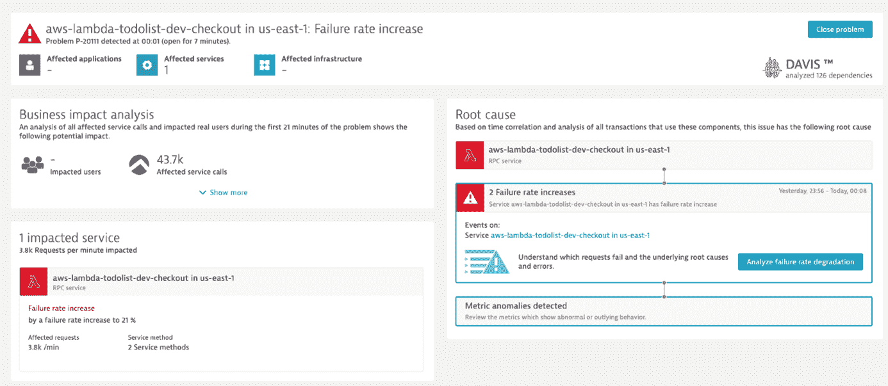

# Dynatrace 增加了观察能力

> 原文：<https://devops.com/dynatrace-adds-to-observability-capabilities/>

Dynatrace 今天宣布，通过推出其 [PurePath 4](https://www.businesswire.com/news/home/20201117005378/en/) 平台，该平台增加了对开源 OpenTelemetry 框架和 W3C Trace Context 规范的支持，从而扩展了其[可观测性](https://devops.com/?s=observability)能力。

此外，该公司正在增加对运行在亚马逊网络服务(AWS)、微软 Azure 和谷歌云平台上的服务网格和无服务器计算框架的支持。

Dynatrace 的首席技术策略师 Alois Reitbauer 表示，通过增加对开源工具的支持来收集指标，实现可观测性的总成本正在降低，此时向基于微服务的应用程序的过渡使得观察应用程序的需求比以往任何时候都更加重要。

自 2006 年以来，Dynatrace 一直通过其 OneAgent 软件支持分布式跟踪，现在该平台增加了对 OpenTelemetry 和 W3C 跟踪上下文的支持。Dynatrace 现在正成为最新的可观测性工具提供商，将开源软件应用于仪器应用，这是将工程努力集中于提高分析能力的一部分。

对于 Dynatrace，这些功能是由嵌入在 Dynatrace 平台和 SmartScape 连续拓扑映射技术中的 Davis 人工智能(AI)引擎驱动的。Reitbauer 指出，这些技术的结合使 Dynatrace 能够自动发现 it 环境的变化，并发现可能出现的任何问题的根本原因。

尽管可以通过应用程序性能监控(APM)工具广泛使用，分布式跟踪现在也开始流行起来。随着应用程序环境变得越来越复杂，需要更深入地分析事件，以发现停机或性能问题的根本原因。

面临的挑战是，将这种水平的仪器应用于应用程序的成本很高。许多 IT 组织一直以来都将 APM 工具的使用限制在其最关键的整体应用程序上。他补充说，还值得记住的是，三层应用程序更容易排除故障，因为任何问题的潜在来源可能已经为 It 团队所熟知。

然而，鉴于微服务之间存在的所有依赖性，Reitbauer 表示，更深入地了解应用环境中发生的事情的需求正在成为一个更大的需求。

当然，可观察性一直是最佳 DevOps 实践的核心原则。DevOps 团队要求的可观测性深度水平往往差异很大。基于微服务的应用越来越多地被采用，这必然会推动更多的 IT 组织以更高的复杂性和成熟度采用 DevOps。

与此同时，平台提供商之间的可观察性战争正在加剧。实现这种可观察性的选项并不缺乏，因此将由每个 it 团队来决定哪个平台可能最适合他们的 DevOps 工作流。Dynatrace 认为，随着越来越多的应用程序被检测，决定采用哪个平台将更接近于人工智能功能，从而更快地解决问题，而不管部署的是什么类型的应用程序，而不是用于检测应用程序的代理软件的功能。