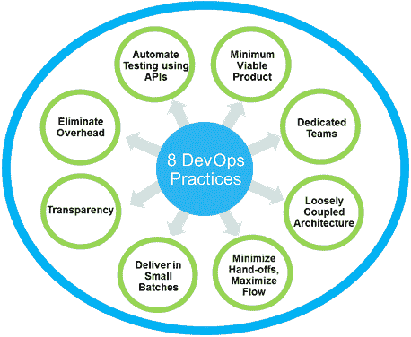

# 八大关键开发运维实践:创新、交付、重复

> 原文：<https://devops.com/eight-critical-devops-practices-innovate-deliver-repeat/>

一段时间以来，DevOps 吸引了很多人的兴趣。像 DevOps.com 这样的论坛上的讨论和辩论正在提高我们对正确方法的集体理解，现在我们看到了快速行动者应用 DevOps 实践以基于云、大数据和移动技术的快速数字创新颠覆整个行业的具体证据。几年来，我个人一直是 IBM 转型的一部分，我想反思一下我们所学到的东西，并与您分享 Forrester Research 最近的一项研究结果。

DevOps 帮助组织解决一个关键的*业务*挑战——持续捕捉和响应反馈(内部和外部),以便我们能够快速重复地将创新想法转化为高度相关且令人满意的产品和服务。这不仅涉及开发和运营，还涉及组织的所有方面，因为它需要整个组织的协作，包括业务和供应链。与单向的传统模式相比，DevOps 是双向的，它不仅基于向客户推出一些东西，还基于获得他们的反馈以进行改进。

在最近的一次网络广播中，我与弗雷斯特公司的首席分析师、敏捷和迭代软件开发领域的领先专家库尔特·比特纳讨论了加速软件交付的八种开发运维实践。此网络广播重点介绍了 Forrester 最近对开发运维实践、周期时间以及企业在开发运维实践采用成熟度方面的调查。 *您可以在这里观看网络直播重播了解更多——*

*他们对 600 名负责应用程序开发的 IT 专业人员的调查发现，大约三分之一的团队一直以一到三周的节奏交付产品*和*，最快的团队比较慢的团队产生了更高的业务满意度，这表明他们不会为了快速交付而牺牲质量。该研究揭示了这些团队是如何做到的:通过采用以下八个 DevOps 实践:*

**

1.  ***最小可行产品—**交付最小可行的产品或应用程序，然后根据反馈在后续的快速发布中对其进行改进，并逐步交付价值。*
2.  ***专门团队—**组建专门的跨职能团队，避免过度专业化，并确保他们不会被附带项目打断。*
3.  ***松散耦合的架构—**在应用程序内部和之间使用松散的架构耦合来降低复杂性，并实现小增量交付。*
4.  ***最大限度地减少交接，最大限度地提高工作效率–**消除不必要的步骤、延迟和步骤之间的摩擦，以提高工作效率。*
5.  ***小批量交付—**小批量交付有助于首先暴露最不确定的问题，并尽早实现对最有价值的使用模式的反馈。*
6.  ***透明–**进度透明有助于每个人及时了解自己的进度，并在不降低工作效率的情况下了解风险。*
7.  ***消除开销–**消除定期和手动状态报告和状态会议的开销，这些开销会占用宝贵的时间并分散交付价值的注意力。*
8.  ***使用 API 自动化测试—**从繁重的手动测试中解脱出来，以提高交付速度、质量和测试准确性，并显著降低成本。*

*该研究驳斥了快速发布需要牺牲质量和接受更高风险的神话。采用这八个 DevOps 实践，尤其是自动化测试和小批量交付，会产生完全相反的效果:小的增量发布会得到更彻底的测试，更稳定，风险更低。*

*采用 DevOps 的最大好处是可以根据每个组织的优先级灵活地选择首先采用哪些实践，然后根据需要逐步采用其余的实践，以优化软件交付生命周期并加速创新。*

*要了解有关调查和八项开发运维实践的更多信息，[请下载 Forrester 研究报告](https://www14.software.ibm.com/webapp/iwm/web/signup.do?source=swg-rtl-sd-ar&S_PKG=ov27813)以及您可以遵循的方法，以便根据您组织的交付周期的当前状态采用这些实践。*

**关于作者**

* Ashok Reddy 负责 IBM 软件集团 Rational 软件部门和 IBM DevOps 产品组合的产品管理&策略、产品设计/用户体验和业务开发。他在美国北卡罗来纳州的罗利工作。Ashok 的角色涉及全球产品交付的所有方面，包括制定产品战略和产品线管理，为 IBM DevOps 产品组合建立产品路线图和合作伙伴关系。*