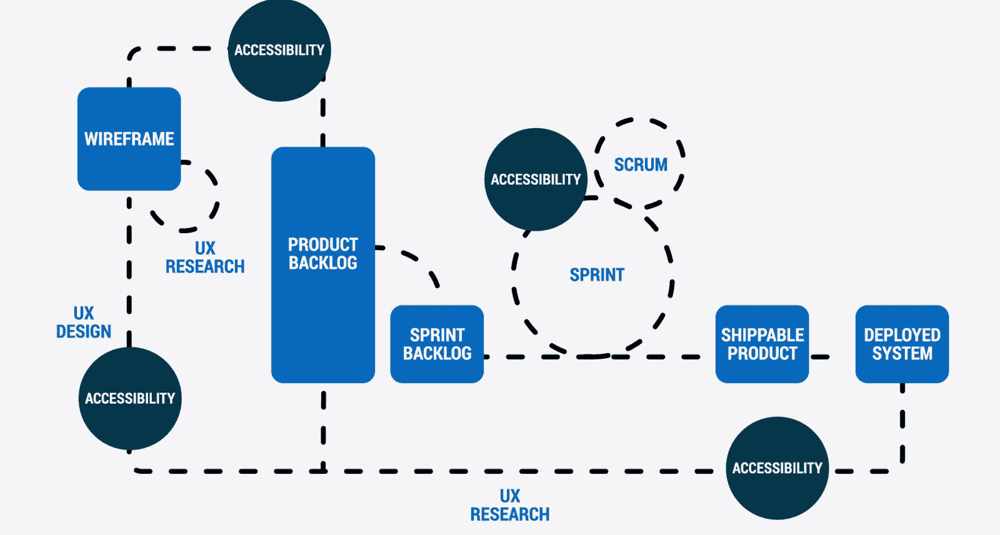

# 将可访问性嵌入 DevOps 流程

> 原文：<https://devops.com/embedding-accessibility-into-the-devops-process/>

对无障碍和包容的呼吁是当今时代的一个典型特征。残疾人，包括视力、听力、认知和身体障碍以及其他人，正在要求平等获得几乎所有的公共服务和与他们互动的论坛，从交通到银行和机场自助服务终端，以及越来越多的数字(网络和移动)服务。

确保可访问性有助于提升品牌，是良好的商业实践。这个过程看起来令人生畏，但是将可访问性集成到 DevOps 中并不一定是势不可挡的。入门有几个简单的步骤。

## **了解贵组织独特的可访问性激励因素**

了解您需要测试哪些可访问性元素取决于许多因素，包括您的行业和您所在的位置。例如，美国政府机构受第 508 节的约束，而电信提供商必须遵守《通信和视频无障碍法案》(CVAA)。不同的场景需要一种细致入微的方法来进行可访问性测试。

数字无障碍的风险远远超出了政府网站，2017 年至 2018 年间，基于美国残疾人法案(ADA)的网络无障碍诉讼数量[增加了](https://info.usablenet.com/2018-ada-web-accessibility-lawsuit-recap-report?hsCtaTracking=ced1162c-41a0-41f1-be8a-60b3f96dfeb5%7Cd65dfdae-71bc-492c-9b8f-f53cdbf519ec) 181%。仅从今年年初开始，包括达美乐比萨和碧昂斯在内的几个知名品牌就因网页可访问性违规而被起诉，将这个问题推到了风口浪尖。

电子商务网站通常更关心收入机会的损失，因为众所周知，由于无法访问网站，一般盲人每个月都会放弃几家公司。对于面向交易的网站，不可访问性直接转化为业务损失。无论动机是什么，建立同理心都是赋予开发人员这一使命意义的好方法。组织可以通过举办并让开发人员参与“[同理心活动](https://accessibility.deque.com/accessibility-empathy-lab)”来做到这一点，在这些活动中，提供模拟，开发人员可以使用残障人士经常依赖的辅助技术，直接体验与给定网站进行交互的感觉。

## **设定可实现的中期里程碑**

敏捷开发团队强调在软件生命周期中尽早捕捉缺陷，以确保高效、高质量的推出。不幸的是，易访问性测试经常被放到过程的末尾，或者作为用户接受度或可用性测试来执行。这种类型的测试通常是手动的，并且可能是资源密集型和昂贵的。

组织只有在听到最终用户遇到问题时才意识到问题，或者更糟的是，采取法律行动以获得对基于 web 的内容和服务的平等访问权。

从手动流程过渡到完全自动化的集成流程需要时间。我们建议设定可实现的中期里程碑，从小处开始，并建立在早期成功的基础上。组织可能不知道首先要解决什么，但一些常见的可实现的第一个里程碑的例子是，所有数字视频都配有字幕和/或手语翻译(针对听力受损者)，并确保所有新的用户界面都没有自动化工具识别的任何问题。专家和培训师可以提供宝贵的建议来解决基本问题，然后在成功的基础上再接再厉。

## **实施工具**

今天的开发人员比以往任何时候都更容易获得更全面的易访问性测试工具。目前，所有主要平台(web、Windows、Android 和 iOS)都有可用的工具，其中许多都是开源的，使它们每天都更丰富。交互式测试功能可以使开发团队在周期的早期彻底评估产品的可访问性，而库允许这些测试作为开发测试自动化的一部分定期运行。一个好的工具将为开发人员提供简单的补救指导，并允许他们踏上学习之旅，以增加他们的知识和专业技能。

## **测量、改进和自动化**

正在进行的度量是理解您的可访问性转换是否稳固的关键。领先的度量标准将关注开发实践中的变化。这些变化将给出最终用户结果的早期指示。一个主要指标的例子是“从自动化测试的角度来看，干净的新 UI 代码的百分比”

最终用户的结果虽然滞后，但对于确保活动带来真正的变化非常重要。结果的一个例子可能是与可访问性相关的呼叫中心查询的数量和变化。减少意味着进入生产的可访问性问题更少。当指标以与业务成果(如客户满意度)直接相关的方式呈现时，它们是最强的，因为这些往往最能引起业务主管的共鸣，这有助于建立最广泛的内部支持基础。

一旦你有了一些早期的成功，是时候扩展了，你可以不断地解决问题。组织还应该关注在开发周期的早期不断地[将可访问性测试“进一步左移”](https://www.deque.com/shift-left/)以提高质量，同时保持速度。你越早发现并修复可访问性问题，这些问题就越不可能深入到软件中，从而使得撤销这些问题更加困难和耗时。

********

**组织还应该考虑用全自动测试来代替交互式和手动的易访问性测试。虽然手动测试不能完全消除，但自动化单元测试和集成测试使开发人员能够在编码时(而不是事后)测试可访问性，而自动化回归测试确保实时 web 内容和应用程序在更改后保持可访问性。自动化回归测试对于希望经常发布软件同时保持质量的组织来说是至关重要的——在一些行业，比如金融服务，大量的网站经历了某种程度的可访问性回归。**

## ****结论****

**DevOps 团队广泛地关注于保持特别高水平的软件质量和速度。我们沉迷于最小化进入产品的错误数量，但是可能忽略了高质量软件的关键属性之一——可访问性。**

**在大多数情况下，功能测试不包括易访问性测试。虽然功能测试确定系统是否按预期工作(即，某些输入生成某些输出)，但可访问性侧重于确保作为非功能属性的残疾人的可用性。据估计，美国目前的残疾人数量几乎相当于加州和纽约人口的总和，因此易访问性测试需要像功能测试一样优先考虑。否则，你会把这些人拒之门外。**

**总之，通过其数字产品和服务展现出可访问性承诺的组织将在竞争日益激烈的市场空间中拥有天然的优势。开始可以相对简单，并且您应该集中于激励开发团队实现和超额实现，强调持续改进而不是从一开始就完美。**

**迪伦·巴雷尔**