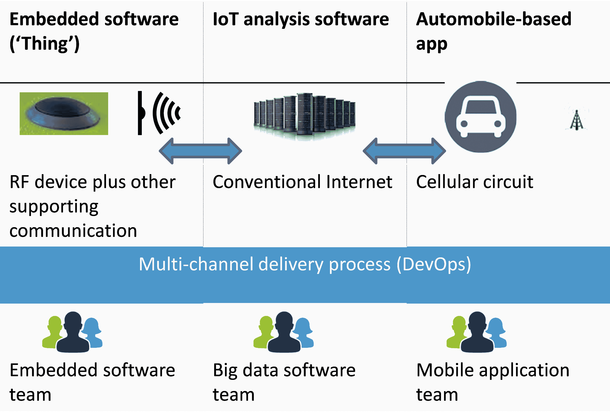

# 拥抱物联网时代的开发运维

> 原文：<https://devops.com/embracing-devops-iot-era/>

对于我们这些努力应对通过物联网(IoT)交付软件的挑战的人来说，DevOps 可以成为救星。

在互联网上交付软件不是一件容易的事情，在物联网上交付更是难上加难。您如何向如此多的“事物”交付软件，其中许多是与世界其他部分无关的“孤独者”？

令人鼓舞的是，我们知道并学会喜欢的软件管理流程和工具在物联网时代仍然有效。事实上，它们不仅有用，而且是必不可少的。

我们需要团队更顺畅地合作，更快速地交流，以减轻更高的技术风险。因此，DevOps 流程和工具在物联网时代至关重要，因为它们促进了团队之间顺畅的协作。

## 典型的物联网场景

考虑一个场景，您需要为一个“智能”城市开发一个“智能”停车系统。该系统将包括停车场中的多个传感器、每个停车区的显示设备以及通信设备、用于控制和分析的中央服务器以及每辆汽车中的智能设备。

司机可以在他们的汽车设备上检查附近停车场有多少空位，并导航到合适的停车场。他们也可以提前预订位置，并从预订位置开始付款。当他们离开停车位时，停车位传感器会自动检测到停车位空闲，并更新中央服务器。中央服务器将空位发送给车载设备，司机可以看到这些空位。中央服务器还生成各种报告，并执行各种高端分析。

与任何传统的互联网系统一样，有多个软件组件。它们都有各自的交付(开发、测试和部署)流程。这些流需要相互依赖和协作地工作，并且它们需要集中的配置管理和仪表板。

## 物联网的规模和多样性

然而，差异和挑战在于部署的绝对规模、部署环境的多样性和多种部署渠道。你可以想象，任何一个大城市都会有数百万辆汽车，数千个停车场，以及数十万个停车位。部署设备的数量很容易达到数百万。

为了防止垄断，不是所有的停车传感器都来自同一个制造商。这同样适用于车载设备。虽然可以强制执行某些标准，但并非所有制造商都会遵守一个通用协议。有必要在这些设备上允许多种通信和安全协议。这种协议的多样性会使设备上的软件部署变得复杂。

## 其他考虑

使整个部署过程更加复杂的是，大部分部署将通过空中传输(OTA)完成。考虑到 OTA 部署易受射频干扰和其他传输问题的影响，部署流程必须比传统有线部署更加稳健。

需要考虑的因素甚至更多:一个基于城市的系统可能是极其动态的。每天都有新车注册，增加了交通流量。新的停车场可能会不时建成，并融入智能城市系统。如前所述，来自新传感器制造商的新型芯片可以增加竞争。进入市场的新的、更复杂的车载设备可能会提供智能停车软件。当然，和传统系统一样，新的功能和补丁会频繁发布。最后，随着该系统成为城市生活的一部分，其作为分析工具的效用可能会从分析停车趋势扩展到其他活动领域。

这些商业和技术因素会给系统带来巨大的进化压力。智能进化城市中的智能系统也必须进化。然而，系统中任何地方的变化都不能破坏其他地方的系统。这种情况在物联网系统中发生的几率更高，因为互连协议还没有成熟到可以通用的程度，也因为物理设备条件永远无法完美预测。例如，中央大数据服务器所需的单个额外场可能会给停车场脆弱的射频系统带来不可持续的额外负担，并导致整个数据传输中断。

## DevOps 如何提供帮助

为了抵消物联网中技术和业务风险的增加，我们需要强大的流程和工具，通过改善团队之间的沟通和协作来减轻额外的风险。具有以下特征的工具变得不可或缺:

*   一个集中的仪表板，提供软件开发的跨流视图；
*   考虑到流之间相互依赖的紧张性质，跨流和生命周期阶段跟踪所有相关软件工件之间的联系的能力；和
*   一种可以检测断开连接的工具。

这些工具还需要一个良好的 DevOps 管理文化，鼓励开发和运营之间的密切协作和快速沟通。

物联网提高了多个软件流之间以及开发和运营流之间紧密协作的需求。采用 [DevOps 文化](https://www.ibm.com/developerworks/community/blogs/c914709e-8097-4537-92ef-8982fc416138/entry/the_devops_culture?lang=en)和 [DevOps 使能工具](https://www.ibm.com/developerworks/community/blogs/c914709e-8097-4537-92ef-8982fc416138/entry/devops_tools_and_processes?lang=en)是抵消物联网软件交付风险的方法。

## 关于提交人/ Vidhya 诉 Kumar

Vidhya 是 IBM 的顾问软件工程师。作为敏捷方法、持续交付和文档的倡导者和实践者，她在 IT 行业有大约 10 年的经验。她是 DevOps、应用生命周期管理和搜索方法方面的主题专家。