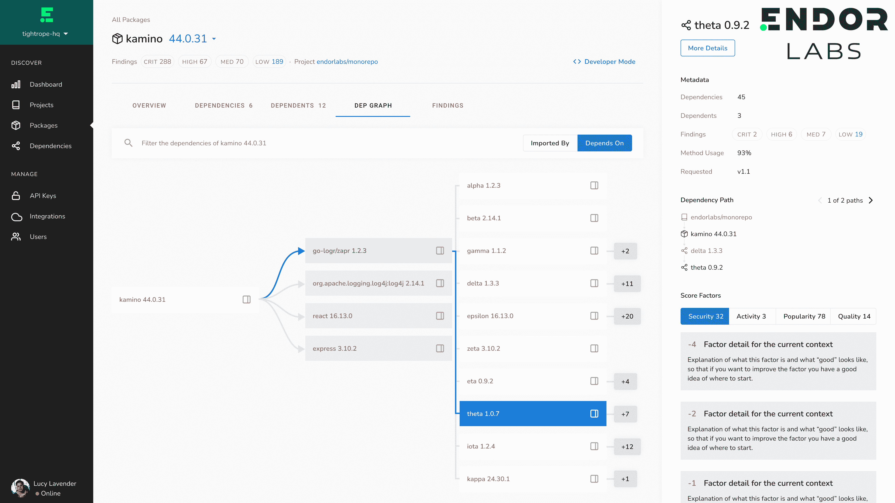

# Endor Labs 应用图形分析来保护软件供应链

> 原文：<https://devops.com/endor-labs-applies-graph-analysis-to-secure-software-supply-chains/>

Endor Labs [今天退出了秘密模式，推出了一个平台](https://www.endorlabs.com/blog/seed-press-release)，该平台应用图形分析来识别应用程序中存在的依赖程度。

刚刚筹集了 2500 万美元资金的 Endor Labs 首席执行官 Varun Badhwar 表示，依赖关系生命周期管理平台使组织能够更简单地管理涉及数万个组件的应用程序中的依赖关系。

他补充说，现有的软件组合分析(SCA)工具不能准确地识别软件组件之间的依赖关系，因为它们产生了太多的误报。

Badhwar 说，为了解决这个问题，依赖生命周期管理平台为应用环境中使用的每个组件提供了相当于信用风险分数的东西。

依赖生命周期管理平台设计用于在[持续集成](https://devops.com/?s=continuous+integration)过程中带外运行，目前正通过一个私人测试程序提供。

平均来说，大约 80%的应用程序是由开发人员从存储库中下载的开源组件组成的。挑战在于，这些组件中有许多都有已知的漏洞。Badhwar 说，依赖生命周期管理平台使在构建过程中识别这些漏洞和找到可能受新发现的零日漏洞影响的组件变得更加简单。

总的来说，依赖生命周期管理平台通过简化漏洞管理提高了应用程序开发和网络安全团队的生产力，他补充道。

Badhwar 指出，在应用程序动态更新时，对依赖图的全面理解还可以让客户生成和分析准确的[软件材料清单(sbom)](https://devops.com/?s=SBOMs)。

在一系列引人注目的违规事件之后，人们越来越关注软件供应链。面临的挑战是，大多数开发人员没有很多网络安全专业知识，即使提供了识别漏洞的工具，也会产生太多警报。在没有任何背景的情况下，这些警报中的大部分都被忽略了。与此同时，新应用程序的部署和更新速度并没有放缓，尤其是随着越来越多的组织开始采用云原生应用程序，从而更容易淘汰和替换软件组件。

组织实施 DevSecOps 最佳实践来教导开发人员如何构建更安全的应用程序将需要数年时间，但这一旅程需要从工具开始，这些工具可以使开发人员在部署应用程序之前更简单地解决问题。对抗应用程序漏洞的最好方法是确保它们不会在代码中出现。从不断进入应用程序环境的漏洞数量来看，很明显，当前用于构建应用程序的流程已被彻底破坏。

此时，修复应用程序开发和部署流程将需要数年时间，但随着更安全的应用程序最终取代数百万不安全的应用程序，组织的整体安全状况将稳步改善。现在的问题是在另一个已知的漏洞导致另一场重大安全危机之前找到实现这一目标的方法。