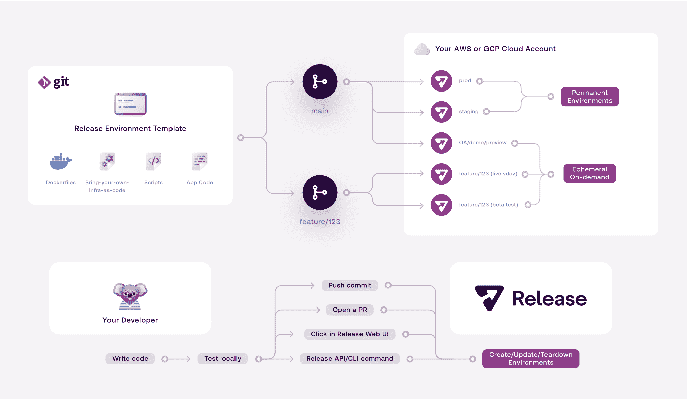

# 2022 年最佳:环境即服务:解放您的开发人员

> 原文：<https://devops.com/environments-as-a-service-free-your-devs/>

随着 2022 年的临近，我们 DevOps.com 想要突出今年最受欢迎的文章。以下是我们 2022 年最佳系列的最新内容。

自从服务器发明以来，环境就是 DevOps 工程师生存的祸根。它们会产生巨大的瓶颈，阻碍生产力，耗尽开发人员的生命和动力。但它们也是完全必要的。

DevOps 团队花费大量时间构建和维护他们的开发环境。它们对于测试新网站、应用、产品和更新至关重要；确保一切都按照预期的方式运行。没有足够的环境会减慢工作流程，因为开发人员要等待使用环境。

软件行业有一个新的推动力来提供环境即服务 [(EaaS)](https://devops.com/beyond-iaas-the-benefits-of-using-eaas/) ，消除了构建和维护环境的烦人但必要的工作，并给予 DevOps 工程师更多的自由来处理更具挑战性的创收项目。

EaaS 使公司能够使用第三方服务按需创建新的开发环境，包括数据、基础设施和代码——构建和运行应用程序所需的所有东西。环境即服务为企业带来了重大改进，节省了资金和时间，同时提高了速度、交付和部署速度。

EaaS 提供了所有事情的自动化和编码，否则会浪费开发人员和基础设施人员的时间。他们应该专注于更高价值的任务，比如创造和提炼让公司或产品独一无二的东西。

### 消除瓶颈

当准备一个新产品或服务时，团队必须测试所有相关的代码，以确保它是功能性的、安全的，并且没有任何问题。多重环境对这一过程至关重要。然而，在许多情况下，团队在一个单一的、共享的登台环境中工作。

这种设置意味着开发人员必须排队等待测试他们的产品部分。这些瓶颈是延迟发布的最大原因之一。

时间就是金钱，在这种情况下，失去的时间就是金钱。我们估计每年管理环境的总成本超过 450 亿美元，而发布延迟每年会给组织造成数百万美元的损失。

组织可以在其基础设施即代码(IaC)框架、敏捷工作流和其他重要软件之上构建 EaaS。通过这样做，开发人员只需点击一下鼠标就可以创建一个新的环境。

这意味着开发人员可以为每个特性分支拉取请求创建一个新的环境。EaaS 还释放了定制能力。例如，测试需要与其他关键服务集成的更大更快的环境，而规模更小的环境对于演示之类的过程来说很好。

现在，开发人员可以自由地测试和开发软件，而不用等待或踩别人的脚趾。此外，按需环境也可能在不再需要时被销毁。这就是实时容量规划。

### 节省时间和金钱

容量知识和更好的容量规划意味着省钱。了解所需的环境数量和类型，有助于组织[避免在云基础设施上过度支出或支出不足](https://devops.com/?s=cloud+cost+management)。

对于规模相当大的开发运维团队来说，构建环境可能需要一年多的时间，而且成本高达数十万美元，更不用说持续管理、新技术集成以及云资源和成本管理方面的挑战了。第三方 EaaS 提供商负责所有这些，让 DevOps 工程师能够专注于困难的问题，而不是维护和重复随着技术进步已经完成的工作。

### 您的组织 EaaS 准备好了吗？

然而，任何时候，一个公司自动化一些像试运行和测试环境这样重要的事情，重要的是把他们所有的事情都做好。幸运的是，这样做的最佳方法与构建任何基础架构平台的最佳实践非常匹配:

●使用基础设施即代码可以自动配置基础设施，而不是手动配置。

●将定制代码容器化，可以更容易地为新环境快速复制代码。

●最后，仔细考虑动态创建环境时，您的环境将会如何表现。像为主机名创建环境变量和尽量不硬编码特定于环境的变量这样的简单事情是必须的。

遵循这些步骤的组织已经为 EaaS 做好了准备。通过自动化这些艰苦的任务，公司可以释放他们的 DevOps 团队，让他们成为组织的超级英雄，解决最大的问题，让技术来处理其余的问题。