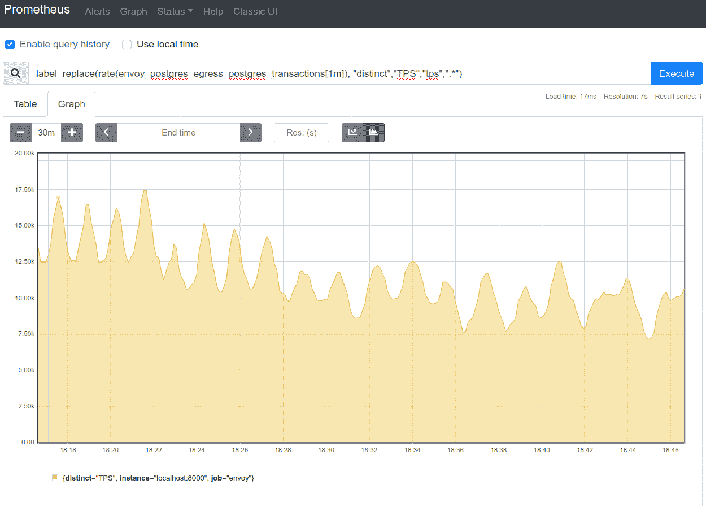

# 特使代理服务器项目成熟了

> 原文：<https://devops.com/envoy-proxy-server-project-comes-of-age/>

随着可以部署的平台数量的不断增加，开源[特使](https://www.envoyproxy.io/)代理软件项目背后的动力正在增加。

在云本地计算基金会(CNCF)的支持下开发的 Envoy 最近已经扩展到包括对 [Arm64 CI 处理器](https://www.cncf.io/blog/2020/08/12/cncf-project-envoy-enables-arm64-ci-using-azure-pipelines/)和 [Postgres 数据库](https://www.cncf.io/blog/2020/08/13/envoy-1-15-introduces-a-new-postgres-extension-with-monitoring-support/)的支持。

Envoy 提供第 7 层边缘和服务代理，可用于为基于微服务的云原生应用和基于虚拟机的现有传统应用提供网络抽象层。

最初由 Lyft 开发，现在有超过 180 家 IT 供应商和超过 155 家公司为 Envoy 做出贡献。Lyft 的软件工程师马特·克莱恩(Matt Klein)也是特使项目的维护者，他说，在这一水平上，特使显然已经达到了临界质量水平。事实上，这种级别的支持就是为什么如此多的服务网格提供商选择在 Envoy 上部署他们的框架。

克莱恩承认特使是一个复杂的软件，需要相当水平的工程专业知识来掌握。然而，随着 IT 团队希望变得更加敏捷，对降低网络复杂性的抽象层的需求变得更加明显，尤其是当组织开始接受边缘计算时。

这种灵活性现在也可以通过插件扩展到软件平台。以 Postgres 为例，Envoy 现在可以解码和解释 Postgres 的有线协议格式，以便从 Postgres 流量中提取数据和指标。这种能力不仅可以更有效地路由数据库流量，还可以从 Postgres 服务器上卸载该任务的管理，而无需对数据库平台进行任何更改。

Envoy 使得将最初提出的用于管理云中虚拟机的许多基础设施即代码概念扩展到网络成为可能。多年来，开发运维团队一直能够在几分钟内调配虚拟机。但是，在内部 IT 环境中，配置网络资源可能需要几天甚至几周的时间。Envoy 提供了一个抽象层，使得在更高的抽象层次上管理网络服务成为可能。

Klein 说，除了使 Envoy 不那么复杂之外，监督其开发的团队正在努力增加对 WebAssembly 的更深支持，这是一个使在 Envoy 上构建应用程序变得更容易的平台。Klein 补充说，Envoy 团队还计划加强与多种可观测性工具的集成，以使 DevOps 流程更容易应用于网络服务。

随着 Envoy 的不断发展，网络运营和开发运维的融合速度只会越来越快。DevOps 团队将能够使用 Envoy 与服务网格协同工作，以编程方式随意管理网络服务。重新定义企业 It 组织内的角色以反映新的现实可能需要一些时间，但通过命令行界面管理网络的日子即将结束，网络上的每个路由器、交换机或设备都必须单独访问命令行界面。取而代之的是，一个基于商用处理器的软件定义网络的新时代终于开始崛起。