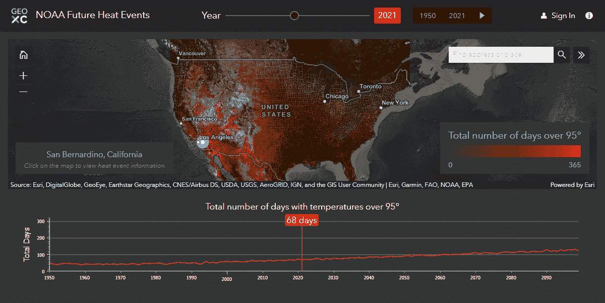

# Esri 推出通过 API 调用地理空间数据的 PaaS 环境

> 原文：<https://devops.com/esri-unveils-paas-environment-for-calling-geospatial-data-via-apis/>

Esri 今天发布了一个平台即服务(PaaS)环境，通过该环境，开发人员可以通过调用云服务的应用程序编程接口(API)将地理空间功能嵌入到他们的应用程序中。

Esri 开发技术首席技术官 Euan Cameron 表示，ArcGIS 平台将使开发人员更容易将地理信息系统(GIS)的地图功能与移动应用程序结合起来。这些应用程序可以通过调用 API 来访问整个 ArcGIS 软件堆栈。以前，IT 团队必须独自建立整个 Esri 平台，以便为开发团队提供对 Esri 地理空间平台的访问。

Cameron 说, [PaaS 环境](https://devops.com/?s=platform-as-a-service)也使开发者能够访问专业级地理空间内容，这些内容可以直接插入他们的应用程序。

随着需要地图功能的移动应用程序的流行，地理空间平台变得越来越重要。卡梅伦说，随着 5G 无线网络的扩展，需要类似功能的应用数量将继续增长。Cameron 说，PaaS 环境将管理地理空间平台的复杂性抽象为一组 API，这将使大规模构建这些应用程序变得更加容易。

当然，还有其他方法可以将地理空间数据库作为一项服务来使用。然而，Cameron 说 Esri 在提供这些功能以及它在广泛的消费者和商业应用程序中策划的内容方面有着悠久的历史。Cameron 说，这些功能现在是任何应用程序的 API 调用。

当然，DevOps 团队将需要集成一个 PaaS 环境，该环境可以作为云服务在他们的整体工作流程中调用。Esri 致力于在全球数据中心网络上提供其 PaaS 产品，以最大限度地减少应用程序对其平台进行 API 调用的延迟。

如今，很难想象一个应用程序不需要至少某种程度的地理空间功能。时间和地点已经成为任何应用程序体验的关键要素。当提供这些功能所需的地理空间平台由其提供商管理时，提供这些功能的总成本会大大降低。事实上，随着应用程序开发的不断发展，DevOps 团队经常发现他们自己编排了一系列对外部服务的 API 调用。这些电话中的每一个都很简单，但是随着时间的推移，数量之多变得难以管理。每个服务提供的 API 的质量也不总是相同的。

无论地理空间功能如何集成到应用程序中，由专门团队管理复杂 GIS 平台的日子可能最终会结束。