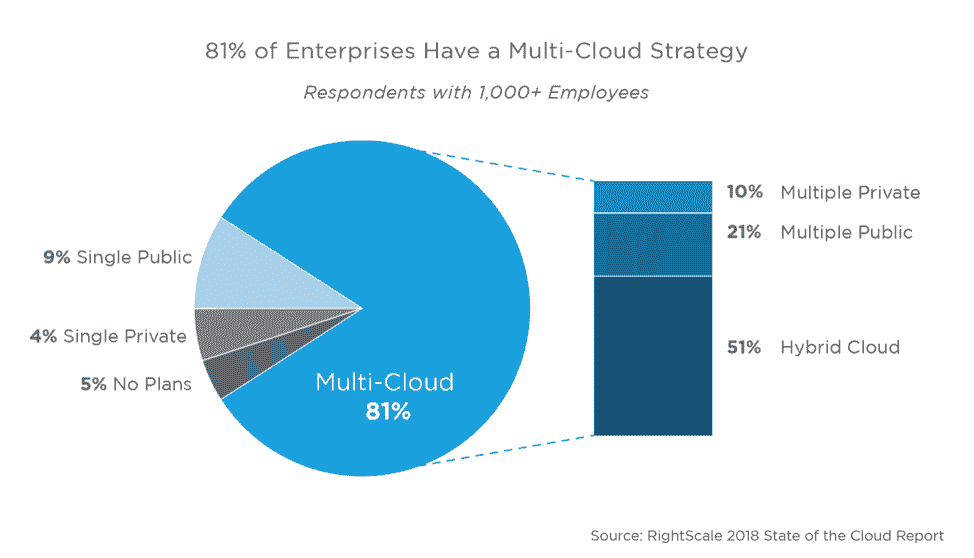

# 评估多云战略:利弊

> 原文：<https://devops.com/evaluating-a-multi-cloud-strategy-pros-and-cons/>

首先，让我们定义一下多重云。显然，我们在谈论使用一个或多个云，但是云有不同的风格。例如，多云融合了混合云的概念，即公共云和私有云的混合。但是多云也可以指两个或多个公共云或者两个或多个私有云。

那么，为什么这很重要？在过去一年左右的时间里，我看到使用多种公共云的公司数量大幅增加。事实上，超过 20%的 ParkMyCloud 客户使用多个公共云。考虑到这一趋势，我认为现在是时候来看看多云战略的好处了。但我也想提一下负面因素——因为，当然，没有“简单的按钮”

根据“RightScale 2018 年云计算状况报告”，超过 80%的企业拥有云计算战略:

## **多云的优势是什么？**

那么，为什么企业的基础设施朝着这个方向发展呢？简单的原因包括以下几点:

*   降低风险—创建弹性架构。
*   管理供应商锁定—获得价格保护。
*   优化—针对成本和性能优化您的工作负载。
*   云提供商的独特能力——利用人工智能、IOT、机器学习等领域的产品。

当我问我们的首席技术官，他认为多重云战略有哪些优势时，他强调了风险管理。我们自己的平台诞生在云端，所以我们运行在 AWS 上。我们还有一个具有冗余的多区域体系结构(姑且称之为“多云之光”)，如果我们采用多云，我们将利用另一个公共云来降低风险。

具体来说，他从一家供应商遭遇基础设施崩溃或攻击的角度提到了风险管理。大约 15 个月前的一年，AWS 遇到了一个问题，当时 S3 在美国东部 1 区离线超过 5 个小时，影响了许多大大小小的公司。从网络应用到智能手机应用的软件都受到了影响(包括我们的)。某些 AWS 地区也成为 DDoS 攻击的目标，影响了服务的可用性。

在这些情况下，备份到其他云服务提供商(CSP)或私有云可以确保 100%的正常运行时间。在阿里巴巴和其他云供应商的情况下，由于长期存在，他们可能在某些地理区域有更强的存在。当任何供应商在一个地区站稳脚跟时，其环境具有最低限度的冗余和适当的安全措施来提供所需的高可用性；在这种情况下，从可用性角度来看，同一地区的另一个提供商可能更安全。

## **多云有什么缺点？**

现在，让我们假设你想去多云:这对你意味着什么？根据我们自己与 AWS、Azure 和 Google Cloud 集成的经验，我们看到每个云都有自己的一套接口和自己的挑战。供应商之间不是“写一次，到处运行”的情况，任何云或网络管理实用程序系统都必须提供与每个 CSP 的深度集成。

此外，配置和管理每个 CSP 的细微差别需要广泛而深入的知识，并且很难找到具有多种云基本专业知识的员工，因此需要更多员工来管理多种云，并确信它是以安全和高可用性的方式完成的。随着每个人都试图赶上 AWS-以及 AWS 本身以极快的速度发展-个人或组织很难最好地利用一个 CSP，更不用说多个云了。

例如，一个通用的容器环境可以通过将工程师与虚拟机管理的细微差别隔离开来，在一定程度上帮助缓解这些问题；然而，网络、基础设施、成本优化、安全性和可用性等问题仍然是电信运营商所特有的。

从理论上讲，拥有多种云策略是有优势的。实际上，像许多事情一样，这并不像看起来那么简单。

— [杰伦教堂](https://devops.com/author/jay-chapel/)