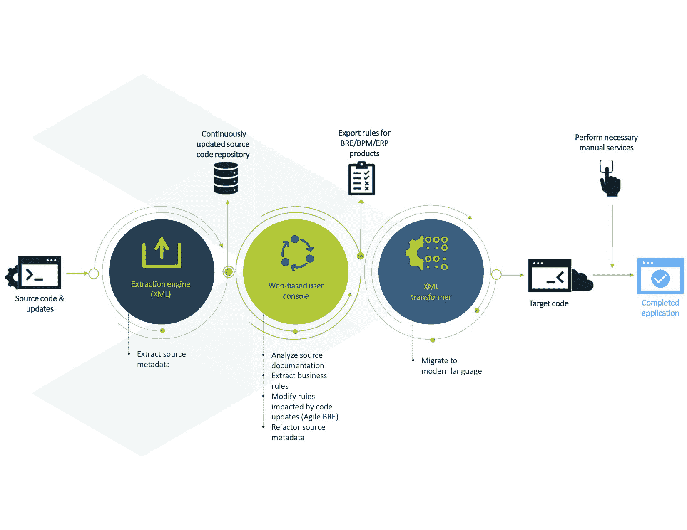

# EvolveWare 进一步自动化应用程序现代化任务

> 原文：<https://devops.com/evolveware-further-automates-app-modernization-tasks/>

EvolveWare 今天宣布，其 Intellisys 应用程序现代化平台增加了[敏捷业务规则提取](https://www.prnewswire.com/in/news-releases/evolveware-facilitates-non-disruptive-application-modernization-with-industrys-first-and-only-agile-business-rules-extraction-solution-301639845.html)功能。

EvolveWare 首席执行官 Miten Marfatia 表示，敏捷业务规则提取功能消除了在应用程序转移到云或重构时冻结代码开发的需要。他说，取而代之的是，Intellisys 平台现在将跟踪代码的更新，并在[应用程序被现代化](https://devops.com/?s=application+modernization)后应用它们。

代码更新现在可以自动转移到提取的业务规则存储库中，而不会影响不受更新影响的规则。对于受更新影响的规则，将生成一个报告，突出显示这些更改。Marfatia 说，IT 团队现在还可以通过存储库同时更新业务策略和现代化应用程序，该存储库还可以跟踪图表、逻辑、数据库详细信息和关键依赖关系等文档。

除了以多种格式呈现逻辑(包括伪代码、流程图、决策表和业务分析师语言)之外，它还支持在需要时将整合和优化操作恢复到原始状态。

总的来说，IT 团队一直在努力进行应用程序现代化，这要求他们要么将在内部 IT 环境中运行的单一应用程序提升并转移到云中，要么将其重构为一组在云中本地运行的微服务。最终，大多数组织将重构单一的应用程序，因此争论变成了在将应用程序提升和转移到云中之前，在多大程度上进行这些工作。大多数单一的应用程序并不是为在云中运行而设计的，所以当应用程序被转移时，遇到许多性能问题并不罕见。

EvolveWare 声称，其 Intellisys 平台通过消除大量原本需要的手动工作，将应用程序现代化的成本降低了 60%。Marfatia 说，总的来说，现代化的努力受到应该自动化的人工过程的阻碍。

大多数 DevOps 团队在更新应用程序时遇到的问题是，这不是他们经常执行的任务。因此，许多所需的过程并没有像应用于更常规的手动任务那样被自动化。Intellisys 平台旨在使 IT 团队能够自动执行与将应用程序迁移到另一个平台相关的最常见任务。

如今，这些迁移的最大驱动力是自新冠肺炎疫情启动以来加速的数字业务转型。各种规模的组织都在将应用程序迁移到云中，以确保更高的可用性和弹性，从而在疫情恶化或其他意外事件导致难以访问 it 服务时，限制可能遇到的中断数量。

当然，挑战在于将应用程序以及它们所依赖的数据库从一个平台转移到另一个平台并不容易。一些组织可能需要几个月，有时甚至几年的时间来完成过渡。鉴于许多组织希望将积压的应用迁移到另一个平台，很明显[需要更高水平的自动化](https://techstrong.tv/videos/interviews/application-modernization-miten-marfatia-evolveware)来加速过渡，按照目前的轨迹，这可能需要数年才能完成。