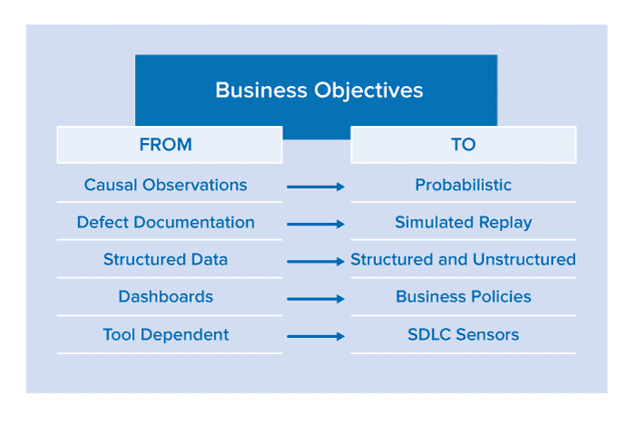

# 演进到持续测试

> 原文：<https://devops.com/evolving-continuous-testing/>

随着敏捷开发实践的成熟和 DevOps 原则渗透到我们的企业文化中，组织正在意识到加速软件交付的独特机会。然而，当你加速任何过程时，不成熟的实践领域如测试和障碍会变得更加明显。这就是以每小时 5 英里的速度驶过减速带和以每小时 50 英里的速度驶过减速带的区别……以每小时 50 英里的速度行驶，减速带会非常刺耳。

加速任何业务流程都将暴露出系统性的约束，这些约束将整个组织束缚在其运行最慢的组件上。在加速软件开发生命周期(SDLC)的情况下，测试已经成为充分利用更多软件开发迭代方法的最大障碍。对于组织来说，利用这些变革性的开发策略，他们必须从测试自动化转移到持续测试。

区分测试自动化和连续测试看起来像是语义上的练习，但是自动化功能测试和执行连续测试过程之间的差距是巨大的。随着软件交付过程的成熟，这种差距将会逐渐缩小。内部和外部的影响都将推动持续测试的发展。在内部，敏捷、DevOps 和精益流程计划将是产生变革需求的主要驱动力。从外部来看，审计政府和行业合规计划的费用和开销将是变革的主要推动力。

## 测试路线图

任何真正的变革举措都需要人员、流程和技术的协调一致，让技术成为推动者，而不是银弹。然而，当我们迁移到真正的质量保证过程时，我们必须探索一些基本的技术主题。总的来说，我们必须从单独关注测试自动化转移到自动化度量风险的过程。要开始这一旅程，我们必须考虑以下几点:

在业务目标的驱动下，组织必须转向更加自动化的质量保证方法，而不是自下而上测试软件的战术任务。

### 从因果观察到概率风险评估

质量保证(QA)传统上执行手动或自动测试，来自测试工作的反馈集中在测试通过或失败的事件上——这是不够的。测试是因果性的，这意味着测试是为了验证一个非常具体的功能范围而构建的，并且被评估为孤立的数据点。尽管这些独立的数据点至关重要，但我们还必须将它们用作扩展等式的输入，以便从统计角度识别应用热点。

SDLC 产生大量数据，这些数据很容易关联。监控过程模式可以产生非常可行的结果。例如，如果应用程序组件在给定的持续集成构建中遇到以下所有问题，就应该触发代码审查:

*   大于平均值的回归失败
*   静态分析缺陷密度大于平均值
*   圈复杂度大于规定的阈值

### 从缺陷文档到模拟重放

测试人员和开发人员之间关于一个报告缺陷的可再现性的争论已经成为传奇。将缺陷退回到开发中比退回世界知名厨师的主菜更难。考虑到加速软件发布周期的雄心勃勃的目标，大多数组织将通过消除这种反复来节省大量的时间。

通过利用服务虚拟化来模拟测试环境和/或虚拟机记录和回放技术来观察程序如何执行，测试人员应该能够在一个简单的容器化包中交付非常具体的测试和环境实例。这个包应该通过封装测试来隔离缺陷，并为开发人员提供验证修复所需的框架。

### 从结构化数据到结构化和非结构化数据

当前用于管理 SDLC 的工具和基础设施系统在结构化数据的生成和集成方面有了显著的改进(例如，CI 引擎如何导入和呈现测试结果)。这些数据很有价值，必须更有效地加以利用(正如我们在“从因果观察到概率”一节中所述)。

分散在内部和可公开访问的应用程序中的大量非结构化高质量数据往往蕴含着秘密，这些秘密决定了使用竞争对手产品的最终用户是开心还是不开心。例如，移动应用程序的开发人员希望从最终用户的评论中获得持续的趋势反馈:

*   iTunes 应用商店
*   安卓应用商店
*   Stackoverflow
*   推特
*   脸谱网
*   该公司的发布公告
*   竞争对手的发布公告

这些数据被认为是非结构化的，因为关键的发现没有以规范的格式呈现:需要解析和二次分析来提取有价值的信息。尽管这些输入可能会被产品营销人员或经理监控，但是将这些数据点直接提供给开发和测试团队——就从业者可以采取行动而言——是必不可少的。

### 从仪表板到业务策略

在一个无所不在的世界中，质量关将使一个候选发布能够通过交付管道得到提升。任何需要人工验证的东西都会堵塞管道。仪表板需要人工解释，从而延迟了流程。

仪表板对于聚合数据、提供重复数据的历史视角和可视化信息非常方便。然而，它们对于实时决策来说太麻烦了，因为它们不提供可操作的情报。

业务策略帮助组织从仪表板发展到自动化决策。通过定义和自动监控决定候选版本是否满足业务期望的策略，质量关将阻止高风险的候选版本到达最终用户。这是降低快速和全自动交付流程(如连续交付)固有风险的关键。

### 从工具依赖到 SDLC 传感器

面对现实吧——运行工具很便宜。随着过程智能引擎的出现，我们在 SDLC 中收集的数据观察越多，发现缺陷预防模式的机会就越多。

考虑到大型和多样化工具集的优势，我们需要将重点从依赖特定供应商提供的单一工具“套件”(具有特定的优势和劣势)转移到拥有分散在软件开发生命周期中的大量 SDLC 传感器。为了优化这些传感器的精度和价值，至关重要的是停止允许以特别的方式应用工具，这种方式在今天仍然非常普遍。相反，我们需要确保它们被一致地应用，并且它们的观察结果被汇集到过程智能引擎中，在那里它们可以与跨工具、跨测试运行和随着时间的推移的其他观察结果相关联。这不仅会增加识别应用程序热点的可能性，还会降低误判的风险。

## 关于作者/韦恩·阿里奥拉

首席战略官 Wayne Ariola 领导 Parasoft 长期战略的制定和执行。他利用客户的意见，并与行业领导者建立合作伙伴关系，以确保 Parasoft 解决方案不断发展，以支持现实世界业务流程和系统不断变化的复杂性。Ariola 为 Parasoft 核心技术的设计做出了贡献，并因其发明获得了多项专利。Ariola 是服务虚拟化、SOA 和 API 质量、质量策略治理和应用程序安全性等领域的公认领导者，经常为包括软件测试&性能、SOA World 和 ebizQ 在内的出版物撰稿，也是重要行业活动的热门演讲者。Ariola 在技术和软件开发行业拥有 20 多年的战略咨询经验。