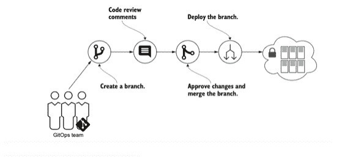
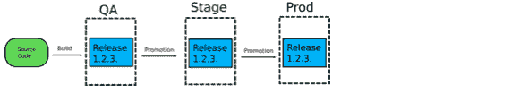

# 将 GitOps 扩展到企业

> 原文：<https://devops.com/extending-gitops-to-the-enterprise/>

GitOps 是一个相对较新的术语，但是随着越来越多的组织采用这种范式，它的发展势头越来越猛。在 DevOps 中，GitOps 位于开发和运营连续体的软件工程方面。尽管 GitOps 更有可能被较小的组织采用，但是较大的企业只需对总体框架做一些调整就可以成功地实现 GitOps。

让我们从头开始。如果我们能够将 DevOps 和 GitOps 方法结合起来，并使用 [Git 分布式版本控制系统](https://www.weave.works/blog/gitops-git-push-all-the-things) 作为真理的最终来源，这不是很好吗？然后，当对正确的状态有争议时，人们知道去哪里找正确的版本。

在 GitOps 中，系统所需的配置存储在版本控制系统中，如 Git。存储在 Git 中的期望状态和系统的实际状态之间的任何差异都向 DevOps 团队表明，并非所有的更改都已部署。这些变更可以通过标准修订控制流程(如拉式请求(PRs ))进行审核和批准。当 PR 被批准并合并到主分支时，操作员软件过程负责根据 Git 中的配置将系统的当前状态更改为所需状态。

GitOps 不需要特定的工具集，但是这些工具必须:

1.  根据 Git 中存储的所需系统状态进行操作。
2.  检测期望状态和实际状态之间的差异。
3.  在基础设施上执行所需的操作，以同步实际状态和期望状态。

在 [GitOps](https://devops.com/s?=GitOps) 的理想实现中，不允许对系统进行手动更改，对配置的所有更改都必须对存储在 Git 中的文件进行。基础设施和运营工程师在 GitOps 模型中的角色从执行基础设施变更和应用程序部署转变为开发和维护 GitOps 自动化，并帮助团队通过 Git 审查和批准变更。

GitOps 非常适合非关键环境，但是企业不太可能采用 GitOps，因为 GitOps 用户面临许多挑战。

## GitOps 面临的挑战

GitOps 仅适用于软件开发生命周期(SDLC)的一个子集。这一点很重要，因为 GitOps 工具有时被宣传为可以解决所有发布问题的通用解决方案——这是不正确的。首先，GitOps 要求您的部署工件已经存在。这意味着诸如以下任务

*   编译代码
*   运行单元/集成测试
*   安全扫描
*   静态分析

不是 GitOps 工具所关心的，并且假定已经存在。GitOps 也没有解决不同环境之间的版本升级问题。

### 可审计性

由于强制推送，默认 GitOps 进程是不完全可审核的。强制推送本质上允许用户从中央存储库的 Git 历史中删除任何不需要的提交块。

### 业务审批

PRs 是 GitOps 中使用的典型批准模型。开发人员进行更改，创建 PR，然后审批者可能会接受该 PR。这将被记录下来，并部署一个更改。基于 PR 的批准模型假设同行已经在使用 Git 并且熟悉 PR。

一般来说，这很有效，直到我们需要包括业务批准。业务人员可能不熟悉 Git 或 PRs。如果一个团队需要业务批准，他们必须在 GitOps 之上构建一个流程。这大大增加了交货时间。

### 治理

GitOps 依赖于一个纯粹基于 PR 批准的模型，在该模型中，PR 批准者负责审查。在 PR 被批准后，就没有办法实施企业策略规则。 企业需要控制最终用户可以在特定集群上执行的操作，以确保这些集群符合政策，从而满足治理、法律要求或实施最佳实践。

## GitOps 的企业方法

但是，在企业级有办法解决这个问题。

**漂移检测报警**

每当存储库中出现偏差时，企业客户都会收到警报，基于此，客户可以选择批准或拒绝偏差。如果被拒绝，合并的 PR 应该恢复到以前的状态，以确保 Git 与集群的期望状态同步。

**使用管道促进环境间的发布**

为了在环境之间提升一个工件，用户将能够使用一个具有部署阶段、性能监控和日志分析/批准的管道。

假设开发人员提交源代码，而 GitOps 部署发生在 QA 环境中。符合公司制定的政策标准后，请购单将自动获得批准。然后可以将其推送到生产环境中。

**治理  治理**

开发人员和平台工程师将策略即代码集成到他们当前的 GitOps 流程中有许多原因。首先，这种策略有助于加速应用程序的开发和部署，因为它有助于解决许多减缓开发进度的变更管理障碍。

在开发方面，策略即代码(policy-as-code)帮助应用程序开发人员了解并遵守公司的配置、安全和合规性政策。例如，开发人员可能不记得——或者可能没有理由知道——在 AWS 中将负载均衡器部署到 Kubernetes 上是否被批准。策略即代码自动解决了这个问题。

能够在 GitOps 部署期间运行策略，并作为部署的一部分遵守这些策略，以及在出现任何违规时发出警报、审计、通知并自动将更改从 Git 回滚到先前成功的合规状态，以便 Git 与集群保持同步。

## GitOps + AIOps

有一种观点认为，一旦 GitOps 就位，一切都将无缝运行，没有任何问题。没有那么多；持续监控部署状态以确保一切正常非常重要。这就是 AIOps 出现的原因。

GitOps 使开发人员和开发团队能够看到任何清单变更、基础设施变更或工件变更。部署后，GitOps 操作员可以立即了解服务健康状况的变化，了解导致这些变化的原因，并使用 AIOps 自动执行调查过程。如果发现任何严重的异常，操作员可以确定系统的当前状态，如果有任何不同，就恢复到以前的兼容 Git 提交。