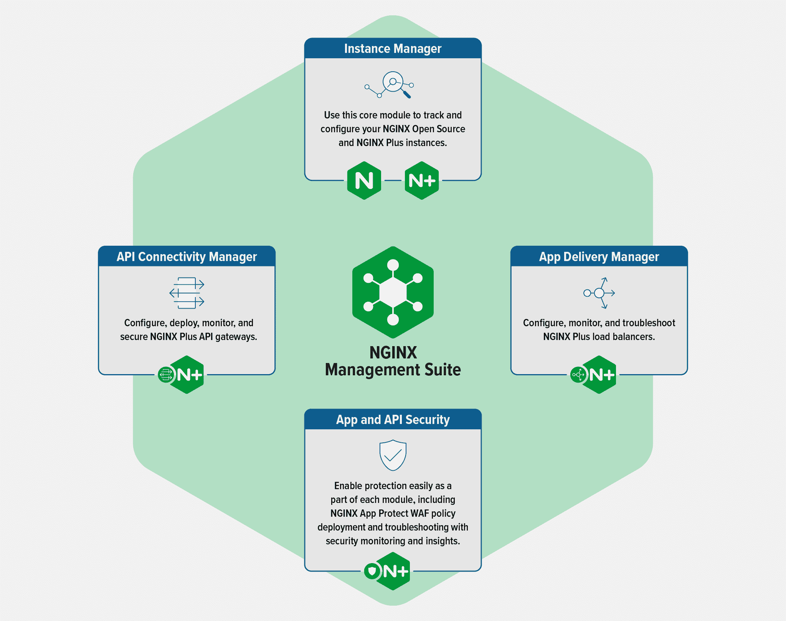

# F5 NGINX 提供现代管理平台

> 原文：<https://devops.com/f5-nginx-delivers-modern-management-platform/>

F5 NGINX 改进了其管理套件的实施方案，旨在提高平台的可访问性和易用性。

F5 NGINX 产品管理副总裁 Eric Braun 表示, [NGINX 管理套件 1.0](https://www.nginx.com/blog/connect-scale-secure-apps-apis-with-f5-nginx-management-suite/) 基于模块化平台，可以动态扩展 NGINX 代理软件、应用交付服务、应用编程接口(API)管理工作流和公司安全产品的实例。

Braun 指出，这种方法使 F5 NGINX 软件的自动化部署成为可能，而无需依赖容易出现错误配置的手动流程。

他补充说，该平台基于现代架构，这也使管理员能够使开发团队在通过门户定义的一组策略的限制内自助服务他们自己的需求。

Braun 说，NGINX 管理套件取代了 NGINX 控制器，后者是一个更加单一的平台，不是基于 API 优先的服务管理方法。

NGINX 管理套件的核心模块是该公司代理软件的开源和商业实例的实例管理器、API 连接管理器、应用交付管理器以及应用和 API 安全模块。NGINX 管理套件将使组织能够使用 NGINX App Protect Web 应用程序防火墙(WAF)来保护应用程序和 API，而 App Delivery Manager 模块将得到扩展，以便在用作负载平衡器时能够对 NGINX Plus 进行配置、保护、监控和故障排除。

NGINX 管理平台的改造是一系列努力的最新成果，旨在使用基于微服务的平台实现应用和 IT 基础设施管理的现代化，该平台可以在需要更多资源时更容易地扩展。模块化程度更高的方法还让 IT 团队能够更精细地控制各种模块的访问方式。

Braun 指出，它还简化了 It 团队的部署，例如，服务网格或 API 网关，而无需添加额外的管理平台。他补充说，这种能力将大大简化部署这些平台的过程，因为不再需要专门的平台来管理它们。

尚不清楚后一种能力将在多大程度上使 It 组织能够将管理各种任务的责任进一步转移给应用程序开发团队。然而，很明显，应用程序开发团队希望能够自助满足他们自己的 it 需求，并在没有集中式 IT 组织干预的情况下提供服务。实际上，IT 组织正试图在集中化的优势和在 DevOps 工作流环境中更快地构建和部署应用程序的需求之间取得平衡。

大多数 It 组织可能还需要一段时间才能始终保持这种平衡。然而，与此同时，随着 [IT 管理](https://devops.com/?s=IT+management)平台继续使用 API 进行现代化，集成它们也应该变得更加容易。这将由每个 It 组织来决定需要多少管理平台，但至少，构成当今 IT 环境的各种管理孤岛终于开始瓦解。