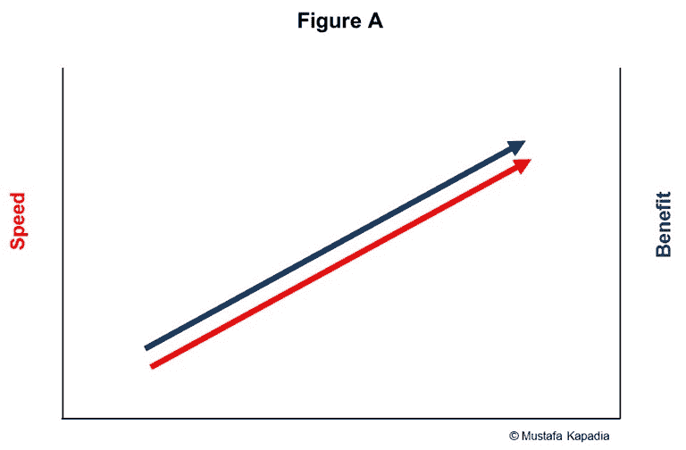
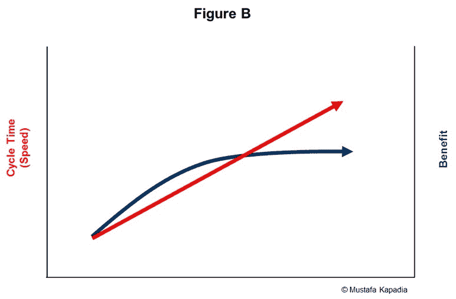
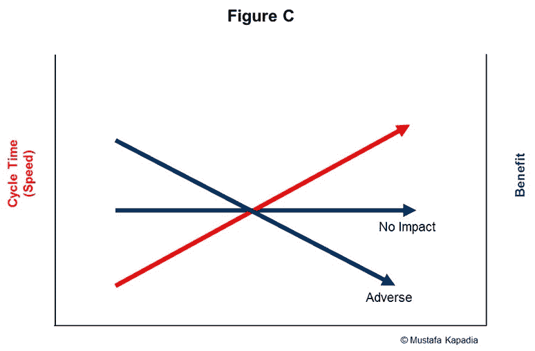

# 多快才算够快？

> 原文：<https://devops.com/fast-fast-enough/>

DevOps 的主要目标之一是让组织能够更快地将想法推向市场。但是多快才算够快呢？他们是否需要将上市时间缩短 10%、20%、50%..90%?所有的应用程序最终都需要在几个小时内发布吗？为了竞争，我们都必须成为世界上的 Etsy 或网飞吗？

不幸的是，没有简单的答案。最佳的应用交付速度(也称为上市时间)在不同的行业、市场、组织之间，甚至在组织自己的应用组合内部都有很大的差异。记住“两个速度”。

换句话说，就速度而言，没有“一个适合所有人”的标准。然而，确定您的最佳速度——目标——对您的 DevOps 成功至关重要。没有它，几乎不可能提供一个远景，测量进展，并从根本上改变你交付软件的方式。例如，它非常擅长衡量成本。事实上，他们从每条路到周日都在测量成本。因此，成本外卖成为服务交付的基本价值衡量标准——“交付同样的服务，你能做到多低”。类似地，如果速度和敏捷性是目标，那么我们必须从测量我们当前的速度开始，然后为未来状态设定(现实的)目标。

**速度的定义**

在我们开始尝试确定应用程序的最佳速度之前，重要的是我们首先要就速度的定义达成一致。我们喜欢认为速度是一个相当简单的概念，但令人惊讶的是它是如此的不被理解。

许多刚接触开发运维的组织简单地将速度等同于发布周期。他们认为，如果增加周期数，就可以缩短上市时间。不幸的是，它不是这样工作的。发布频率的提高是速度提高的自然结果(我们将在下面的例子中看到)，而不是速度的驱动力。

真正的周期时间是从头到尾测量的——从创意进入开发漏斗到发布给最终用户。换句话说，这是特定代码的在制品(WIP)时间，任何速度上的提高都是 WIP 时间的减少。

例如，一个医疗保健客户最近告诉我们，他们只需要 20 天就可以开发出中等尺寸的增强产品。对他们来说，每次增强的周期时间是 20 天。但是通过进一步的检查，我们发现确定需求需要 20 天，设置环境需要 10 天(使用云)，测试需要 15 天，将代码从一个环境转移到另一个环境需要 10 天，审批需要 15 天。当我们将所有这些加在一起时，我们发现该增强功能的真正上市时间(速度)刚刚超过 90 天。

一旦我们能够在 tsurehis 的上下文中定义速度，它就在组织内部打开了一个全新的对话世界。现在，他们不是优化 20 天，而是另外 70 天的活动。即使他们只需缩短 70 天的 1/3(通过一些简单的流程工程实现自动化)，他们也能把上市时间缩短到 65 天。此外，该团队现在可以更快地交付 5 项增强功能(65 天 x 5)，而不仅仅是每年交付 4 项增强功能(90 天 x 4)。

通过以如此宽泛的术语定义速度，它不仅让 it 团队能够看到全局，还能看到浪费区域、真正端到端改进的机会以及协作平台。

现在我们有了正确的定义，让我们开始回答百万美元的问题，

我应该有多快(我的最佳速度是多少)？

简单的回答足以让客户高兴并击败竞争对手。但是要确定在什么时候你能够实现这个目标就有点复杂了。

大多数组织试图通过向内看来回答这个问题。他们执行详细的价值流映射练习，确定每个活动的周期时间，识别瓶颈，然后三角测量如果消除一些关键瓶颈，他们可以走多快。

不幸的是，速度不是你能走多快的函数(IT 观点)，而是潜在利益的函数(业务/市场观点)。更准确地说，您的最佳速度直接取决于企业将获得的额外收益(额外收入、更高的客户获取率、更好的客户保持率等)。)作为更大速度的结果。

为了帮助更好地理解收益和速度之间的关系，问自己以下三个问题，

1.  如果我们将周期时间(从创意到生产)缩短 10%、20%、30%、40%等等。，对业务的增量好处是什么
2.  我们能量化这种益处吗？
3.  这种好处对速度的敏感程度如何？它们是否成反比，是否存在效益/速度平台？

通过这样做，大多数应用程序很有可能属于这三种情况中的一种。

1.  效益和速度是成正比的

对于一些企业来说，速度就是王道。你交付产品的速度越快，收益就越大。面向消费者的应用程序(脸书、链接等。)专注于创收/获取客户在这种情况下效果很好。对于这些应用，基本上没有速度限制。经验法则是踩油门，别挡我的路。

****

**最佳速度:不限速，踩油门**

1.  收益提高，但仅限于某一点

大多数 SaaS 应用程序(SFDC、Workday 等。)就属于这一类。在某一点上，增量收益随着速度的增加而减少。换句话说，用户喜欢定期更新和升级，但只到一定程度。改变太多太快，你最终只能交付很少的附加值。在这种情况下，存在一个最佳速度，在此之后对速度的任何投资都是浪费金钱。

 **最佳速度:将你的速度限制到有利于高原的地步**

1.  收益和速度成反比/不相关

这与 A 相反，在 A 中，速度对收益有不利影响/没有影响。在这里，用户认为稳定和现状比什么都重要。变革是受欢迎的，但需要少之又少。许多本地遗留应用程序都属于这一类别。想象一下，如果你的 ERP 提供商每天发布一个新的更新(迷你升级)。这会给组织带来巨大的破坏。如果这发生在你的总账系统上，你将永远无法关闭你的账簿。如果你发现自己属于这一类，最好去选择一个不同的应用程序。

 **优速:无，稳胜于变**

**两个警告**

这些图表很好地展示了各种选项，但有两个警告是每个组织都应该知道的，成本和竞争。

成本:如果达到这个速度的成本大于潜在的增量收益，速度限制就没有什么意义了。毕竟，像任何其他 IT 项目一样，ROI 是决定 DevOps 是否值得投资的关键。

竞争:最终……竞争是王牌。不管你的图表和/或你的成本模型显示什么，如果竞争变得更快…你别无选择，只能赶上这个速度，或者更好，超过这个速度。这就是为什么我们敦促我们的许多客户尽早投资开发运维，设定基准，并建立竞争优势。

超速行驶愉快！！

***关于作者/穆斯塔法·卡帕迪亚***

** *穆斯塔法·卡帕迪亚* ** *是 IBM devo PS 实践的服务线负责人，这是一项业务咨询实践，专注于帮助大型企业转变其软件&应用交付。通过 DevOps，组织可以更快地将软件推向市场，质量更好，缺陷更少，风险更低，交付周期更短。*

在加入 IBM 之前，Mustafa 是德勤战略&运营部的管理顾问。他住在旧金山湾区，是一个狂热的博主(如果时间允许的话)，一个演说家，也是初创企业的顾问。

*你可以在 LinkedIn:[https://www.linkedin.com/in/kapadiamustafa](https://www.linkedin.com/in/kapadiamustafa)和 Twitter:[https://twitter.com/mkapadiatweets](https://twitter.com/mkapadiatweets)上关注穆斯塔法*