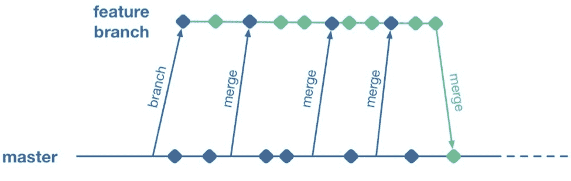
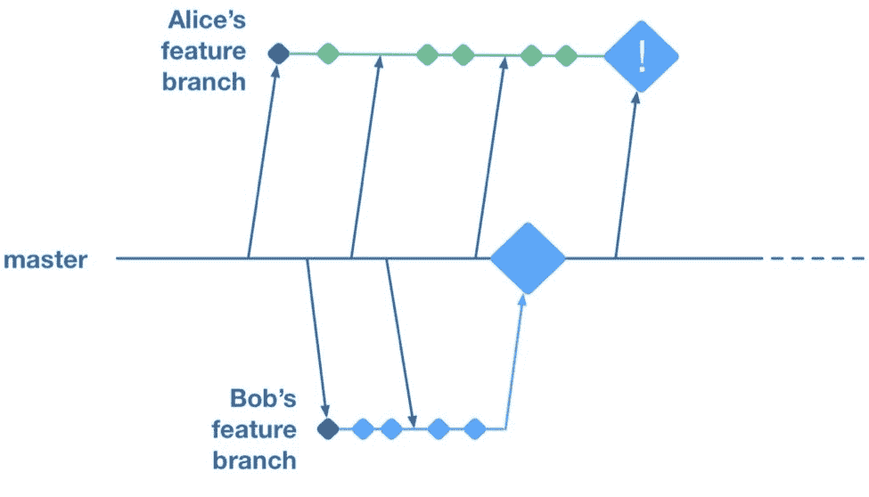

# 特征分支与特征标志:什么是合适的工具？

> 原文：<https://devops.com/feature-branching-vs-feature-flags-whats-right-tool-job/>

一个开发团队的分支管理策略会对其发布高质量软件的速度产生重大影响。在本文中，我们将探讨在同一个代码库中支持多个并发开发工作流的几种不同方法的优缺点。我们将看到两个主要因素——合并冲突的成本和独立发布工作流的能力——经常处于紧张状态，但是特性标志提供了一种解决这种紧张状态的方法。

## **合并冲突**

新产品从一个小代码库开始，通常只由少数开发人员开发。这种情况不需要太多的正式程序。然而，即使一个团队只由两个开发人员组成，仍然最好避免同时处理相同的文件，以避免合并冲突。

不幸的是，即使当我们试图避免踩到对方的脚趾时，看似不相关的工作流最终接触到相同的文件仍然是很常见的。有时候，正是这些意想不到的合并冲突可能会导致最大的痛苦——任何经历过几次的 iOS 开发人员都可能在过去史诗般的三方 XIB 合并中留下一些疤痕。在本文中，我们将探索一些不同的方法来处理当多个开发人员在同一个代码库上工作时合并冲突的挑战。

有些人可能会说，合并冲突现在已经不是什么大问题了，如果使用 Git 这样的现代工具，大部分冲突都可以解决。不幸的是，事实并非如此。Git 当然使得创建分支变得简单，但是它并不总是使得在这些分支中合并并行的变更变得简单。它有一些强大的功能，可以在可能的情况下自动合并变更。这些自动合并试探法有时感觉很神奇，但实际上并不神奇。如果您进行影响大型 XML 文件的并行更改——例如，XIB 或 IDE 项目文件——Git 可能无法在没有人工帮助的情况下合并这些文件。

最重要的是，Git 不能自动解决[语义冲突](https://martinfowler.com/bliki/SemanticConflict.html)。例如，假设在一个分支中，Alice 重命名了一个方法，而在另一个分支中，Bob 添加了该方法的新用法。当这两个分支合并时，Git 不会帮助解决 Bob 的分支使用旧名称调用方法的问题。Bob 的代码正在调用一个不再存在的方法。事实上，Git 不会给 Alice 或 Bob 任何有冲突的线索，因为这些语义冲突不能被我们当前的工具集检测到。

当我们试图编译合并的代码库时，我们只会发现语义冲突，即使这样也只是其中的一个子集。如果代码库是动态类型的语言，比如 javascript，我们可能不会发现，直到我们的用户开始报告生产中的应用崩溃。

除了不得不手动解决这些不可避免的合并冲突的生产力打击之外，引入冲突的恐惧可能对代码库产生更有害的长期影响。一个开发人员看到了一个逐步提高代码库质量的机会，但是如果他们意识到这会导致合并冲突，他们就会有点不愿意这样做。

随着改变的成本变得更高，做出小改进的努力是否值得投资的计算也随之改变。随着时间的推移，这会对代码库的内部质量产生微妙的影响。更重要的是，这种小而广泛的重构可以逐渐改善代码库——或者阻止它逐渐退化——正是经常导致合并冲突的变化类型。在我看来，这是基于分支的开发的真正隐藏成本——它抑制了那种“[童子军规则](http://programmer.97things.oreilly.com/wiki/index.php/The_Boy_Scout_Rule)”的改进，这种改进可以防止代码库的区域逐渐退化为禁区。

因此，已经确定合并冲突是一件坏事，让我们看看如何避免它们。

## **直接在主机上工作**

一个小团队开始开发一个新的应用程序时，可能会通过让所有的开发人员频繁地向一个共享的主分支推送来降低一个大的意外合并冲突的风险——这是持续集成的核心原则之一。当每个人都频繁地在一个共享的主分支中同步他们的变更时，一个意外的合并冲突会更早地暴露出来，并且更容易处理。

不幸的是，将多个工作流放在一个共享的主分支上会带来一个很大的缺点:如果有任何工作流没有准备好发布，那么共享分支上就没有什么可以发布。让我们用一个假设的例子来看看为什么。

Alice 和 Bob 是两个开发团队，正在开发一个移动应用程序。他们有两个工作流程正在进行中。Bob 正在对用户偏好的工作方式进行重大改革，而 Alice 正在完成应用程序的一个关键新功能，大老板们已经决定必须在本周末之前将该功能推送到应用程序商店。这个团队试图通过频繁地将他们的代码变更推到共享的主分支来避免大的合并冲突。

周四，Alice 完成了她的修改并做了一些测试。在对应用程序进行大致浏览时，她注意到用户偏好部分崩溃了。她问鲍勃是否知道原因。Bob 解释说，他正在对这部分代码进行全面检查。这比他预计的时间要长一点，而且可能会有一段时间出现问题。爱丽丝看了鲍勃一眼。她向他解释说，她的功能必须在本周进入应用程序商店。鲍勃·高尔普斯。经过两天漫长的过程，Bob 和 Alice 能够回滚 Bob 的更改，其中一些更改与 Alice 作为其新功能的一部分所做的更改纠缠在一起。他们设法在周六之前发货到 app store，危机得以避免。

我们在这里看到，因为 Alice 和 Bob 都致力于一个共享的分支，他们独立的工作流变得纠缠在一起。没有 Bob 的修改，Alice 无法发布她的修改，反之亦然。这是在共享分支上工作的巨大缺点——尽管我们稍后会发现有方法可以减轻这一点。

## **特征分支**

为了避免耦合工作流的问题，开发团队通常会将正在进行的代码转移到共享分支上。一些团队会选择在本地机器上继续使用 master，但是只有在工作完成后才推送到团队的共享 repo。其他团队将选择使用功能分支，在独立的分支上维护独立的工作流，并且只在完成后将它们合并到主项目中。

顺便说一下，有趣的是，当使用像 Git 这样的分布式源代码控制系统时，这两种方法本质上是等价的；唯一的区别是未合并的进行中的变更在远程特性分支中是可见的，还是隐藏在 dev 的本地主特性中。因此，我将把这两种变体作为特性分支来讨论。

因此，如果一个团队正在使用特性分支，那么他们所有的问题都解决了，对吗？可惜没有。我们现在重新引入了痛苦合并的风险。在功能分支上完成的工作不会与其他变更集成，直到它被合并到共享的主分支。每当两个工作流都接触到相同的文件时，不管是无意的还是有意的，都会有一个潜在的合并冲突，这个冲突会继续扩大，直到其中一个流的分支到达 master。一些团队试图通过频繁地将主变更合并回动态特性分支来缓解这个问题。

*** *** 然而，当孤立的分支上发生平行变化时，这没有帮助。当 Bob 的特征分支落在 master 上时，Alice 的分支将只能看到 Bob 的变化。这些平行变化之间潜在的合并冲突现在正等待着 Alice 下一次从 master 合并。

*(*******a *r*******【a】******【n】****【c】****

*一些团队试图通过“交叉合并”来解决这个问题——将一个功能分支上的工作转移到另一个功能分支上，以减少这些分支之间潜在的合并冲突。*

*然而，一旦您将两个特性分支合并在一起，您实际上已经创建了一个正在进行的工作的共享分支，并且回到了与将正在进行的变更推送到共享主项目的团队相同的问题上:来自两个工作流的代码变更现在混合在一起了。您的功能现在已耦合在一起，不能单独释放。*

*总的来说，特性分支允许团队分离工作流，这样它们就可以独立发布。然而，当并行的特性分支包含大量的变更时，它们引入了大量合并冲突的风险。只有当并行工作已经完成时，从主工作重新合并到功能分支才有帮助，分支之间的交叉合并将功能耦合在一起，就像在共享主工作一样。*

## ***特征标志***

*如果一个团队想要避免分支引入的合并冲突风险，他们有什么选择？他们可以回到频繁地在主干上集成变更，但是我们发现这有一个主要的缺点，以前独立的工作流现在被耦合在一起，不能独立发布。这就是一种称为特征标志(也称为特征切换、bits 或 flippers)的技术可以发挥作用的地方。*

*特性标志是一种隔离进行中的代码的方法，它将代码放在“标志”或“开关”的后面仅当标志打开时，工作进行中代码才会被执行。否则，它将作为“潜在代码”存在于代码库中下面是如何使用基本特征标志的示意图:*

*if(feature flags . ison(" my-new-feature "){
showNewFeatureInUI()；
}*

*除非我的新功能标志已配置为“开”，否则新功能不会显示在应用程序的用户界面中。这意味着即使实现新功能的代码充满了错误，只要该功能的标志被关闭，应用程序也可以发布。*

*通过使用特性标志，可以将进行中的变更推入共享分支，而不会阻塞从该分支的发布。如果 Bob 正在开发他的功能，而 Alice 想要发布她的功能，团队可以通过创建一个版本来实现，在这个版本中，Alice 已完成的功能被打开，而 Bob 尚未完成的功能被关闭。我们获得了持续集成开发人员工作流的好处(减少了合并冲突的风险),同时仍然保持那些工作流的发布是分离的。*

*这种技术并不特别新。它是有时被称为[基于 trunk 的开发](https://trunkbaseddevelopment.com/)的技术家族的一部分(你可以看出这种技术并不新，因为它的名字使用 trunk 而不是 mastermoniker，由于 git 的优势，mastermoniker 在今天更常见)。Flickr、Etsy、Github 和脸书都是这项技术的知名支持者。对于其著名的每天两次从共享分支部署 facebook.com 的能力，脸书对功能标志的使用是一个关键的使能因素。*

## ***特征标志的缺点***

*与到目前为止讨论的其他方法一样，特性标志也有缺点。它们给代码库带来了相当多的干扰，因为我们现在需要为任何不完整的特性显式地实现某种分支逻辑。随着时间的推移，这种噪音可能会导致一些混乱的代码，除非在不再需要旧的特性标志时，小心地将它们收回。测试人员可能需要一段时间来适应带有功能标记的应用程序——将未完成的、未经测试的代码发送到应用程序商店的想法需要一段时间来适应。如果可以在运行时远程控制标志，那么团队需要明白，在应用到部署给最终用户的应用程序之前，必须对标志的新配置进行测试。*

*最后，某些类型的更改很难通过功能标志来保护——涉及大量文件的广泛但肤浅的更改可能是一个挑战。幸运的是，特性标记并不是一种要么全有要么全无的方法；特征分支仍然可以用于在标志后面实现起来特别复杂的变化。*

## ***特征标志成功***

*当一个团队开始采用特征标记时，他们通常会遇到上面讨论的一些挑战，并最终找到减轻它们的方法。下面是一些在特性标记代码库中成功工作的技巧。*

### ***让您的标志过期***

*很多团队在第一次开始使用这种方法的时候都有点高兴。他们倾向于引入许多标志，但是一旦他们不再需要控制一个特性是开还是关，他们就不会花时间让这些标志退役。确保花时间淘汰旧的标志——它们会在代码库中引入设计阻力，并在管理标志时造成混乱。一些团队采取了非常激进的方法来确保旧的标志过期，例如当他们创建一个标志时设置“定时炸弹”,或者让它在一段时间后仍在使用时抛出一个异常。其他技术包括在创建标志时将标志移除任务添加到团队的待办事项中，作为提醒。*

### ***旗帜不是银弹***

*为新的工作流使用特性标志并不总是有意义的。标志最适合于新功能或替代功能，在这些功能中，对功能的访问可以从代码中的一个点进行控制，通常是通过显示或隐藏按钮，或者改变当您点击 UI 的某个部分时发生的事情。其他类型的工作，比如内部重构，很难在一面旗帜后面得到保护。对于这种类型的工作，考虑使用特性分支，理想情况下将工作分解成更小的块，可以在一系列分支中增量实现，而不是一个长期分支。这将降低大型合并冲突随时间增长的风险。*

## ***总结***

*特性标记和特性分支都是分离并行代码变更的方法，并允许团队以更少的协调开销发布变更。特性分支很容易上手，但是会导致痛苦的合并冲突。这种合并冲突的风险倾向于抑制对代码库进行增量改进，并可能导致代码库的某些区域成为“不可行”的区域。特性标志允许团队实践真正的持续集成，并完全将代码变更从特性发布中分离出来，代价是实现每个标志会有些复杂。*

*特性标志不是灵丹妙药，也不总是正确的选择，但是对于团队来说，尝试这种方法很容易。您可以简单地从一个硬编码的 if/else 语句开始，看看它如何进行，并从那里开始。*

## ***关于** **作者/皮特·霍奇森*** 

*皮特·霍奇森是 T2 的顾问、软件工程师和建筑师。他的客户从早期的旧金山初创公司到财富 50 强企业，专注于通过测试自动化、功能标志、基于主干的开发和 DevOps 等实践，以可持续的速度实现软件的持续交付。Pete 经常参加播客小组讨论，在美国和欧洲的定期会议上发言，还是特约作者。*