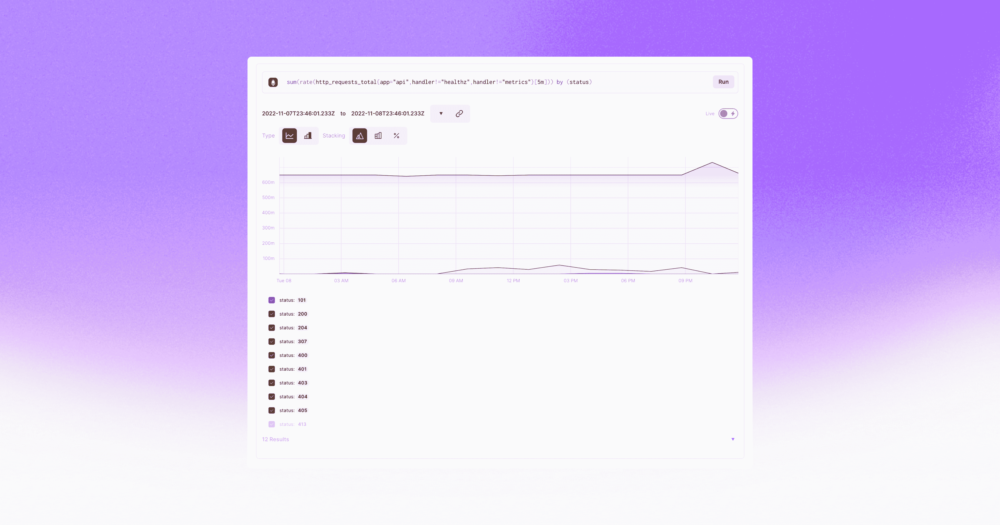

# Fiberplane 笔记本工具促进 DevOps 协作

> 原文：<https://devops.com/fiberplane-notebook-tool-fosters-devops-collaboration/>

Fiberplane 今天宣布，它将推出一款名为[的公开测试版，这是一款同名的实时协作笔记本](https://www.prnewswire.com/news-releases/fiberplane-introduces-first-real-time-collaborative-notebooks-for-devops-301678522.html?tc=eml_cleartime)，专为需要快速调试 it 基础设施的开发团队设计。

Fiberplane 首席执行官 Micha Hernandez van Leuffen 表示，在新冠肺炎疫情之后，很明显，DevOps 团队的结构已经发生了永久性的变化，现在这些团队的更多成员远程工作。他补充说，挑战在于，为开发运维团队提供的管理 IT 环境的工具，其设计初衷并不是为了培养现在所需的协作水平。

Hernandez van Leuffen 指出，在不同时代设计的仪表板需要被一些工具所取代，这些工具可以使 DevOps 团队更容易地实时协作调试基础设施。

Fiberplane 笔记本通过使用 Google Docs 中使用的相同操作转换算法来实现这一目标，使团队能够围绕一个文档或电子表格轻松协作。核心平台本身内置于 Rust and WebAssembly (Wasm)中，Hernandez van Leuffen 表示，这使得将 Fiberplane 作为插件集成到现有的 DevOps 工作流中变得更加简单。例如，在 Fiberplane 笔记本中，DevOps 团队可以编写和运行 PromQL 查询，并通过集成图形显示普罗米修斯图表和其他数据。

Fiberplane Notebook 最初集成的是 Grafana Loki、Elasticsearch 和 Prometheus 监控工具。它还公开了应用程序编程接口(API)和命令行接口(CLI ),以根据特定的外部事件(如监控警报)自动创建笔记本。

Hernandez van Leuffen 表示，事实上，Fiberplane 正在将数据科学团队用于协作的笔记本电脑概念应用到 DevOps 工作流中。他补充说，目标是通过减少解决任何问题所需的时间来提高 DevOps 团队的生产力。

随着 IT 环境在云和微服务时代变得更加分散，故障排除问题总是跨越 IT 团队多个成员的责任。事实上，Fiberplane 使建立一个虚拟作战室成为可能，这个虚拟作战室使 it 组织的成员能够协作，直到当前的问题得到解决。

解决任何 IT 问题的速度已经成为一个至关重要的指标。鉴于 IT 环境的复杂性，事故的发生是不可避免的。理想情况下，IT 团队会在这些问题扰乱业务之前发现它们。然而，在现实中，组织用来评估 DevOps 团队有效性的标准是，不管公平与否，IT 问题一旦被发现，解决的速度有多快。分布式开发运维团队调度其资源所花费的时间越长，该团队就越有可能被认为效率低下——无论实际实现的应用可用性级别如何。

当然，精明的 DevOps 团队已经实施了广泛的事件管理最佳实践，为应对广泛的问题创建了一定程度的肌肉记忆。问题是总会出现不可预见的问题。因此，DevOps 团队需要找到快速关注某个问题的方法，因为这样或那样的原因，这个问题太不可预测了；他们需要期待意想不到的事情。