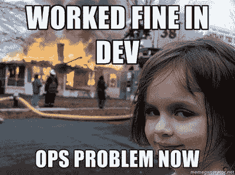

# 首先，我们修复了 Dev，但我们不要忘记 Ops

> 原文：<https://devops.com/first-fixed-dev-lets-not-forget-ops/>

自 2008 年成立以来，DevOps 已经从一个开发者的地下反叛运动发展成为一个主流运动，代表了各个行业和各个规模。只要看看参加 DevOps 活动的人的穿着，你就能看到这种变化:黑色 t 恤仍然存在，但这些天也有很多西装和领带。这一成功的另一个标志是公司试图将 DevOps 融入他们现有的概念框架——因此，出现了过多的“ITIL 和 DevOps”论文。

尽管取得了这些成功，但是 DevOps 运动仍然年轻。当然，信息技术发展很快，但我们并不是在谈论一种可以迅速采用并广泛传播的技术。对组织来说，致力于开发运维是一个重大的文化转变，这需要时间。一些组织已经进行了五年的开发运维，并围绕这一新方法全面重新设计了他们的流程，但大多数组织仍处于开发运维之旅的开端。正如威廉·吉布森所说，“未来就在这里；只是分布不均匀。”

## 首要任务:加快发布速度

DevOps 采用的早期阶段集中于围绕将代码发布到产品的活动，因为这是 DevOps 运动最初创建来打破的瓶颈。虽然现在宣布胜利还为时过早，但可以肯定地说，发布过程中的改进是巨大的。今天，任何不打算实现 DevOps 原则的新项目都必须有一个非常好的理由和解释。

注意关于新项目的限定。在全新的情况下，很容易采用 DevOps 方法和期望；然而，在棕地项目中，这要困难得多，因为以前的文化规范已经在工具和过程中表现出来，很难在飞行中改变。好的一面是，随着时间的推移，旧的做事方式会自然消亡，因为代码库会被重新设计、移植和替换。最终，每个项目都将是 DevOps 项目。

## 我们是不是跑得太快了，别人都跟不上？

然而，DevOps 不仅仅是发布和部署。它还包括已经部署的操作。毕竟，它就在名字里！尽管来自运营背景，但可能会有一种感觉，DevOps 不适合“像我这样的人”对 DevOps 的一些简单的解释集中在开发人员和运营人员之间有时对立的关系上，忘记了优秀的运营人员和开发人员一样有动力让开发人员更多地参与运营。

当工程师试图在没有运营部门参与的情况下“做开发工作”时，出现的困难之一是运营部门没有准备好加入进来。当开发人员在 18 个月的周期中进行非敏捷的发布时，运营人员对于一个发布对他们来说意味着什么有一套特定的假设。在一段时间内，进行这种单一的发布对于 Ops 来说是一件痛苦的事情，但是会有足够的时间来做好准备，并且其他需要的活动可以围绕该发布进行安排。

其中一个重要的依赖因素是准备对正在部署的代码进行监控和管理。需要检测什么，这些提要需要放在哪里，当它们到达时需要什么来理解这些提要，当其中一个提要变红时谁需要跳转，等等。NOC 中有很多事情是开发人员并不总是意识到的。

如果开发人员突然每隔几周就发布一个更加敏捷的版本，那么运营人员将无法即时调整他们现有的工具和流程以适应新的节奏。当您有几个月的准备时间时，可以编写和修改大量的规则和过滤器，以理解监控数据，过滤掉 cruft，并正确地传递剩余的内容。当你的发布周期是以天或小时来计算的时候，就不是这样了。

开发人员应该记住，“基础设施作为代码”也包括调试代码。采用发布自动化、容器化或者其他什么将会成为下一个很酷的工具的方法本身并不能解决问题。布里奇特·克鲁姆胡特对这一机制有一个精彩的阐述:

> 容器不会修复你破碎的文化。微服务不会阻止你的两个披萨团队在吃披萨的时候互相交流。再多的工业强度的作业调度也不能使你的组织免受康威定律的影响，该定律指出“设计系统的组织……被限制生产这些组织的通信结构的复制品。

抛开开发人员和运营人员之间经常存在的沟通障碍不谈，运营团队必须处理的一个约束是，运营部门被分成许多不同的团队，每个团队只处理一个领域或一种技术。然而现在，问题往往会有跨越这些领域边界的症状，因此运营团队必须相互沟通。

历史上做这件事的方法不是很有效，依赖于门票乒乓，升级，作战室和良好的旧指责风暴。如果你突然加速一个这样的系统，你认为会发生什么？答案是，它只是把自己扭成碎片。

## 完成 DevOps 文化转变

好消息是，其他人已经达到了你现在的位置，并且有工具和技术可以帮助你操作你开发的东西。与 DevOps 运动的其他部分一样，这既是一场技术变革，也是一场文化变革。运营团队需要开始以新的方式思考运营。

这种变化的一个方面是正在进行的向不可变架构的转变，也称为小狗对牛。另一个是支持跨支持领域的高效沟通。今天，就像盲人摸象的寓言一样，支持团队经常抓住问题的不同部分，错误地识别它们，因为他们只有部分信息，因此不能真正解决问题。没有人真正了解整头大象，也许除了某个专家，只有在多次升级后才能联系到他/她——而且他/她确实有更好的事情要做。

另一方面，如果运营团队可以与开发团队并肩工作，那么良性循环就成为可能，高效的运营可以消除开发过程中的更多摩擦。无论是机器对机器的交流、人对人的对话还是机器对人的互动，沟通都是关键。做对了这一点的组织在开发和运营方面都会获得巨大的回报。

多米尼克·威灵顿是 Moogsoft 的首席布道者