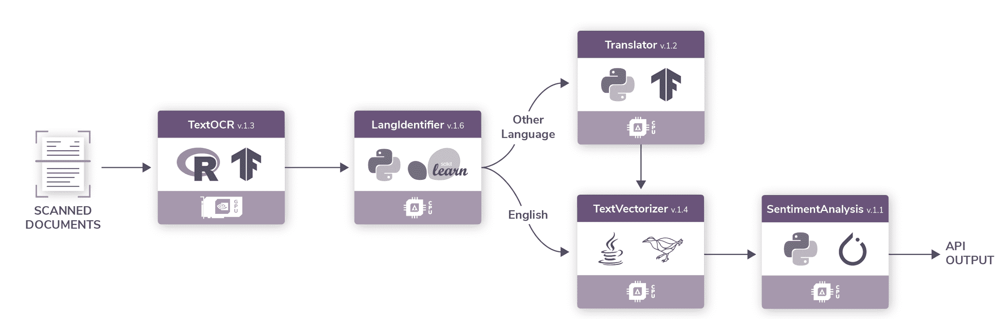
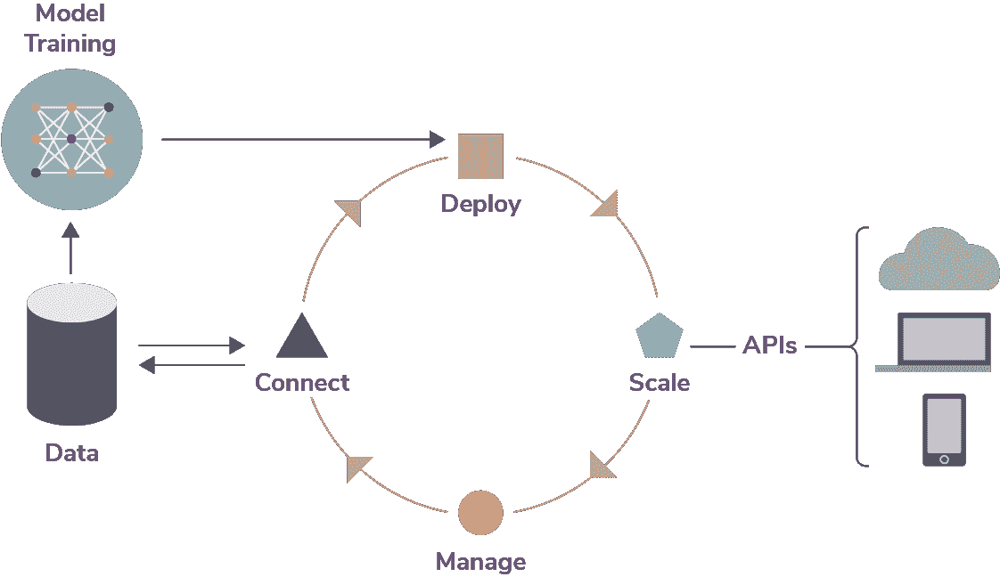
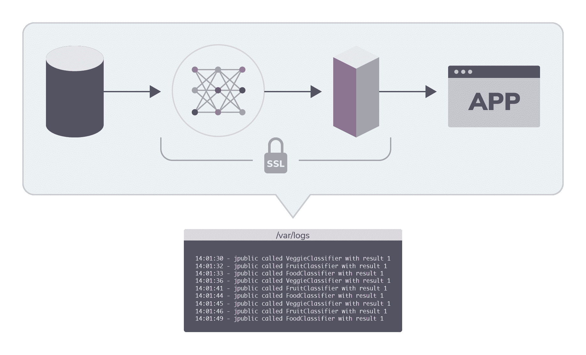

# 机器学习 DevOps 的五大挑战

> 原文：<https://devops.com/five-challenges-of-machine-learning-devops/>

随着组织将机器学习(ML)添加到他们的工作流中，尝试将模型创建和部署挤压到现有的软件开发生命周期(SDLC)中是很诱人的。然而，ML 从根本上不同于传统的应用程序，在一个新的、独特的称为机器学习开发生命周期的过程中考虑这一点很重要。

我们已经确定了每个组织在开始支持 ML 开发时应该记住的五个挑战。

## 让异质性发挥作用

当给定的工作选择了正确的工具时，机器学习就成功了。根据用例的不同，数据科学家可能会选择 Python、R、Scala 或其他语言来构建一个模型，而选择另一种语言来构建第二个模型。在给定的编程语言中，有许多可用的框架和工具包，这增加了版本控制和一致性的复杂性。

例如，TensorFlow、PyTorch 和 Scikit-learn 都使用 Python，但是每个都针对特定类型的操作进行了调整，并且每个都输出稍微不同类型的模型。

支持 ML 的应用程序通常调用一系列互连的模型，这些模型通常由不同的团队使用不同的语言和框架编写。

Figure 1: An ML pipeline that extracts text from scanned documents and analyzes its sentiment passing through several languages and frameworks.

例如，一家公关公司希望识别批评其客户的新闻和报道，可以使用以下渠道:

1.  使用光学字符识别(OCR)模型从数百份扫描文档中提取所有文本。
2.  使用语言识别模型识别该文本的语言。
3.  把这篇课文翻译成英语。
4.  通过将英文文本转换为数字的矢量化模型，为情感分析准备文本。
5.  使用情感分析模型对文本评分。

## 计划 ML 迭代

在机器学习中，你的代码只是一个更大的生态系统的一部分——模型与实时、往往是非结构化或不可预测的数据的交互。与新数据的交互会引入模型漂移并影响准确性，需要不断评估、调整和重新训练模型。

Figure 2: The continuous ML Lifecycle with iterations.

因此，ML 迭代比传统的应用程序开发工作流更快、更频繁。这对版本管理和其他运营流程提出了更高的要求，并要求 DevOps 流程、工具和人员具有更高的敏捷性。

对采用支持 ML 的应用程序感兴趣的组织需要准备好处理迭代的负担，而不会超出预算或引入不必要的基础设施任务。

## 开发合适的基础设施

模型训练过程通常涉及以下多个实例:

*   漫长而密集的计算周期。
*   固定的非弹性载荷。
*   单个用户。
*   单一模型上的并行实验。

部署之后，来自多个团队的模型进入共享生产阶段，其特征是:

*   短暂、不可预测的计算机爆发。
*   弹性缩放。
*   许多用户使用许多型号。

运营团队必须能够持续支持培训和部署环境，因为这是一个连续的生命周期。从适用于 ML 工作负载的越来越多的处理器，到特定于云的扩展和管理的进步，再到层出不穷的新数据科学工具，为这项工作选择正确的基础架构变得非常复杂。

让你的 ML 程序经得起未来考验是很重要的，以确保你今天使用的工具或框架不会导致锁定或更糟——过时。

## 您将如何扩展？

为了应对 ML 工作负载的不可预测性和低延迟的优势，组织必须构建计算能力来支持大量突发事件。

有三种典型的架构方法，每种都有优点和缺点:

**传统容量规划:**在传统架构中，运营部门保留能够扩展到最大预期需求的计算资源。

优点:

*   预留容量始终可用
*   易于管理

缺点:

*   极度浪费和成本
*   意料之外的需求可能会超出产能

**弹性缩放:**标准弹性缩放设计用于局部最大值，根据阶跃函数缩放机器。

优点:

*   相对于传统架构的成本改进

缺点:

*   低效的硬件利用
*   难以管理同一硬件上的异构工作负载
*   管理开销略高于传统架构

**无服务器:**无服务器架构方法在请求到来时旋转模型。

优点:

*   显著提高了硬件利用率
*   大幅降低成本
*   更易于在同一台机器上运行和扩展不同类型的工作负载

缺点:

*   定制的本地解决方案的大量管理开销
*   一些没有大量 API 和报告的第三方服务提供了有限的可解释性
*   性能调整以满足延迟要求

架构师可以在云中或物理数据中心实施这三种方法中的任何一种，尽管弹性扩展或无服务器方法需要更多的内部管理工作。

## 信任结果的可审计性和治理

可解释性——理解模型为什么做出给定的预测或分类——是 ML 基础设施和生命周期的重要部分。然而，同样重要并且经常被忽视的是模型可审计性和治理的相关主题——理解和管理对模型、数据和相关资产的访问。

Figure 3: An audit trail can help inform decisions.

为了理解复杂的管道、大量的用户以及快速的模型和数据迭代，部署系统应该尝试识别:

*   谁叫哪个版本哪个型号。
*   何时调用模型。
*   模型使用的数据。
*   产生了什么结果。

在开始机器学习计划之前，思考和规划这五个挑战是确保您的投资获得有价值回报的良好开端。

要了解更多关于集装箱化基础设施和云原生技术的信息，请考虑参加 11 月 18 日至 21 日在圣地亚哥举办的 [KubeCon + CloudNativeCon NA](https://events.linuxfoundation.org/events/kubecon-cloudnativecon-north-america-2019/) 。

迭戈·奥本海默