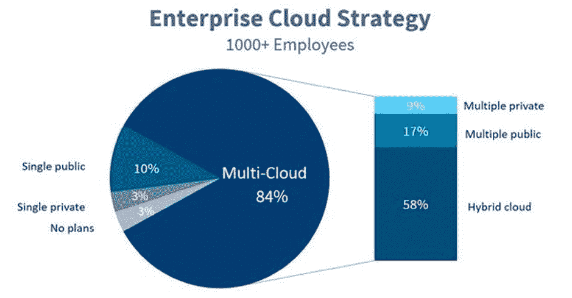

# 企业云计算战略中要避免的五大错误

> 原文：<https://devops.com/five-major-mistakes-to-avoid-in-enterprise-multi-cloud-strategies/>

对于企业来说，由于涉及大量的数据和应用程序，采用多云策略并不像看起来那么简单。因此，在多云实施中，错误是常见的。这些错误是什么，企业如何避免？

## **多云的增长**

现在，云计算是大多数企业 IT 基础设施的主要组成部分。这是因为公司必须加快数据访问和管理流程，以适应快速的市场需求。

数据分析公司 Sumo Logic 的一项研究显示，在过去几年[中，企业对云计算的使用每年增长 50%。](https://assets.sumologic.com/resources/continuous_intelligence_2019.pdf)2017 年至 2024 年[32.1%的优异 CAGR，市场也有望触及近 80 亿美元。](https://www.marketwatch.com/press-release/multi-cloud-management-market-global-trends-market-share-growth-opportunity-and-2027-2019-09-16)

Figure 1: The share of cloud environments in enterprises. Source: [Forbes](https://www.forbes.com/sites/janakirammsv/2019/03/03/10-key-takeaways-from-rightscale-2019-state-of-the-cloud-report-from-flexera/#5dac0f413962).

几个因素证明了这种加速增长的合理性。首先，多云环境让企业不必局限于一家供应商的云解决方案，这是企业在与供应商打交道时面临的常见问题。巨大的投资回报和卓越的云计算实施性能也是其成功的两大因素。

## **以错误的方式部署多云战略的影响**

任何像多重云一样快速发展的技术趋势都会带来令人担忧的负面影响。企业可能不具备有效利用云计算所需的技能和资源。这可能会影响性能，增加成本，或者更糟，产生安全漏洞，使毫无准备的组织陷入瘫痪。

一般公司一次性使用 [16 个 SaaS 工具 。](https://www.bettercloud.com/monitor/wp-content/uploads/sites/3/2017/05/2017stateofthesaaspoweredworkplace-report-1.pdf) 虽然 SaaS 应用程序具有内置的安全性，但组织仍有责任保护其环境，尤其是依赖关系。如果没有适当的恢复措施，一个应用程序中的漏洞可能会影响整个生态系统。

Nominet 的多云调查受访者表示，他们在 2019 年面临 [至少一次数据泄露](https://www.technewsworld.com/story/86229.html) —比混合云和单云用户多 50%。如今，数据违规罚款 [已达数百万](https://www.pkware.com/blog/what-s-the-real-cost-of-a-data-breach) ，企业无法承受支付不必要的罚款对其本已紧张的利润造成的影响。这就是为什么需要格外谨慎地实施多云战略。

以下是企业云计算战略中需要避免的五大错误。

## **在不具备所需能力的情况下实现云计算**

习惯于单一云部署的组织如果在不具备所需能力的情况下使用多云，就会面临失败的风险。使用 SaaS 应用程序的经验不足以保证完全的多云迁移。企业至少应该拥有合适的技术专长、工具和技术。

开发团队将不得不调整心态，以便在多云环境中高效工作。其他重要的业务部门也需要重新调整以适应这种变化。换句话说，你的公司必须建立一种以多种云为中心的文化，而不是把它当作另一种新技术。

投资培训，让团队成员掌握必要的云计算技能。这可能很贵，但是从高效员工身上产生的投资回报率远远超过培训成本。你的招聘流程还应该优先考虑在该领域有丰富经验的候选人，以使入职更容易。

使用行业标准工具简化管道自动化、CI/CD 和监控等领域的开发。这减轻了 QA 的负担，同时由于减少了[的部署焦虑，也让开发人员在使用云计算时可以安心。](https://devops.com/fighting-deployment-anxiety-5-tips/) 最终，你的团队应该能够以最小的摩擦在云中构建、测试、部署和监控代码。

## **未解决云蔓延问题**

除非你被套牢，否则你将在你的多云中与各种提供商和技术堆栈打交道。您的环境可能因不必要的资产和依赖关系而超载，导致【云蔓延】，对预算和性能产生负面影响。

为了克服云的蔓延，请根据组织目标精心规划您的云基础设施。仅将符合您需求的核心应用程序集成到 tee 中。“最好拥有”会耗尽宝贵的资源，并且可以推迟到您的云计算成熟之后。

合理调整您的环境，使规划更容易。合理调整将资源分配与您的多云工作负载相匹配。它通常是自动化的，或者由云提供商作为服务提供。企业可以 [通过合理调整基础设施](https://www.cio.com/article/3228247/right-sizing-public-cloud-instances-can-cut-costs-20-40.html)——这在当今激烈的市场中是一个巨大的优势。

## **未考虑复杂性**

您环境中的更多资产意味着更多复杂性挑战。可扩展性、安全性和资源优化是企业需要密切关注的三个关键领域。集成也很困难，因为不是所有的提供商都提供与其他工具的无缝连接。

如果这是您的组织第一次使用多重云，请考虑使用流行的云应用程序。定制解决方案最好在稳定的环境中实施，并且在真正需要时实施。

另一个需要考虑的因素是您基础设施的负载平衡策略。当需求达到峰值时，哪些资源具有更高的优先级，哪些资源可以被牺牲？自动化是负载平衡的必备条件，尤其是当您的环境由成千上万的资产组成时——这在企业系统中很常见。

在您的云计算战略中需要考虑的其他复杂性因素有:

*   顺从。
*   资产和数据可见性。
*   成本管理。
*   性能。
*   系统设计。

## **为未使用和未充分利用的资源支付过多费用**

如果您在未使用和未充分利用的资源上花费过多，那么多云并不像预期的那样经济高效。百分之五十二的企业云资源 [勉强达到最佳使用率](https://www.gigenet.com/blog/underutilizing-cloud-computing-resources/) 而云浪费去年创下 140 亿美元的历史新高[。](https://devops.com/cloud-waste-to-hit-over-14-billion-in-2019/)

幸运的是，成本优化是作为缓解云蔓延和合理调整的副作用而实现的。做到这两点，并结合优化未使用的 EBS 卷和快照等最佳实践，将显著降低您的成本。

## **能见度差**

一般的多云环境中的资产数量要求您的团队在其中导航时具有全面的可见性。没有可见性，开发人员的工作会被 [错综复杂的依赖关系和外来配置](https://info.crosscode.com/blog/how-to-manage-dependency-risks-in-open-source-libraries) 所干扰，从而破坏组织的生产力。如果依赖关系受到损害，这也会导致安全漏洞——如果您的团队看不到体系结构，他们如何找到问题的根源呢？

使用绘图工具绘制出每个资产和依赖关系。通过提高可见性，您可以增强您的云计算的安全性，同时允许开发人员在全面了解您的生态系统后放心地部署代码。将制图见解与贵组织的技术文档相结合，以进一步改善结果。

## **立即支持您的云计算**

从您的多重云获得最佳性能的最简单方法是尽早避免常见的陷阱。根据上面提到的技巧，您可以提高可伸缩性、成本和性能，而不会屈服于复杂性挑战。

— [Soumik Sarkar](https://devops.com/author/soumik-sarkar/)