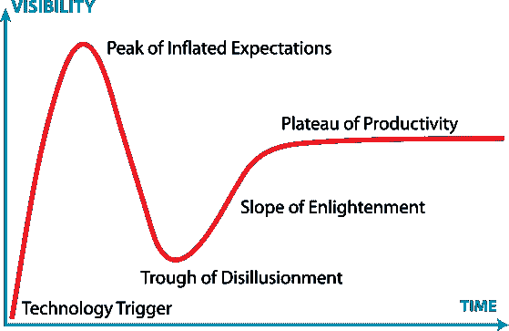

# 关注人工智能对 IT 运营的真正价值

> 原文：<https://devops.com/focusing-real-value-ai-ops/>

在对人工智能的大肆宣传中，让我们专注于它能提供的真正价值，尤其是对繁忙的 it 运营团队而言。

2018 年已经成为人工智能和机器学习(ML)成为主流的一年——至少在公众意识方面，如果不是实际可用的产品的话。当我写这篇文章的时候，一年一度的 CES 活动——也就是王子风格的展览，“以前被称为”国际消费电子展——正在如火如荼地进行。随着亚马逊的 Alexa [被嵌入越来越多的产品](https://www.pocket-lint.com/smart-home/news/amazon/143246-alexa-takes-over-ces-2018-ai-powered-tvs-fridges-mirrors-and-more) 和谷歌也展示了自己的消费者人工智能能力[中，通常的怀疑都被排除在外。](https://www.recode.net/2018/1/9/16871330/google-ces-2018-assistant-ai-alexa-amazon-integrations)

更意想不到的人工智能采用者包括 [法拉利](https://www.zdnet.com/article/ferrari-ai-partnership-will-fundamentally-change-sports-broadcasts-intel-ces/) ，但也有一些值得注意的失败演示，其中 [一个启用人工智能的行李箱反复从主人身边跑开](https://www.theverge.com/ces/2018/1/8/16861048/90fun-puppy-1-autonomous-following-suitcase-segway-ces-2018) 或 [人工智能拒绝在现场演示期间回答问题](https://www.independent.co.uk/life-style/gadgets-and-tech/news/ces-2018-lg-cloi-robot-video-ignores-questions-commands-smart-home-voice-assistant-ai-a8150166.html) 。所有这些都让 BBC 提出疑问， [“人工智能什么时候能为人类服务？”](https://www.bbc.com/news/technology-42619807)

## 在拉斯维加斯发生的事，就留在拉斯维加斯

当然，CES 上的很多东西都是无聊的，但是人工智能和人工智能还有其他各种各样的应用。问题是，每当有这么多的炒作，失望和幻灭就不远了。 [Gartner 著名的炒作周期模型](https://en.wikipedia.org/wiki/Hype_cycle)可以在这里帮上忙。

By Jeremykemp at Wikipedia, CC BY-SA 3.0

传统的担忧是，在更现实的理解出现和技术实现真正的主流采用之前，在膨胀的预期峰值时启动的过于乐观的项目有失败的风险，导致过度谨慎和在幻灭的低谷时启动的项目减少。然而，由于 AI 和 ML 的性质，还有第二种更为隐蔽的故障模式。

AI 和 ML 一般作为黑箱操作。非常快速地提供结果，并且不需要开发确定性规则，但是通常不可能确定 为什么产生特定结果或者详细地排除故障。随着这些技术在现实世界中的使用，实验室中可能不明显的潜在问题开始出现。如果你的智能冰箱看错了鸡肉的保质期(你也不想检查一下)，你可能会有几个小时不舒服。如果你的智能恒温器出于某种原因决定你的房子应该尽可能热，你仍然要为取暖费买单。

那些是 【尼斯】 的失败模式。如果面部识别算法是在没有正确种族平衡的数据集上训练的，你可能会导致你的一些员工无法进门，或者你的一些客户无法解锁你的设备，等等。

情况变得更糟了。执法部门显然对面部识别很感兴趣——但如果一个有缺陷的系统将你置于一场暴乱的现场，该怎么办呢？[https://www . liberty-human-rights . org . uk/news/blog/misidentificati on-and-independent-rules-we-lift-lid-mets-Notting-hill-face-recognition](https://www.liberty-human-rights.org.uk/news/blog/misidentification-and-improvised-rules-we-lift-lid-mets-notting-hill-facial-recognition)即使你能证明自己的清白，你可能仍然需要与家人和雇主进行一些艰难的对话，你的邻居可能永远不会忘记你被戴着手铐带走的那次。

# **不要把人工智能宝宝和炒作的洗澡水一起倒掉**

那么，我们应该忘记这些人工智能的废话吗？远非如此。事实上，我个人确信 *AI 是我们未来* 非常关键的一部分。只是需要用正确的方式。

我上面提到了训练数据，这是关键。AI 系统需要大量的好数据，它们需要经过训练才能做出好的评估。在现实世界中，这个问题的两个方面都非常困难。收集足够的数据，确保收集的数据实际上代表问题空间，处理围绕个人可识别信息的隐私问题，以及正确格式化数据以供机器学习系统摄取，这些都已经不是无关紧要的问题。然而，即使假设你已经成功地克服了这个障碍，最初的结果也不会很好或很可靠。如果你的深度学习模型不偏离轨道，由理解你正在训练的领域的人进行智能评估是关键。

# **来到 IT 运营实验室**

从这些角度来看，IT Ops 是应用这些技术的理想领域。首先，IT 基础架构已经生成了大量的事件数据，如果您坚持认为是大数据，那么所有这些事件都已经按照定义进行了格式化，以便于机器读取。当然，有许多不同的格式，从 SNMP，通过各种专有的特定于产品的格式，到现代的 REST APIs，但事实证明计算机非常擅长将信息从一种表示转换成另一种表示。

一旦事件数据进入人工智能系统，它就可以应用任何算法来试图理解它们:哪些事件甚至是重要的，哪些事件彼此相关，可能存在什么其他关系，等等。同样，在评估结果时，it 运营部门已经有人员、工具和流程来解决这个问题:这是一个真正的问题吗？如果是，该怎么办？如果不是，为什么不是。这种评估可以反馈到学习系统，以改进其下次的结果，随着时间的推移进行迭代，以提供更有价值和更可靠的结果。

这种学习甚至可以应用于评估过程本身，观察用户认为最有趣和最有价值的内容，并从中推断出最重要的数据，或者寻找人类互动的模式，以组建最有效的团队来处理特定类型的事件。

[这就是 AIOps 的全部。](https://www.moogsoft.com/resources/aiops/guide/gartner-2017-aiops-market-guide) 不要以为你在 CES 上看到的那种消费级人工智能就是这个领域正在发生的一切。人工智能具有巨大的潜力来帮助简化企业 IT 运营，通过向人类专家提供可操作的事件，帮助他们更有效地合作，并随着时间的推移进行学习和改进。

一旦消费电子展的热潮平息下来，好好看看 [AIOps](https://devops.com/aiops-second-law-ops/) ，并开始思考它如何融入你的 2018 年计划。

多米尼克·惠灵顿