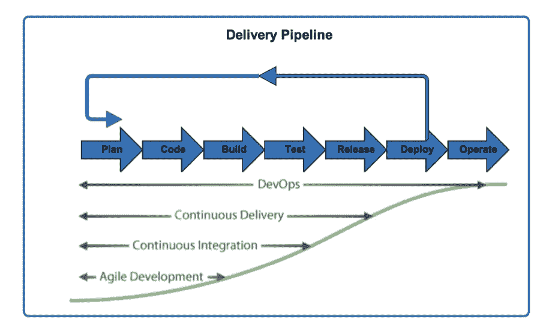

# 沿着涅磐的简单道路到达 DevOps

> 原文：<https://devops.com/follow-simple-path-nirvana-devops/>

也许这篇文章的标题是一个误导，因为没有什么是真正“简单”的。但是，对于任何规模的公司来说，实现 DevOps 目标都有一条明确的途径。只要通过采用敏捷、持续集成和持续交付的原则，遵循一个逐步增加的模式，您将达到您的 DevOps 目标。这条道路是 DevOps 成熟度的自然发展，组织可以在采用关键原则和技术解决方案的同时遵循这条道路。

## 敏捷开发

采用敏捷开发方法通常是成熟的组织采取的第一步，因为他们无疑已经听说了放弃瀑布软件开发生命周期的巨大好处。这是迈出第一步的原因。它帮助您的组织的员工成长为一个紧密结合的工作机器，促进降低技术债务的改进，同时还专注于构建关键功能。

随着敏捷团队的不断成熟，他们已经拉拢了关键的业务利益相关者，这些利益相关者能够掌握技术挑战的驱动因素，并且能够平衡业务的增长需求和技术团队的可持续性需求。突然间，团队投入了至少 20%的冲刺时间来处理技术债务，并向他们的产品所有者报告这些胜利。这些小胜利变成了大胜利，因为业务中笨重的基础设施和软件成为了过去的遗迹和传说。

但是敏捷开发之所以是最关键的第一步，还有一个潜在的原因:它真正赋予了开发人员改善客户体验的能力，并让他们感觉良好。有了 scrum master 的保护，团队就不会精疲力尽，并确保 sprint 计划的发生，团队成员更有可能对他们的工作以及他们的努力对业务和客户的结果充满热情。这是 DevOps 赋能的真正开始。

## 连续累计

随着团队沿着敏捷开发连续体走向成熟，他们 DevOps 成熟的下一步是走向持续集成。持续集成是公司自动化其软件构建过程的过程:代码签入触发构建作业，然后触发测试验证作业，等等。这个过程使团队能够不断地将他们的代码构建与下游过程集成，避免手动接触点。

此外，这种范式允许更快的反馈循环，以确保更高质量的产品，并使不同的团队能够利用自动化作为“中间人”一起工作

## 连续交货

DevOps 成熟的第三步是连续输送。企业经常混淆“交付”和“部署”——事实上，连续交付只是确保公司软件在任何给定时间点都处于可部署状态的过程。这对于快速迭代、A/B 测试以及更成熟的快速和经常取悦客户的方式非常有用。

连续交付的一个关键组成部分是确保软件为生产做好准备。当一个团队正在进行连续交付时，他们确信他们是敏捷的、反应灵敏的，并且坚持最高的质量标准。

## DevOps

至此，公司达到了 DevOps 涅槃状态。在这种情况下，软件不仅仅是连续交付的，而且所有的操作需求都是不断得到满足的。监控、度量、自动回滚软件版本的能力、可伸缩性等等是强大的 DevOps 组织的关键组成部分。

借助 DevOps 采用的这一深思熟虑的逐步流程，组织可以毫不妥协地以一种有意识且有凝聚力的方式满足业务需求。

我很乐意在 [@jsin](https://twitter.com/jsin) 听到任何关于 DevOps 的反馈或建议。

## 关于作者/杰森·肖恩

Jason Shawn 是开发运维及云计算领域的技术领导者。他的职业生涯始于软件开发人员，曾担任过多个职能和管理职位，这使他对软件开发生命周期有着独特的见解。他对持续交付、敏捷软件开发以及授权团队在日常生活中采用 DevOps 和敏捷原则充满热情。他还是 Cloudbees 客户顾问委员会的成员，喜欢公开演讲、旅行和与家人在一起。