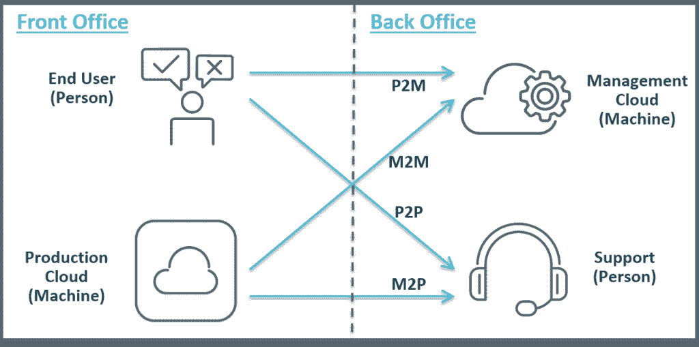

# 关闭 DevOps 反馈回路的四个关键向量

> 原文：<https://devops.com/four-key-vectors-closing-devops-feedback-loop/>

关于 DevOps，我经常被问到的一个问题是——也是所有 DevOps 幻灯片艺术家的一个长期挑战——我们所说的“闭合反馈回路”到底是什么意思

**问:您提到“关闭反馈回路”是什么意思？Ops 现在监控我们的系统，并在需要时提醒开发人员(下一步，开发人员携带寻呼机！).这是同一个空调吗？**

是的，这绝对是等式的一部分。从运营(及更多)到开发(及更多)的反馈——通过警报、监控、日志条目、服务单或口头——是至关重要的。例如，良好的快速反馈有助于:

*   将开发和运营与用户体验更紧密地联系起来
*   建立共享的洞察力以取代脆弱的部落知识
*   培养两个团队在整个服务中的所有权
*   对问题或新需求做出快速响应
*   鼓励更快的实验和对失败的容忍

在较小的组织中，反馈循环往往相对简单——只需俯身告诉你的同事正在发生什么，或者编程监控系统向你发送警报。然而，对于更大的组织来说，团队的多样性、事件的数量、[职责的分离](https://devops.com/blogs/enterprise-devops/ensuring-security-managing-risk-enterprise-devops/)以及反馈的多样性会使这变得更难处理。

在较大的组织中，我认为有四个关键向量用于结束 DevOps 反馈循环:

*   机器对人(M2P)
*   个人对个人(P2P)
*   机器对机器(M2M)
*   人对机器(P2M)

我试着在下面举例说明了这 4 个向量(我不是任何类型的图形艺术家，我喜欢任何关于这个图像的反馈):

**机器对人(M2P)**

这或多或少是原始问题提出的警报周期——机器流程(例如性能监控)发现了一个错误情况，它无法将其识别为“已知可解决”的问题，因此将其转发给负责人。机器可以通过智能流程编排自动解决许多问题——回滚版本、增加容量、修改配置、迁移工作负载、重启服务——但有时需要人来解决困难和/或不常见的问题。

**个人对个人(P2P)**

这只是经典的“热线”反馈，应用程序用户(内部或外部)直接与 IT 人员(如帮助台人员)交谈。这可能是最强有力的反馈。它不仅可以帮助识别缺陷，还可以识别改进的机会——从新功能到全新的服务。然而，要使这种个人反馈有用，必须将其转移到开发或运营流程中，例如更新配置脚本，或作为未来发布计划的输入。

**机器对机器(M2M)**

这包括自动解决问题(例如，监控检测到性能瓶颈，触发配置引擎添加额外容量)，还包括数据挖掘，它反馈“真实”生产数据以构建更真实的测试和 QA 环境，或提供更准确的容量规划。这种反馈使 prod 更加稳定，使 QA 和测试更加真实，减少了人为和流程错误，并有助于从 SDLC 的开始就将可伸缩性构建到应用程序中。

**人对机(P2M)**

这可以采取多种形式，例如最终用户将问题记录到自助服务门户或服务台，或者对移动应用程序进行评级，或者在线投诉。自动化可以触发对已知问题的解决，因此最终用户可以自动解决问题；或者反馈可以到达产品所有者，以解决常见的用户投诉。然而，P2M 反馈可能会浪费资源并增加技术债务，因为可解决的问题被反复修复而不是永久修复；或者用户投诉被忽略。

**最终提示**

这四个积极反馈的向量只是一个起点，但描述了一个框架，企业在寻求关闭和加速您的反馈循环时可以遵循这个框架。还要记住，在 DevOps 模式下，反馈需要更快、更准确，尤其是在大型组织中，它不仅需要与开发和运营部门联系，还需要与其他利益相关方联系，包括业务负责人、测试和 QA 团队、安全团队，当然还有最终用户。

你的反馈回路是什么？你涵盖了所有四个向量吗？你还有我遗漏的吗？请在下面的评论中告诉我——一如既往，我很乐意收到你的来信。