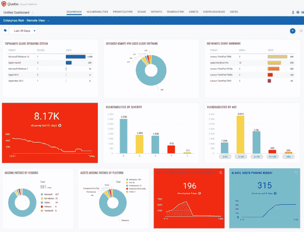

# Qualys 提供的免费远程终端保护解决方案

> 原文：<https://devops.com/free-remote-endpoint-protection-solution-from-qualys/>

Qualys 今天宣布，它将提供完全免费的 60 天版本的基于云的远程终端保护解决方案。该产品功能齐全，在免费版中没有关闭任何功能。它也是基于云的，所以不用担心托管解决方案。这来得正是时候，有这么多员工远程工作。

您可以从以下网址下载免费解决方案:

[**www.qualys.com/forms/remote-endpoint**](https://www.qualys.com/forms/remote-endpoint)

**根据 Qualys 发布的消息:**

***“Qualys 远程终端安全解决方案允许安全团队利用轻量级 Qualys 云代理来:***

*   ***完成所有远程终端硬件及其运行的应用程序的最新清单***
*   ***实时了解影响操作系统和应用程序的所有关键漏洞，这些漏洞会给这些设备带来风险***
*   ***只需点击一下鼠标，即可在数小时内从云中远程修补这些系统，而无需使用 VPN 网关上有限的可用带宽***
*   ***通过跟踪导致终端暴露于漏洞的常见错误配置，实现设备健康的可见性。"***

**DevOps.com 与 Qualys 总裁 Sumedh Thakar 就这一新的免费解决方案进行了交谈。下面可以听到这段对话:**

 **[https://w.soundcloud.com/player/?url=https%3A//api.soundcloud.com/tracks/781753402%3Fsecret_token%3Ds-71NVJkp6AxZ&color=%23ff5500&auto_play=false&hide_related=false&show_comments=true&show_user=true&show_reposts=false&show_teaser=true](https://w.soundcloud.com/player/?url=https%3A//api.soundcloud.com/tracks/781753402%3Fsecret_token%3Ds-71NVJkp6AxZ&color=%23ff5500&auto_play=false&hide_related=false&show_comments=true&show_user=true&show_reposts=false&show_teaser=true)** 

**这是该解决方案基于 web 的界面的屏幕截图:**

****

**你问的 60 天后会发生什么？Qualys 没有明确地说对此有什么计划，但我怀疑这将取决于我们的经济和在家工作的趋势。同时，如果您正在为企业寻找远程终端解决方案，这是免费试用 60 天的绝佳机会。**

**— [Alan Shimel](https://devops.com/author/ashimmy/)**