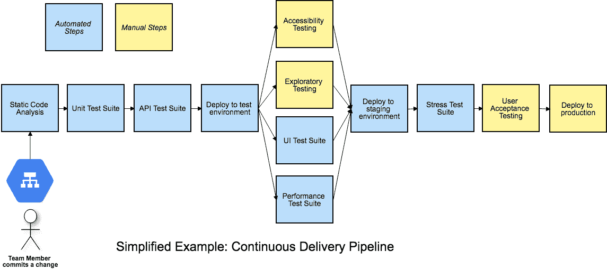
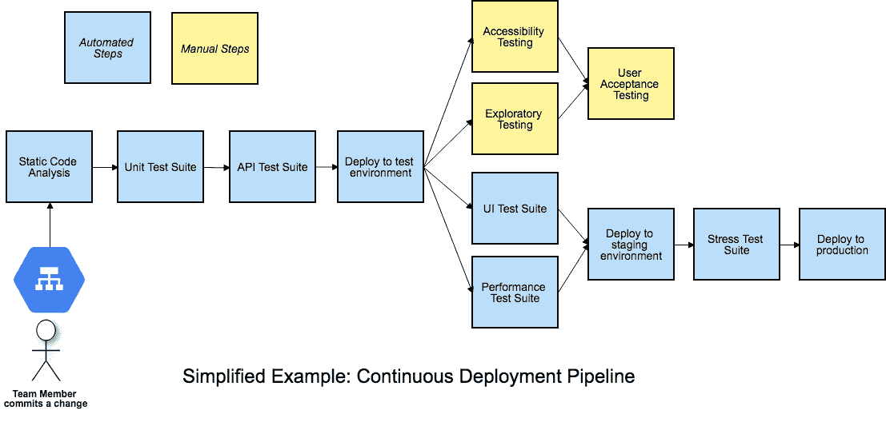

# 消除管道中的测试瓶颈

> 原文：<https://devops.com/get-testing-bottlenecks-out-of-your-pipelines/>

早在 2009 年，当我阅读 Jez Humble 和 David Farley 的《持续交付:通过构建、测试和部署自动化的可靠软件发布》时，我第一次知道了术语“部署管道”。每当团队成员提交对源代码库的变更时，构建、部署、测试和发布过程的端到端自动化就开始了。

这本书的第 5 章指出，所有项目通用的测试形式包括手动测试阶段，这些阶段“…断言系统是可用的并且满足它的需求，检测任何自动化测试没有发现的缺陷，并且验证它为它的用户提供了价值。这些阶段通常包括探索性测试环境、集成环境和 UAT(用户验收测试)。”

Humble 和 Farley 将这些手动阶段包括在部署管道中，也称为持续集成(CI)管道、构建管道或交付管道。然而，根据我的观察，我认为很多时候人们会忘记这些重要的手工步骤。

尽管由于技术的进步，我们可以用测试自动化做越来越多的事情，但是手工测试活动仍然存在于大多数业务领域中。几年前，当我们开始转向连续交付(CD)时，我自己的前一个团队意识到了这一点，每周两次部署到生产中。更小的变更和更频繁的部署意味着回归失败的风险更低。然而，我们仍然在努力适应重要的手工测试活动。

每当我的跨职能交付团队遇到问题时，我都会想办法让它变得可见，帮助我们讨论它，集思广益来解决它。当我从[艾比·邦瑟](https://twitter.com/a_bangser)和[阿什利·汉斯伯格](https://twitter.com/aahunsberger)那里学会可视化我们的管道的技术时，我对人工阶段的“啊哈”时刻到来了。我的团队知道我们有这些手工测试活动，没有它们我们不会有信心发布变更，但是我们并没有真正把它们看作是流水线中的阶段。

## 可视化您的管道–包括手动阶段

Figure 1: A Continuous Delivery Pipeline (my diagrams are inspired by Katrina Clokie’s pipeline diagrams in “A Practical Guide to Testing in DevOps”)

召集你的团队来可视化你的管道是找到改进方法的好方法。聚集在一张桌子周围，用卡片或便签纸，或者在白板上画画——你的管道中的所有步骤是什么，包括手动步骤？在图 1 中，团队 CD 管道中的手工阶段以黄色显示。在企业决定按下按钮并部署到生产之前，所有自动化和手动的事情都需要发生。显而易见，这些手动阶段会成为瓶颈。手动探索性测试可能比自动化测试套件花费更长的时间。如果用户接受度测试需要由特定的业务涉众来完成，而他们在正确的时间不可用，那么发布就会被推迟。如果团队希望转移到持续部署，在持续部署中，一旦所有阶段成功完成，产品的每一个变更都将投入生产，那么这些手动阶段将会成为障碍。

当你让包括开发人员、数据库专家、操作专家和产品所有者在内的整个团队参与解决这些问题时，你可能会发现解决这些问题的创新方法。在我的团队中，我们决定团队中的每个人都需要帮助进行探索性测试，这样我们就可以及时地完成它。测试人员通过实践研讨会和与他们配对来帮助开发人员学习探索性的测试技巧。然后，每个开发一个故事的开发人员在宣布故事结束之前，都要在故事级别进行探索性测试。我们在史诗级或特性级编写了探索性测试章程，作为我们 backlog 中的故事。当足够多的故事完成时，团队中的任何人，包括测试人员和产品负责人，都可以拿起这些章程。

如果我们不能在下一次生产部署之前完成所有必要的探索性测试，我们就使用[特性标志](https://martinfowler.com/articles/feature-toggles.html)向客户隐藏变更，直到我们完成测试。我们可以继续部署变更，并等到确信它们不会给客户带来任何麻烦时再发布。

## 异步测试阶段

使用特性标志或切换是一个很好的方法，允许团队异步地处理一些手动测试活动，因此它们不会阻碍部署管道。如果一些必需的手动可访问性、测试需要额外的一天来完成，或者 UAT 必须推迟一周，部署仍然会发生。可以为一小部分用户打开更改，并在生产中观察是否有任何意外行为发生。无论需要什么活动来安全地发布一个特定的变更，都不需要阻碍其他已经准备好供客户使用的变更。

Figure 2: Asynchronous stages in a deployment pipeline

图 2 是一个连续部署管道的例子，但是这种手工阶段的异步方法也适用于连续交付。每次团队成员提交变更时，如果管道中的所有自动化阶段都通过了，那么发布候选版本将被部署到生产中。手动测试活动与其他步骤不一致，不会阻碍部署。

如果我们准备好部署一个特性，但是需要在发布之前完成那些手动测试阶段，开发人员可以将一个特性标志设置为“off ”,以防止它暴露给客户。当异步手动阶段全部完成并成功时，可以在生产中启用功能标志。这是实际版本，客户现在可以使用该功能。应该尽快删除功能标志，因为一次删除太多的功能标志会有严重的风险。

使用特性标志或切换来允许在所有测试阶段完成之前将变更部署到生产环境中，是避免瓶颈并成功进行连续交付或部署的一种方式。[持续交付](https://devops.com/death-of-the-release-the-move-to-continuous-delivery-and-experimentation/)和部署成功依赖于频繁的小变化，而不是大爆炸式的发布。保持低库存的精益方法是可取的。

## 和你的团队一起想象它

我们已经研究了一种防止手动管道阶段阻碍部署的方法，但是您的团队可能还有其他的解决方案。CD 还有很多其他关键的成功因素，比如保持小规模和频繁的变化。当你的团队，或者一个代表性的 it 部门，聚在一起，用一个可视化的管道模型进行实验时，有很多东西需要讨论和集思广益。谈论你需要从每个管道阶段学到什么，谁需要知道，管道是否提供可操作的反馈。

作为一名测试人员，我有时会质疑管道中其他人没有想到的方面。拥有开发、运营、数据库和其他技能的团队成员意味着更有可能找到创造性的解决方案。我们的渠道提供了一个主要的反馈回路，我们希望尽快得到反馈。将每个阶段写在卡片上，并将它们排列在桌子或墙上，这通常会引发并行化更多阶段或实现特定阶段的想法，这是不必要的，或者可以由开发人员在本地完成。

将所有可行的事情自动化。使用您节省的时间来优化您完成手动测试活动的方式，并且尽可能地自动化更多的活动。掌握一些技巧，比如特性标记，这样你就可以花时间对你发布的每个新特性充满信心。

### 参考

“持续交付:通过构建、测试和部署自动化实现可靠的软件发布”，Jez Humble 和 David Farley，[https://continuousdelivery.com](https://continuousdelivery.com)

“DevOps 测试实用指南”，卡特琳娜·克洛基，[https://leanpub.com/testingindevops](https://leanpub.com/testingindevops)

“功能切换，又名功能标志，”皮特·霍兹贡，[https://martinfowler.com/articles/feature-toggles.html](https://martinfowler.com/articles/feature-toggles.html)

— [丽莎·克里斯平](https://devops.com/author/lisa-crispin/)