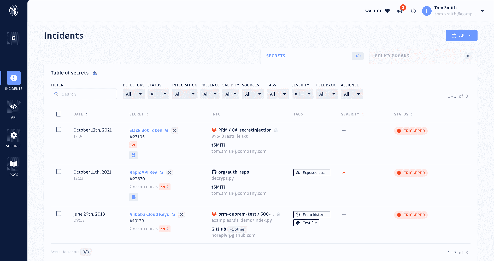

# GitGuardian 加强了与 GitHub 的集成，以保护机密

> 原文：<https://devops.com/gitguardian-tightens-integration-with-github-to-secure-secrets/>

GitGuardian 通过提供与 GitHub 的深度集成，扩展了其保护代码库的能力。

GitGuardian 的产品营销经理 Ziad Ghalleb 表示，安全扫描的结果[现在与补救问题的建议](https://www.globenewswire.com/news-release/2022/06/21/2466462/0/en/GitGuardian-invests-in-the-developer-experience-for-large-scale-enterprise-deployments.html)一起在拉式请求的上下文中提供。

该公司还通过添加与其命令行界面(CLI)集成的应用编程接口(API)密钥供应机制，扩展了开发人员入职选项，此外还简化了 CLI 的配置。

最后，GitGuardian 将对基于角色的访问控制(RBAC)的支持扩展到其平台，以便团队成员可以根据其角色分配不同的事件权限级别。

GitGuardian 可以扫描源代码，实时检测代码库中的 API 密钥、密码、证书、加密密钥和其他敏感数据。为了方便起见，开发人员在构建应用程序时通常会将秘密作为纯文本轻松访问。然而，当这些应用程序部署在生产环境中时，开发人员经常忘记删除这些秘密。网络罪犯知道如何扫描这些秘密，以便更容易地破坏应用程序环境。

最近的一份 GitGuardian [报告](https://devops.com/gitguardian-reports-careless-handling-of-application-secrets/)发现，一家拥有 400 名开发人员的典型公司在扫描其整个代码库时会发现 1050 个独特的硬编码秘密。报告指出，每个秘密有 13 种不同的出现，这意味着修复这些相关漏洞所需的努力将是相当大的。

当然，随着越来越多的组织在一系列引人注目的安全违规事件后审查其软件供应链流程，机密管理正得到越来越多的关注。Ghalleb 说，GitGuardian 通过与 GitHub 集成，使在一组 DevSecOps 最佳实践的背景下实现这一目标变得更加简单。

就采用 DevSecOps 最佳实践而言，现在还为时尚早，但是很明显，应用程序安全性的更多责任正在转移到开发人员身上。面临的挑战是，许多开发人员仍然缺乏必要的工具来确保应用程序在部署到生产环境之前是安全的。

自然，应用程序安全问题解决得越早，修复的成本就越低。机密管理的问题是，网络安全团队通常更关注发现漏洞，而不是寻找安全措施不力的凭据。一旦应用程序被部署到生产环境中，可能要过几个月才会有人发现存在问题——如果发现的话。事实上，在生产环境中运行的存在秘密管理问题的现有应用程序的数量可能是惊人的。

无论如何，这些问题浮出水面只是时间问题。与此同时，DevOps 团队可以在应用程序部署到生产环境之前，更轻松地发现应用程序中的秘密，从而减少可能存在此问题的应用程序的数量。毕竟，唯一比秘密被网络安全团队发现更糟糕的事情是，秘密被网络罪犯发现，并利用它进行破坏。