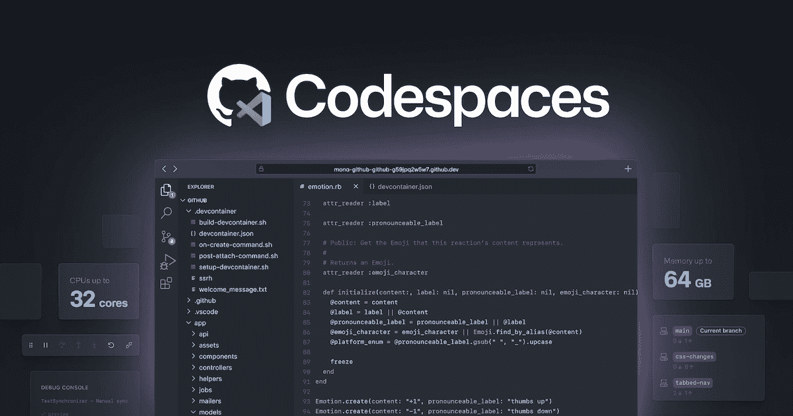

# GitHub 扩展开发人员生产力工具组合

> 原文：<https://devops.com/github-expands-developer-productivity-tools-portfolio/>

在在线 [GitHub Universe 2021](https://www.githubuniverse.com/?false=120820&reg_type_id=120820) 会议期间，GitHub 今天发布了一系列更新，旨在通过让开发人员更容易更快地编写代码和更容易地协作来提高开发人员的生产力。

GitHub 与研发实验室 OpenAI 合作开发的 GitHub Copilot 工具旨在帮助开发人员更快地编写更好的代码，该工具正在通过技术预览版进行扩展，以添加对 Java 和集成开发环境(IDE) JetBrains 的支持。

此外，GitHib 为预配置开发环境提供的代码空间工具正在扩展，以包括对 devcontainer 功能组合、GitHub 命令行接口(CLI)和 REST 应用程序编程接口(API)以及附加访问控制的支持。

[GitHub](https://devops.com/?s=GitHub) Actions 也进行了更新，除了提供对部署环境的访问以简化审批、改进可重复使用的工作流和自托管跑步者的自动扩展功能之外，还增加了对使用 OpenID Connect 标准的部署的支持。

现在还有一个测试版的命令面板工具，可以帮助开发人员浏览 GitHub，还有一个 GitHub 问题工具的公共测试版，可以让开发人员更简单地对问题进行过滤、排序和分组，并拉取请求。自 GitHub 问题首次预览以来，已经添加的其他功能包括迭代支持、报告和数据可视化工具，以及在公共项目中使用它的能力。

最后，GitHub 在测试版中增加了对 Ruby 作为编程语言的支持，CodeQL 分析引擎现在可以扫描漏洞以及定制访问 GitHub 企业云权限的能力。

GitHub 产品管理副总裁瑞安·萨尔瓦(Ryan Salva)表示，GitHub 致力于通过开发人员编写代码时自动完成代码来提高开发人员的工作效率。对其他编程语言的支持也将在未来几个月内推出。Salva 指出，目标不是利用人工智能取代开发人员，而是消除阻碍开发人员变得更有创造力的繁重工作。

Salva 补充说，不会很快有一天开发人员不必打字来编写代码，但有可能利用人工智能来提供一种减少编码错误的提前打字能力。

Salva 说，我们的目标应该是让开发人员能够在越来越多的组织使用推动广泛数字业务流程转型计划的应用程序的时候，创造更多的应用程序体验。

Salva 指出，作为这项工作的一部分，减少开发人员在编写代码时遇到的摩擦也很重要，首先要设置开发环境本身。

目前还不清楚对开发人员生产力和协作的关注会对应用程序的构建和部署速度产生什么影响。然而，随着开发人员变得更加高效，可以同时启动的应用程序开发项目的数量应该会增加。事实上，可能有一天，如果不采用依赖于更高级别的自动化来安装软件的连续交付最佳实践，应用程序的构建速度会快于组织部署它们的速度。

然而，不管应用程序交付的挑战如何，这是一个大多数组织现在都认为自己幸运拥有的问题。