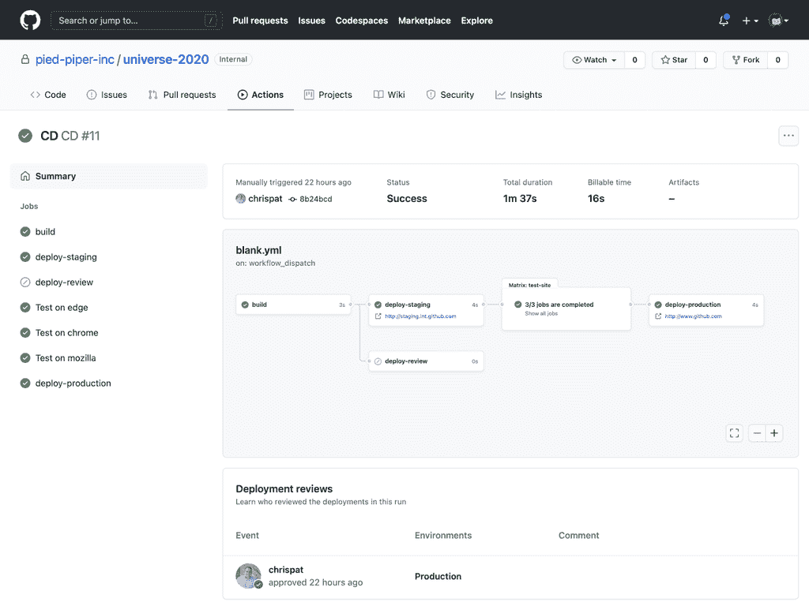

# GitHub 为内部 IT 环境更新服务器平台

> 原文：<https://devops.com/github-updates-server-platform-for-on-prem-it-environs/>

GitHub 本周推出了一系列产品[包括对其服务器平台的更新，其中包括对基于](https://github.blog/2020-12-08-new-from-universe-2020-dark-mode-github-sponsors-for-companies-and-more/) [Git](https://devops.com/?s=Git) 的内部版本源代码库的重大更新。

GitHub 首席执行官 Nat Friedman 通过一个预先录制的视频指出，GitHub Enterprise Server 3.0 版本是 GitHub Enterprise Server 多年来对该平台的首次更新。它带来了对 GitHub 操作和包等功能的支持，以及对代码扫描和测试版秘密扫描功能的支持，GitHub 已经通过其云服务提供了这一功能。

GitHub Enterprise 3.0 服务器平台现在也支持 GitHub Mobile，使开发人员能够远程工作。
微软子公司也正在扩展其云服务的功能，增加了测试版中的自动合并功能，允许拉请求的作者选择在所需的审查或状态检查通过后自动合并拉请求。以前，开发运维团队需要等到“拉”请求完成后才能继续下一个任务。

GitHub 还宣布，它之前预览的讨论协作工具现在可以在所有公共存储库中作为公开测试版获得。该公司计划很快将该功能扩展到 GitHub Mobile。

测试版中添加的其他功能包括更轻松地隔离团队成员之间的工作流的环境、依赖性审查工具、对所需审查者的支持、对部署和部署日志的访问以及 DevOps 管道的工作流可视化工具。

GitHub 还为 DevOps 团队提供了一个测试版的黑暗模式选项。

最后，GitHub 已经扩展了它的 GitHub 赞助商计划，使组织能够直接向从事特定开源项目的开发者提供资金。弗莱德曼指出，这些贡献者中的许多人发现，他们可以通过贡献，像以前为一个雇主一样赚钱。

弗里德曼说，GitHub 一如既往地致力于继续改善开发者体验。自然，这些能力将继续首先在 GitHub 云平台上体现出来。

这在多大程度上符合那些喜欢使用他们部署和控制的存储库来开发应用程序的 IT 组织，还有待观察。虽然越来越多的应用程序开发发生在云中，但仍有许多组织对在任何类型的云平台上提供知识产权持谨慎态度。许多组织也在寻求混合方法，根据应用程序开发项目的敏感性，混合使用基于 Git 的存储库。

不管使用的是什么样的 Git 存储库，由 GitOps 流程支持的自动化工作流正在得到越来越广泛的应用。不太清楚的是，当企业 it 环境变得更加混合时，这些 GitOps 工作流将需要在多大程度上跨多个 Git 存储库扩展。在这些环境中，本地和基于云的 Git 存储库之间的对等性将很快成为一个基本需求。