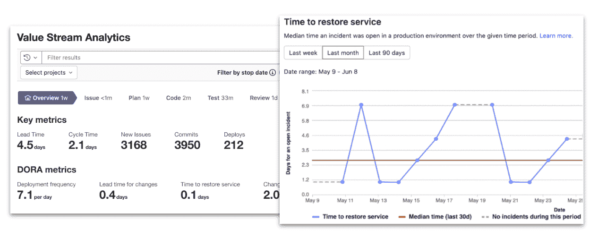

# GitLab 将可观测性嵌入 CI/CD 平台

> 原文：<https://devops.com/gitlab-embeds-observability-in-ci-cd-platform/>

GitLab 持续集成/持续交付(CI/CD)平台的最新版本增加了一系列监控和可视化功能，作为在未来一年内在核心平台中嵌入全套可观察性功能的努力的一部分。

作为这项工作的一部分，[git lab 的最新版本 15.1，](https://about.gitlab.com/releases/2022/06/22/gitlab-15-1-released/)现在增加了对 DevOps 研究和评估( [DORA](https://devops.com/?s=DORA+metrics) )团队定义的所有指标的支持，该团队也是谷歌的一部分。

GitLab 平台的 15.1 版本总共有 30 多个更新。这些包括额外的安全功能，其形式是支持安全断言标记语言(SAML)组同步和由 Google 定义的软件工件的供应链级别( [SLSA](https://devops.com/?s=SLSA) )框架。

最后，GitLab 将 CI/CD 平台中包含的所有配置文件和模板的链接添加到管道编辑器中，使管理大型复杂管道变得更加容易。

GitLab 产品营销总监辛迪·布莱克(Cindy Blake)表示，该平台增加的监控、可观察性和安全功能是消除“数字管道胶带”的持续努力的一部分，许多 DevOps 团队目前依赖数字管道胶带来扩展 CI/CD 平台。Blake 指出，事实上，随着许多 DevOps 团队寻求更好地保护他们的软件供应链，许多人现在正在利用这个时机，用基于公共代码库的集成 CI/CD 平台来取代 DIY 方法。

Blake 说，作为这项工作的一部分，GitLab 正在构建自己的动态应用安全测试(DAST)工具，这些工具将与其 CI/CD 平台更紧密地集成在一起。

总的来说，现在有一种期望，即保护软件供应链所需的工具应在 CI/CD 平台中可用，但组织仍在努力完成实现该目标所需的流程，Blake 补充道。

目前还不清楚随着应用程序开发和部署的现代化，组织希望在多大程度上取代传统的 CI/CD 平台。然而，在许多情况下，与维护其 DevOps 环境中的定制集成相关的技术债务变得相当大。许多组织正在重新审视他们的 DevOps 工作流，作为提高整体开发人员生产力的努力的一部分。当然，挑战在于从一个 CI/CD 平台迁移到另一个平台需要相当多的时间和精力。

与此同时，采用 DevOps 最佳实践的组织数量持续增长。GitLab 认为，随着 CI/CD 市场的总规模继续扩大，这些组织中的大多数将更喜欢集成平台，而不是自己编写和维护定制集成。

无论采用何种方法，监控和观察工作流的能力都是任何 DevOps 工作流的基本要素。当然，可观测平台并不缺乏。目前还不清楚 It 组织是否会采用这些产品中的一种，而不是利用嵌入在 CI/CD 平台中的可观察性和监控。然而，无论如何，发现任何 it 问题的根本原因变得越来越容易。