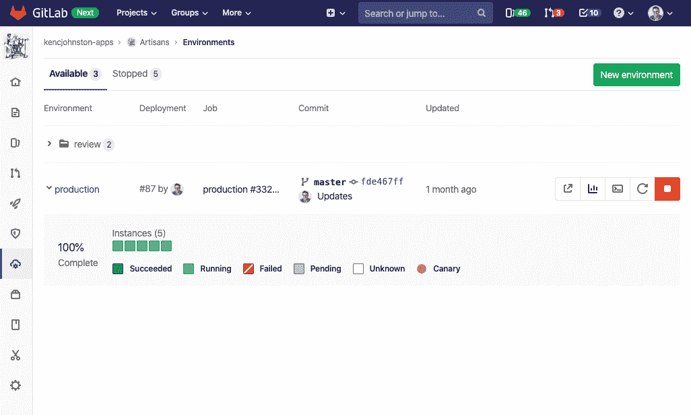

# GitLab 开源监控工具

> 原文：<https://devops.com/gitlab-open-sources-monitoring-tools/>

GitLab 已经决定[将其监控和可观察性工具作为其核心开源平台](https://about.gitlab.com/blog/2019/12/16/observability/)的一部分，以帮助降低 DevOps 的总成本。以前，这些工具是作为 GitLab 的 DevOps 平台中的商业工具的一部分提供的。

GitLab 的产品/运营产品总监肯尼·约翰斯顿表示，随着可观察性的责任向左转移，很明显开发者现在对使用哪些监控工具施加了更多的影响。他说，随着开发人员开始在应用程序开发过程的早期使用监控工具，他们中的大多数人更喜欢开源工具，因为不清楚正在开发的应用程序是否会进入生产环境。

然而，如果应用程序确实进入了生产环境，开发人员就很难对他们使用的任何监控工具进行标准化，以取代 it 运营团队使用的现有商业产品。除了降低成本，GitLab 方法还可以在应用程序从开发环境进入生产环境时消除 DevOps 环境中的任何潜在摩擦。

GitLab 将其监控工具作为开源软件提供的举动，正值更多用于收集数据的遥测应用程序也基于开源软件。此外，基于容器的现代云原生应用程序的开发者正在利用在云原生计算基金会(CNCF)赞助下开发的开源 Prometheus 监控软件来监控他们的应用程序。GitLab 已经提供了与 Prometheus 的集成。

GitLab 还明确表示，它希望其监控工具能够受益于更多开发者的贡献。具体来说，GitLab 呼吁在与 Prometheus 的持续集成以及改进的日志记录、跟踪和警报功能方面提供帮助。

目前还不清楚 DevOps 团队在多大程度上更喜欢依赖开源工具而不是商业监控工具。虽然开源工具在成本方面有一些明显的优势，但许多组织已经为各种现有应用程序标准化了商业监控工具。开源工具通常更难部署，并且不太可能为 IT 运营团队提供足够的观察深度。此外，大多数商业监控工具提供商正在将他们的产品与开源遥测软件和 Prometheus 相集成，以弥合应用程序在生产环境中开发和部署时可能出现的任何分歧。

有一点很清楚，随着开发人员越来越多地对其应用程序在生产环境中的性能负责，IT 环境中会有更多的人使用这些工具。此外，现代应用需要监控工具来了解微服务之间存在的所有依赖关系。以前，由于成本问题，IT 运营团队倾向于将基于商业软件的监控工具限制在其最关键的应用程序中使用。随着开源监控工具的兴起，更广泛地应用监控的机会变得更加经济可行。

无论选择哪种发展方向，对 IT 环境的了解越多，就越容易采用最佳开发运维实践。

— [迈克·维扎德](https://devops.com/author/mike-vizard/)