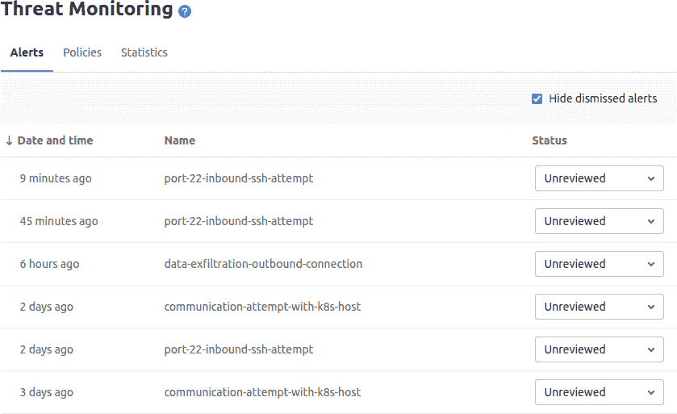

# GitLab 发布 CI/CD 平台更新

> 原文：<https://devops.com/gitlab-releases-updates-to-ci-cd-platform/>

GitLab 本周[发布了 13.9 更新](https://about.gitlab.com/releases/2021/02/22/gitlab-13-9-released/)，为其同名开源持续集成/持续交付(CI/CD)平台增加了 60 多项新功能和更新功能。

GitLab 的产品营销经理 Brian Glanz 表示，这些功能中最主要的是一个安全警报仪表板，它使 DevOps 团队能够更容易地筛选高优先级警报。Glanz 说，随着越来越多的组织采用 DevSecOps 最佳流程，应用程序开发团队需要能够优先考虑哪些安全问题比其他问题更紧迫。

其他新功能包括重用 CI/CD 配置管道的能力，以及在执行管理任务时保持实例可用的维护模式选项。

此外，除了能够查看所有**包含**和**扩展**配置合并在一起的管道配置版本之外，现在还可以查看发布指标的组级分析。

Glanz 表示，GitLab 继续获得牵引力，因为它提供的所有功能都基于相同的集成代码库。Glanz 说，DevOps 团队利用新功能所需付出的努力比竞争对手平台要少得多。

与此同时，Glanz 指出，来自公司外部的 GitLab 贡献者的数量也在持续增加。最新版本有 299 个来自更广泛的 GitLab 社区的合并贡献。

目前还不清楚组织对替换现有 CI/CD 平台的兴趣有多大。然而，对于组织来说，由不同的 DevOps 团队使用多个 CI/CD 平台并不罕见。与此同时，企业 IT 组织中采用 DevSecOps 流程来推进数字化业务转型计划的团队数量持续上升。随着越来越多的组织意识到他们是如何依赖定制软件来区别于竞争对手，越来越多的企业 IT 组织将选择在单个 CI/CD 平台上实现标准化，以降低成本并提高整体效率。

GitLab 去年发布的一份报告指出，组织可以将应用程序开发和交付提高 87%，从而节省超过 2300 万美元。总体而言，该报告称，组织可以在 GitLab 平台上获得 407%的投资回报(ROI)。

当然，CI/CD 平台提供商之间的竞争仍然非常激烈。随着大多数开发人员在家工作以帮助对抗新冠肺炎疫情的传播，这些平台提供商一直在宣传他们支持远程工作的能力。现在还不清楚新冠肺炎疫苗正在分发，开发人员是否会集体回到办公室。然而，很明显，即使疫情平息了，应用程序代码的创建和维护方式也会变得更加流畅。许多组织现在更愿意在任何能找到开发人员的地方雇佣他们。

当然，这些开发人员中的许多人会对加入工作流不连贯的组织持谨慎态度，特别是当涉及到将应用程序安全的责任进一步转移给开发人员时。事实上，任何组织有效招募开发人员的能力现在都与其 DevOps 工作流的整体复杂性直接相关。