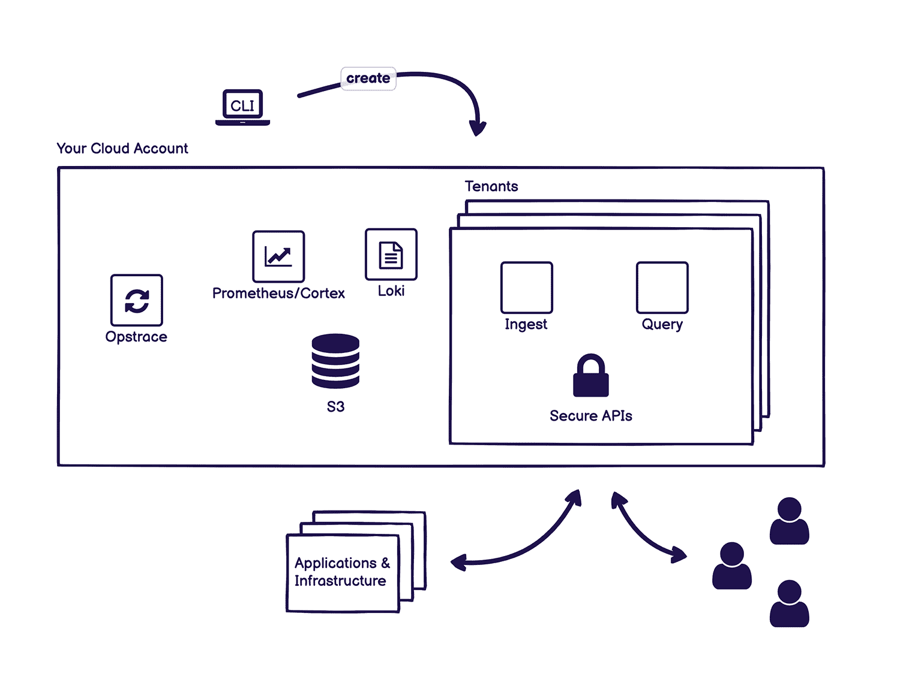

# GitLab 收购 Opstrace 后修改可观测性策略

> 原文：<https://devops.com/gitlab-revamps-observability-strategy-after-acquiring-opstrace/>

GitLab 计划在收购 Opstrace 后，使可观察性成为其持续集成/持续交付(CI/CD)平台[的一个更加集成的元素。](https://about.gitlab.com/press/releases/2021-12-14-gitlab-acquires-opstrace-to-expand-its-devops-platform-with-open-source-observability-solution.html)

Opstrace 的开源项目公开了一个由 Cortex for Prometheus 创建的可水平扩展的应用程序编程接口(API)，这是一个在云本地计算基金会(CNCF)的支持下推进的开源监控平台。然后，它利用 Loki API 来收集日志数据。

DevOps 团队还可以将 Prometheus 的现有实例指向 Opstrace 或他们用来收集日志数据的 Fluentd 或 Promtail 软件的任何实例，并支持各种其他 API，如计划中的 Datadog 代理。提供命令行界面(CLI)来设置 Opstrace 的实例，该实例创建一个控制器，通过该控制器来管理日志数据的收集。

GitLab 产品管理高级总监肯尼·约翰斯顿表示，作为使[可观察性](https://devops.com/?s=observability)更容易获得的持续努力的一部分，GitLab 计划为使用 GitLab 自我管理版本或软件即服务(SaaS)平台的组织默认集成 Opstrace 和 GitLab Monitor。

Opstrace 目前收集日志和指标，并计划支持分布式跟踪。Johnston 指出，目标是扩展 GitLab 已经在其 CI/CD 平台中提供的可观测性能力的整体范围。他补充说，目标是让 DevOps 团队更容易利用可观测性能力和询问数据来优化工作流，而无需获得单独的可观测性平台。

GitLab 打赌，随着 Prometheus 继续获得牵引力，更多的 DevOps 团队将更愿意将其触角延伸到可观测性领域，而不是必须管理一个单独的平台。

尽管可观察性一直是 DevOps 最佳实践的核心原则，但事实证明实现它是一个挑战。在最好的情况下，大多数组织可以根据预定义的指标持续监控 IT 环境，这些指标可以确定特定平台或应用程序何时在预期范围内运行。可观察性将指标、日志和跟踪(一种特殊的日志记录形式)结合起来，以一种更简单的方式对应用程序进行检测，从而解决问题，而不必仅仅依靠为监控特定流程或功能而创建的一组有限的预定义指标。

DevOps 团队接受可观测性的比率自然会有所不同。在 2022 年，最大的障碍可能不是技术，而是简单地了解哪些查询可以帮助开发运维团队在出现重大中断之前更好地了解 it 问题的根本原因。从长远来看，预计机器学习算法将利用可观测性平台收集的数据，在实际发生之前很久就自动识别可能导致中断的问题。

无论如何，即使在最复杂的 IT 环境中，辨别事件的能力也在稳步提高。无论这是作为监控的延伸还是通过拥抱真正的可观察性来实现的，可能都不那么重要——只要最终目标得以实现。