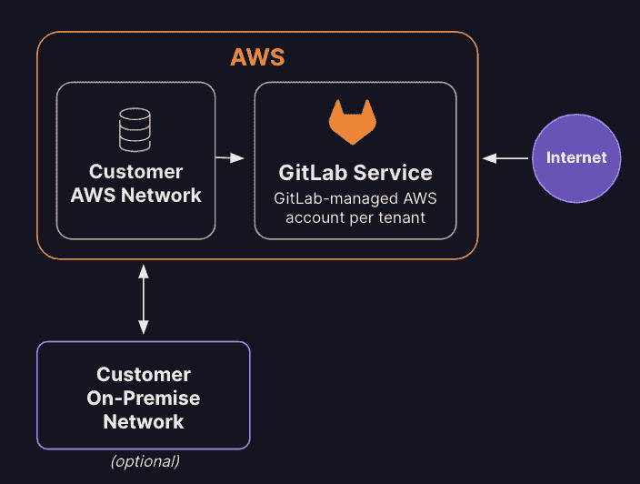

# GitLab 在云端推出专用 SaaS 版

> 原文：<https://devops.com/gitlab-unfurls-dedicated-saas-edition-in-the-cloud/>

GitLab 今天向有限数量的客户提供了其持续集成/持续交付(CI/CD)平台的软件即服务(SaaS)版本的单租户版本。

GitLab 产品副总裁 David DeSanto 表示, [GitLab Dedicated](https://www.globenewswire.com/en/news-release/2022/11/30/2565001/0/en/GitLab-Dedicated-Launches-to-Meet-Organizations-Complex-Compliance-Requirements.html) 选项提供了云平台的所有优势，而没有任何潜在的合规问题。

DeSanto 表示，该平台的单租户版本旨在部署在客户选择的云平台上，确保存储在云中的所有数据都是隔离的。此外，GitLab Dedicated 的访问是通过专用网络连接提供的，他补充说。

最初，GitLab Dedicated 将在亚马逊网络服务(AWS)云上提供，计划在 2023 年正式推出后支持其他云平台。

DeSanto 说，GitLab 实际上试图在低成本的多租户平台版本或要求组织自己部署平台的内部版本之间取得平衡。

总的来说，GitLab 预计这个平台的最新版本对在高度监管的行业中运营的组织最具吸引力。然而，他指出，越来越多的组织希望将他们的数据隔离在私有云中，以更好地保护他们的软件供应链。

在一系列高调的违规和漏洞披露之后，审查其[软件供应链](https://devops.com/?s=software+supply+chain)的组织数量有所增加。不太清楚的是，组织会在多大程度上锁定其现有的 CI/CD 平台，而不是用更安全、更易于通过云访问的现代替代方案来取代它。

当然，挑战在于替换 CI/CD 环境并不简单，因此组织需要考虑多年来定制其 CI/CD 环境所花费的时间和精力。在某些情况下，定制提供了有意义的竞争优势。然而，在其他情况下，维护所有这些定制变得比它的价值更麻烦。

每个组织都需要决定他们希望在多大程度上管理用于构建应用程序的 DevOps 平台。DeSanto 说，越来越多的组织决定，他们更愿意将尽可能多的资源用于编写代码，而不是管理用于创建应用程序的底层 CI/CD 平台。

无论采用何种方法，采用 DevOps 最佳实践来更快地构建和部署应用程序的组织数量都在不断增加。通过云访问的 CI/CD 平台降低了小型组织的准入门槛，这些组织通常不具备管理开发运维平台所需的技能和资源。

同时，基于 SaaS 的方法将显著增加使用 DevOps 工作流构建的应用程序的数量。DevOps 的采用水平自然会因组织而异。然而，随着越来越多的应用程序以令人难以置信的速度构建和部署，用于推动[数字业务转型](https://digitalcxo.com)计划的定制应用程序的总数将在未来几个月和几年内大幅增加。