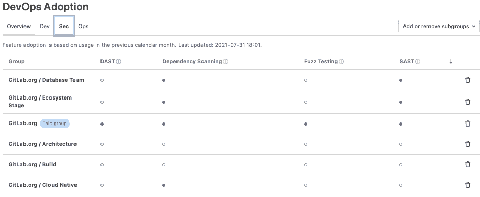

# GitLab 更新提高了开发人员的工作效率

> 原文：<https://devops.com/gitlab-updates-improve-developer-productivity/>

GitLab 本周发布了对其同名的持续集成/持续交付(CI/CD)平台的更新，主要解决提高[开发人员生产力](https://devops.com/?s=developer+productivity)的需求。

GitLab 高级产品营销经理 Parker Ennis 表示，GitLab 14.2 版本增加了实时降价预览功能，可以实时预览降价文件，用于创建丰富的网络内容，可以通过网络集成开发环境(IDE)或单个文件编辑器访问。Ennis 说，目标是消除从原始代码切换到单独的预览模式标签的需要。

与此同时，GitLab 现在可以直接在一个合并请求页面中启动 GitPod，这是一个用于在云中自动启动开发环境的工具，同时增加了更容易跟踪组织中哪些小组启用了依赖扫描和模糊测试的能力。以前，DevOps 团队只能通过应用编程接口(API)来跟踪这些 GitLab 特性的采用情况。

最后，GitLab 正在为 macOS 添加 Build Cloud 的测试版，这使得开发人员可以更容易地在 GitLab 的软件即服务(SaaS)版本上构建应用程序。

Ennis 说，在新冠肺炎疫情之后，SaaS 版 GitLab 的采用自然增加了，因为许多开发人员仍然在家工作。大多数 DevOps 团队现在专注于尝试提高开发人员的生产力；他指出，由于新冠肺炎病毒的新变种不断出现，预计他们不会很快回到办公室。

组织面临的挑战是，在疫情之后，随着组织竞相数字化转变业务流程，构建应用程序的速度比以往任何时候都要快。Ennis 补充说，因此，开发人员在彼此物理隔离的情况下工作的效率已成为一个主要问题。

开发人员的体验也很重要，因为开发人员跳槽从来没有这么容易过。不仅开发人员被大量招募，Ennis 指出，大多数 DevOps 领导人很少了解他们是如何支配时间的。他补充道，对于开发人员来说，在他们应该写代码的时候，浏览工作网站寻找新的机会相对容易。

目前还不清楚 CI/CD 平台可能会对整体开发者满意度产生多大影响。然而，Ennis 注意到 DevOps 过程变得越脱节，开发人员就越不喜欢他们的雇主。大多数开发人员希望能够花更多的时间编写代码，而不是管理管道和工作流。GitLab 正在为基于 CI/CD 平台的一组更加集成的 DevOps 工作流提供案例，该平台紧密集成了 DevOps 团队可能决定使用的所有模块。Ennis 指出，这种方法旨在吸引企业 IT 组织，这些组织通常没有很多时间和精力来集成构成 DevOps 工作流的模块。

当然，就企业普遍采用 DevOps 平台而言，现在还处于早期阶段。然而，随着更快交付软件的压力持续上升，重新审视应用程序开发过程的需求变得更加迫切。