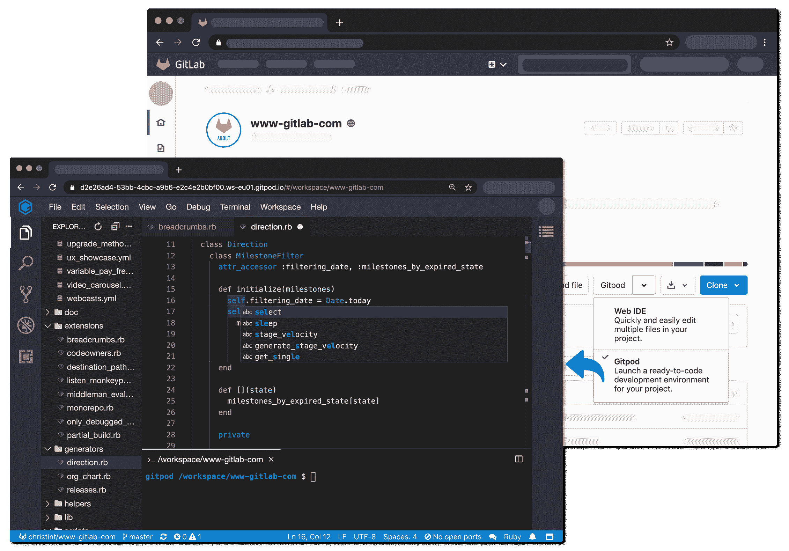

# Gitpod 与 GitLab 合作，自动设置开发环境

> 原文：<https://devops.com/gitpod-allies-with-gitlab-to-automate-setting-up-dev-environments/>

Gitpod 今天宣布，其用于自动化开发环境设置的开源工具[现已集成到 GitLab 持续集成/持续交付(CI/CD)平台](https://www.globenewswire.com/news-release/2020/10/08/2105627/0/en/Gitpod-Raises-3M-USD-Seed-Funding-Announces-Native-Integration-with-GitLab.html)。

Gitpod 平台将版本控制系统视为真理的规范来源，然后[自动化开发人员开始编码](https://devops.com/gitpod-open-sources-automated-local-development-environment/)所需的一切，包括集成开发环境(IDE)、插件、编译器、构建工具、代码生成器、数据库和应用服务器。

Gitpod 首席执行官 Sven Efftinge 刚刚筹集了另外 300 万美元的资金，他说，开发人员可以点击一个按钮，让他们在几分钟内开始编码，而不是浪费半个小时或更长时间等待一堆库和工具安装。

在 GitLab 的下一个版本中，开发人员还可以将 GitLab 的自我管理安装连接到 gitpod.io，这是一种可以注册多个 git 存储库的功能。此外，可以在 Kubernetes 集群上以与 GitLab 集成的方式自托管 Gitpod，或者在 Gitpod 中安装 GitLab VS 代码扩展以与 GitLab 交互。

Efftinge 表示，Gitpod 为 DevOps 团队提供了一种工具，可以跨任何 Git 存储库自动设置开发环境，这相当于 GitHub 最近推出的 [Codespaces](https://devops.com/github-extends-scope-and-reach-of-repository/) 工具。Efftinge 指出，大多数开发人员不是只为一个存储库拥有这种能力，而是为跨越多种类型的存储库的项目工作。

通过自动化建立开发环境的过程，使它们与生产环境保持一致也变得更加容易。代码在第一次部署时不能在生产环境中工作的原因之一是，本地开发环境是以不能准确反映生产环境的方式手动配置的。当开发人员在多个项目上工作时，这个问题变得更加棘手，例如，涉及使用不同存储库构建的独立微服务，这些存储库甚至可能不在同一个生产环境中运行。当团队成员在本地桌面环境的同一实例上实现标准化时，协作也变得更加容易。

Gitpod，原名 TypeFox，与 Google、Ericsson、Arm 和 Red Hat 合作开发了开源的 Eclipse 忒伊亚项目，该项目为使用 TypeScript、CSS 和 HTML 在云中构建 ide 提供了基础。忒伊亚现在是在 Eclipse 基金会的支持下发展起来的，它由运行在浏览器或本地桌面应用程序中的前端和运行在任何主机上的后端组成。两者都通过 WebSockets 上的 JSON RPC 进行通信。除了核心开源项目之外，Gitpod 还利用该项目构建了自己的基于云的服务。

在新冠肺炎疫情之后，人们自然更加关注自动化和开发人员的生产力。在可预见的未来，大多数开发人员将在家工作，以帮助对抗病毒的传播。当然，大多数开发人员多年来一直在办公室外编写代码。现在的挑战是让开发团队尽可能高效地开发应用程序，不管他们在哪里。消除低效的手工任务，例如维护开发环境，是朝着这个方向迈出的重要一步。