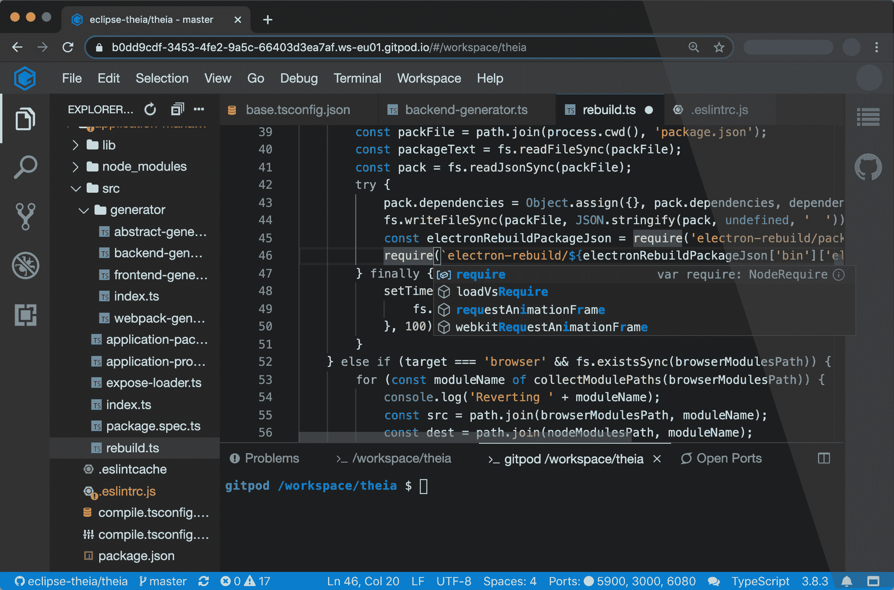

# Gitpod 开源自动化本地开发环境

> 原文：<https://devops.com/gitpod-open-sources-automated-local-development-environment/>

Gitpod 今天宣布，它将在开源许可下提供 Gitpod 集成开发环境(IDE)的一个实例。

公司首席执行官 Sven Efftinge 表示，DevOps 团队现在可以选择自己部署 Gitpod，作为公司提供的现有云服务的替代方案。

Efftinge 说，Gitpod 旨在与 GitLab、GitHub Enterprise 和 Bitbucket 等存储库结合使用，可以自动构建内部开发环境。它持续监控任何 Git 存储库的更新。

Gitpod 然后将为特定的 git 分支配置正确的工具，自动编译机器可执行代码，并下载允许开发人员在内部构建代码所需的所有依赖项。Efftinge 说，开发人员可以在几秒钟内开始编码，而不必手动配置桌面环境。

他说，Gitpod 借用了持续集成平台的概念，并将它们应用到开发环境中，并指出今天的开发人员通常每周花费数小时来设置和维护本地开发人员环境。

他说，通过自动化该过程，本地开发环境也可以更好地与生产环境保持一致。Efftinge 指出，代码在首次部署时无法在生产环境中工作的原因之一是，本地开发环境是以一种不能准确反映生产环境的方式手动配置的。

他补充说，当开发人员在多个项目上工作时，这个问题会变得更加严重，例如，涉及到将在不同生产环境中运行的独立微服务。

Gitpod 还通过确保开发团队中本地桌面环境的所有版本保持一致来防止漂移。当团队成员在本地桌面环境的同一实例上实现标准化时，协作也变得更加容易。

Efftinge 表示，已经有数十万开发者在使用 Gitpod 云服务。他指出，开源版本提供了一个选项，使 DevOps 团队能够自托管他们自己的实例。

Gitpod，原名 TypeFox，与 Google、Ericsson、Arm 和 Red Hat 合作开发了开源的 Eclipse 忒伊亚项目，该项目为使用 TypeScript、CSS 和 HTML 在云中构建 ide 提供了基础。忒伊亚，现在是在 Eclipse 基金会的支持下发展起来的，由运行在浏览器或本地桌面应用程序中的前端和运行在任何主机上的后端组成。前端和后端都通过 WebSockets 上的 JSON RPC 进行通信。 [Gitpod 利用该项目构建了自己的基于云的 IDE](https://devops.com/typefox-ties-cloud-based-ide-to-github/) 。

在新冠肺炎疫情之后，人们自然更加关注自动化和开发人员的生产力。在可预见的未来，大多数开发人员将在家工作，以帮助对抗病毒的传播。当然，大多数开发人员多年来一直在办公室外编写代码。现在的挑战是让开发团队尽可能高效地开发应用程序，不管他们在哪里。消除低效的手动任务(如维护本地开发环境)可能是朝着这个方向迈出的重要一步。

目前还不清楚自从新冠肺炎疫情的冲击以来，DevOps 团队的生产力是更高还是更低。然而，很明显，高度分散的开发人员团队迫切需要一致的体验。