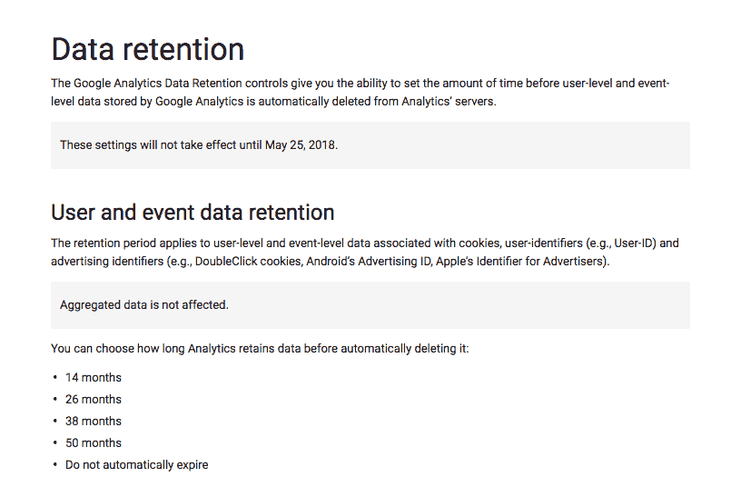

# 谷歌分析适应 GDPR，但问题依然存在

> 原文：<https://devops.com/google-analytics-adapts-to-gdpr-but-questions-remain/>

[通用数据保护条例(GDPR)](https://en.wikipedia.org/wiki/General_Data_Protection_Regulation) 将对 Google Analytics 如何收集和处理数据以及 DevOps 如何使用该工具产生影响——至少，这是目前可以确定的。几乎可以肯定的是，这些变化也会影响任何依赖该工具收集和分析用户数据的组织的 DevOps。众所周知，DevOps 团队将不得不重新配置他们的 Google Analytics 实现，即使一个组织在欧盟(EU)没有用户。

然而，尽管谷歌最近就影响 DevOps 的谷歌分析的修改提供了一些指导，但该公司尚未在新规定于 5 月 25 日生效之前澄清有关变化的一些关键点。眼下，这里是谷歌迄今为止传达的一些变化，以及 DevOps 需要在监管截止日期前采取的行动。

## **需要立即采取行动**

GDPR 的[“被遗忘权”](https://devops.com/devops-to-the-rescue-as-gdpr-deadline-looms/)条款为用户提供了要求删除第三方存储和共享的个人数据的选项。为了满足这一条款，[谷歌分析](https://www.google.com/analytics/#?modal_active=none)将允许组织管理他们用户的数据在谷歌服务器上保留多长时间。通过这种方式，Google Analytics 将自动删除指定日期之前的用户和事件数据。组织可以指定数据在 Google 分析服务器上保留 14 个月、26 个月、38 个月等等，最多保留 50 个月。也可以选择数据不自动过期。谷歌分析表示，它不会删除基于聚合用户数据的信息。

根据 GDPR 的“被遗忘权”条款，谷歌分析还将允许组织删除欧盟国家个人用户的数据，这些数据可用于识别他们的身份。这些数据将包括谷歌分析存储的通用标识符，包括标准的谷歌分析第一方 cookies、用户 ID 或应用程序实例 ID。

然而，谷歌分析尚未详细说明组织将如何能够删除用户数据。虽然这一过程将被动画化，但谷歌表示，更多的信息“将很快可用”，大概是在 GDPR 最后期限之前。

谷歌表示，在 GDPR 之前，它也在起草一项新的“欧盟用户同意政策”。客户必须同意的这一政策涵盖了组织“向您在欧盟的网站和应用的最终用户进行披露并获得其同意的责任。”

谷歌尚未透露的另一项关键修改是谷歌分析将提供的界面，该界面将允许组织改变其用户数据的存储方式。DevOps 是否能够自动化这些过程将在很大程度上取决于 Google Analytics 是否会提供 GUI、API 或两者兼而有之。

“如果 Google Analytics 提供了一个没有 API 的 GUI，那么除了现有的功能之外，DevOps 团队没有什么可以做的来自动化它，因为你需要一个人来做这件事。但是如果它是一个 API，DevOps 团队可以将控制编织到他们现有的框架中，”约翰·l·迈尔斯说，他是[企业管理协会(EMA)](https://www.enterprisemanagement.com/) 的分析师。"如果两者都有，那么你就拥有了两个世界的精华."

此外，一个 API 将允许保留和删除工具在现有的 DevOps 框架内工作，并作为业务流程的一部分实现自动化，Myers 指出。

## **devo PS 挑战赛**

DevOps 显然需要在谷歌分析变化范围之外的其他方面为 GDPR 做好准备，否则将面临高达其年收入 4%的罚款或 2000 万€(2500 万美元)，以较高者为准。事实上，GDPR 适用于从欧盟国家的用户那里收集数据的全球所有组织。事实上，经常有错误的报道称，新的隐私规定仅适用于欧盟公民，而实际上，该规定涉及从任何位于欧盟国家的用户那里收集的数据，而不管其国籍如何。无论如何，显然也不可能确定受 GDPR 保护的用户数据(包括 cookies、姓名、电子邮件地址、社交媒体帖子和其他信息)是属于拥有欧盟 IP 地址的用户，该用户可能只是访问该地区，还是完全的欧盟公民。

鉴于 GDPR 协议对第三方存储和共享数据以及保护其在线隐私的方式进行了严格控制，GDPR 很可能属于紧急开发运维项目类别，需要变更咨询委员会(CAB)以及组织的 IT 运营、质量保证、信息安全和开发团队的参与。当然，GDPR 改变代码部署和流程的程度将取决于组织的商业模式。GDPR 合规还应要求审查合格的法律顾问。

与此同时，Google Analytics 表示，其工具可以帮助组织遵守 GDPR 的数据收集政策。这些功能包括 cookie 设置、隐私控制、数据共享设置、帐户终止时的数据删除和 IP 匿名化。

然而，如上所述，谷歌仍然需要在 5 月 25 日截止日期之前向 DevOps 提供更多关于谷歌分析影响组织的某些变化的澄清。DevOps 社区中的许多人也很可能正在等待了解 DevOps 可以使用 Google Analytics 实现 GDPR 合规性的其他方式。

— [B .卡梅伦增益](https://devops.com/author/b-cameron-gain/)