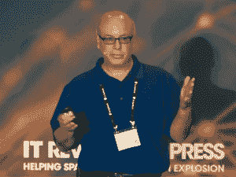
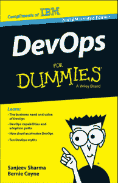

# Google hang out:IBM & Nationwide 在#DevOps 上发布的互连 2015 预览版

> 原文：<https://devops.com/google-hangout-interconnect-preview-ibm-nationwide-devops/>

加入我们的 Google Hangout*与尊贵的嘉宾讨论:**采用 DevOps 实现双速 IT。**

距离 IBM InterCnnect 2015 只有一个月了，三位专题演讲人将为我们带来互连预览

*谷歌视频是免费的。要参加 Google Hangouts LIVE，需要 Gmail 或 Google 个人资料。

[//www.youtube.com/embed/RHTq1aFOVCo](//www.youtube.com/embed/RHTq1aFOVCo)

### **日期:2015 年 1 月 28 日星期三**

### **时间:东部标准时间下午 3 点**

```
REGISTRATION LINK:(NO REGISTRATION REQUIRED*) 
```

### **关于我们的客人:**

 ***[](https://devops.com/wp-content/uploads/2015/01/Rosalind.jpg) 罗莎琳德*** * o * * * ur 客从* * * * @IBM**

**杰出工程师——CLM 和德沃普斯的首席建筑师，技术学院成员**

****【卡门】迪尔多，***o*ur 嘉宾来自@全国**

**总监-工具和技术负责人**

*[](https://devops.com/wp-content/uploads/2015/01/sanjeev-sharma.png)*

*****【桑吉夫】*** *o* *ur 客从 *@IBM **** 

**IBM 全球领导 DevOps 技术销售(执行 IT 专家)，**

*《傻瓜 DevOps》的作者*