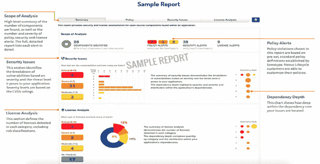

# 政府问:你的软件里有什么？

> 原文：<https://devops.com/government-asks-whats-software/>

美国政府的多个机构正在密切关注他们购买的软件。更具体地说，他们想知道构建软件应用程序时使用了哪些开源和第三方组件。例如:

*   [美国美国食品药品监督管理局(FDA)](http://www.fda.gov/downloads/MedicalDevices/NewsEvents/WorkshopsConferences/UCM482021.pdf) 想知道医疗设备中使用了哪些开源组件。
*   [美国国防部(DOD)](http://www.acq.osd.mil/se/briefs/16944_2014-10-29-NDIA-SEC-Hurt-SwA-vF.pdf) 正在为软件采购引入新的采购语言，以确保其没有漏洞，无论是有意还是无意设计的，还是作为软件的一部分插入的。
*   美国美国联邦贸易委员会(FTC) 对提供已知漏洞软件的企业提起诉讼。

过去一年，美国国家标准与技术研究所(NIST)、保险商实验室(UL)和美国总务管理局(GSA)的 18F 集团也采取了类似举措。这些计划的共同点是需要一个软件材料清单。

根据[维基百科](https://en.wikipedia.org/wiki/Software_Bill_of_Materials)的说法，“软件材料清单(software BOM)是一个软件中组件的列表。软件供应商通常通过组装开源和商业软件组件来创建产品。软件 BOM 描述了产品中的组件。它类似于食品包装上的成分列表。”

## 你的软件里有什么？

如今，这个问题不难回答。过去的软件应用程序是从零开始编码的，每一个都像一片独特的雪花，而今天的应用程序是由可重用的开源和第三方组件组装而成的。现在，80%到 90%的应用程序都是由开源和第三方组件构建而成，组织很容易快速生成软件材料清单。

## 同样的规则也适用于软件

你不想购买变质的食物，不想买一辆安全气囊有缺陷的汽车，也不想让一个亲戚接受一个有缺陷的心脏起搏器。现代社会不会接受这样制造的产品。同样的规则也适用于软件。

最近[对 25，000 个应用](http://www.sonatype.com/hubfs/SSC/Software_Supply_Chain_Inforgraphic.pdf?t=1476812981134)的分析显示，开发团队使用的组件中有 6.8%(约 1/16)包含一个已知的安全缺陷。这些缺陷是用于构建应用程序的开源和第三方组件中的已知安全漏洞。与其他制造业相比，软件制造业的已知缺陷率如此之高，难怪政府机构会给予更多关注。

## 同样的指导方针也适用于政府以外的部门

包括[美国银行家协会(ABA)](http://www.aba.com/Training/Conferences/%20Documents/NCCB16_Mon_Ins%20%20and%20Outs%20of%20Cyber%20Insur-%20ance_buyers%20guide.pdf) 和能源部门控制系统工作组(ESCSWG)在内的行业组织，以及包括[埃克森和梅奥诊所](http://thehill.com/blogs/congress-blog/technology/278712-a-new-narrative-on-cyber-security)在内的私营部门组织，也在强制使用软件材料清单。产生软件材料清单将很快成为开发组织的普遍做法，就像其他制造业一样。

材料清单提供了有用的成分列表。对于一些组织来说，该成分列表用于通知企业和政府组织，他们不会购买带有已知缺陷部件的产品。其他组织将依赖物料清单作为发布的软件应用程序中使用了哪些部件的记录点，这也是制造业中的另一种常见做法。

就在昨天，我收到了丰田的召回通知，通知我我的汽车有一个已知的缺陷高田安全气囊。丰田确切地知道它 10 年前卖给我的汽车用的是什么零件，并找到了我。该公司通知我，它正在研究补救措施，以修复或更换我的汽车中的缺陷部件。

想象一下，如果应用程序开发人员使用软件材料清单，可以做和丰田一样的事情。想象下一个类似 OpenSSL heartbleed 的漏洞明天公布。有多少软件实践能够立即识别出他们是否在应用程序中使用了有缺陷组件的特定版本。这些组织中有多少能够在几秒钟内追踪到该组件？他们中有多少人愿意及时修复这个严重的缺陷？

## 这不仅仅是规则，而是软件供应链的优化

我最喜欢引用"[《凤凰计划](https://www.amazon.com/Phoenix-Project-DevOps-Helping-Business/dp/0988262592)》(一本关于 DevOps 的必读小说)中的一句话是这样的:"*当你保护组织而不把无意义的工作放到 IT 系统中时，你就赢了。当你能从系统中去掉无意义的工作时，你会赢得更多。*

一个普通的应用程序包含 106 个开源和第三方组件。如果您选择了最好的组件，您就可以构建最好的软件。使用已知的有缺陷的组件，你会给系统带来浪费、返工和技术债务——也就是无意义的工作。

制作软件材料清单可以帮助组织快速识别应用程序中使用了哪些部件——好的或坏的。在最近与 VMTurbo 首席架构师 Sylvia Isler 的讨论中，她指出:“对风险的零容忍也是一些客户要求我们提供证据证明我们的应用程序不包含隐藏的安全或许可漏洞的原因。”他们的零容忍政策不仅提高了客户满意度，还通过从他们的系统中删除无意义的工作来帮助他们。客户很高兴，他们的开发团队也很高兴。

## 15 秒内的免费软件材料清单

有些公司提供服务，帮助用户创建软件材料清单。例如，Sonatype 提供的服务为[免费服务](http://www.sonatype.com/download-application-health-check)。分析一个典型的应用程序可能需要 20 秒钟，并生成一个列表，列出所有开源组件的名称、版本和许可证类型，并列出已知的安全漏洞、采用率、年龄和其他属性。

如果政府和客户更加关注他们购买的软件中有什么，也许是时候弄清楚你正在构建的软件中有什么了。

— [德里克·威克斯](https://devops.com/author/derek-e-weeks/)