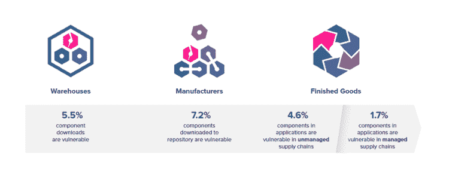

# 政府立法旨在保护物联网

> 原文：<https://devops.com/government-legislation-aims-secure-iot/>

美国参议院正在采取措施保护与物联网(IoT)相关的消费者利益、数据和隐私。参议院网络安全核心小组(Sens. Mark R. Warner，D-VA)和 Cory Gardner，R-CO)的联合主席，以及罗恩·怀登(D-WA)和史蒂夫·戴恩斯(Steve Daines，R-MT)最近提出了一项名为《2017 年物联网网络安全改善法案》的两党立法。

## **解决物联网市场失灵**

根据参议员发布的一份情况说明书，“虽然‘物联网’(IoT)设备及其传输的数据给消费者带来了巨大的好处，但许多设备的相对不安全性带来了巨大的挑战。这项立法旨在通过为联邦采购互联设备建立最低安全要求来解决市场失灵问题。”

拟议的立法向物联网设备制造商揭示了一个新的现实:尽管开发组织目前决定通过成本效益评估投资于网络安全，但他们最终要对其数据和系统的安全负责。

## **美国参议院的提案**

提议的立法要求供应商承诺:

*   确保设备在发货时不包含已知的安全漏洞。
*   确保正确披露在其设备中发现的新安全漏洞。
*   为发现已知漏洞的任何物联网设备制定补救计划。

2017 年物联网网络安全改善法案与联邦政府采购此类设备直接相关，但 Sonatype 预测，它们可能会延伸到私营部门的指导方针。虽然该立法显然旨在保护消费者权益和隐私，但它也关注适用于所有其他主要制造业的质量、安全和监管标准(“*不得装运已知有缺陷的产品*”)。这在其他制造业中是常识，现在国会正指导开发组织对其开发和运输的软件应用类似的质量标准。

## **证明物联网设备没有已知的安全漏洞**

该法规特别要求销售物联网设备的供应商"*提供书面证明，证明在提交提案时，设备不包含任何具有任何已知安全漏洞或缺陷的硬件、软件或固件组件*。"

## **发现新的物联网漏洞时的通知**

在购买任何物联网设备后，政府希望提供互联网连接设备软件或固件组件的卖方"*"通知采购机构任何已知的安全漏洞或缺陷，这些漏洞或缺陷随后由安全研究人员披露给供应商，或者供应商在合同期限内通过其他方式了解到。*

## **确保补救途径可用**

售后阶段的保护更进一步，需要明确的补救途径。拟议的立法将要求“*[物联网设备的]软件或固件的任何部分中的任何未来安全漏洞或缺陷都要进行修补，以便以正确认证和安全的方式修复或移除软件或固件组件中的漏洞或缺陷*。”

## **每个应用程序 20 个漏洞**

最近，Sonatype 发布了其“ [2017 年软件供应链状态](https://www.sonatype.com/ssc2017)”报告，分享了应用程序中已知软件漏洞数量的经验证据——物联网或其他。该报告发现，使用不受管理的软件供应链构建软件的开发组织发布的应用程序平均有 20 个已知的安全漏洞，其中六个漏洞的通用漏洞评分系统(CVSS)评级在 7 到 10 之间。

Sonatype 的报告还揭示了国家政府、联邦机构和行业协会如何采取行动来帮助组织改善开源卫生和应用程序安全实践。在过去的一年里，白宫、美国联邦贸易委员会、国土安全部、卫生与公众服务部和商务部推出了新的指导方针，以提高与物联网设备和任何其他应用开发工作相关的软件供应链的质量、安全性和安全性。

## 潮流已经逆转

虽然拟议的立法仍有待讨论，但有明显的证据表明，那些曾经对此类网络安全问题一无所知或视而不见的人现在开始关注——他们正准备做出重大改变。

2017 年《物联网网络安全改进法案》**T1 的拟议立法全文可在此处找到。**

— [德里克·威克斯](https://devops.com/author/derek-e-weeks/)