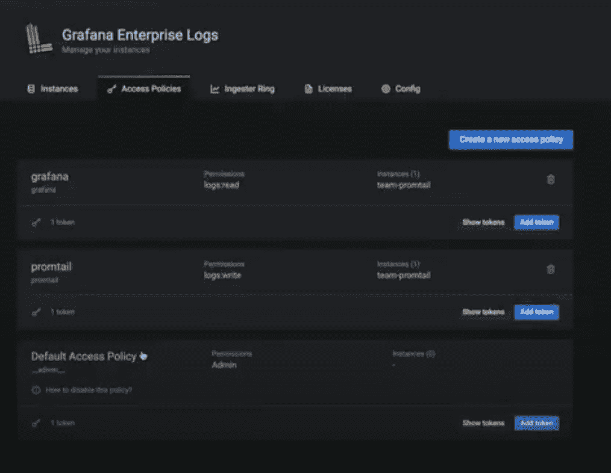

# Grafana Labs 增加了现场观察平台

> 原文：<https://devops.com/grafana-labs-adds-on-premises-observability-platform/>

Grafana Labs 今天宣布推出统一的 Grafana 企业堆栈，使 IT 团队能够在自己的内部 IT 环境中部署基于开源工具(如 Prometheus)的可观测性平台。

Grafana Labs 的产品副总裁 Tom Wilkie 表示，Grafana Enterprise Stack 除了提供针对分布式计算环境优化的 Prometheus 版本，还包括开源 Grafana 仪表盘、Loki 日志聚合工具和 Cortex 查询引擎的策划实例。

Grafana Enterprise Stack 还包括用于可视化来自 Grafana 中其他商业工具的数据的插件，如 Splunk、New Relic、MongoDB、ServiceNow、Oracle 和雪花。此外，它还包括报告工具以及增强的身份认证和安全控制。

Prometheus 是在[云本地计算基金会(CNCF)](https://cncf.io) 的赞助下开发的，作为一个主要用于 Kubernetes 环境的监控平台，它已经获得了广泛的关注。然而，Wilkie 表示，it 组织将 Prometheus 的使用扩展到更广泛的平台只是时间问题。Wilkie 说，Grafana 企业堆栈通过使组织更容易部署基于开源软件的完整的[可观察性](https://devops.com/?s=observability)平台来促进这种转变。

虽然开源软件在实现可观察性方面发挥着关键作用，但当今大多数 IT 组织都依赖一系列专有工具来监控 IT 环境。在未来的几个月中，这些工具中的许多将被可观察性平台所取代，这些平台提供了比目前的单个监测工具更多的背景信息。然而，现在还不清楚 it 团队是更喜欢开源平台还是专有平台，在大多数情况下，这些平台都集成了开源组件。

随着 IT 环境变得越来越复杂，大多数组织目前依赖的工具无法提供足够的可操作性见解。今天，大多数 IT 团队仍然浪费大量的时间在多种工具之间导航，试图发现问题的根本原因。对于 It 团队来说，花上几天时间来发现问题的根源，然后在几分钟内就可以修复，这种情况并不罕见。预期可观测性平台将大大减少调查所需的时间和精力，例如，一个性能问题。

当然，为了实现这个目标，应用程序本身需要变得更加仪表化。开源和专有代理软件的结合将使以更低的成本收集跟踪、日志和其他指标变得更加容易。在许多情况下，由于专有代理软件的成本以及在扩展企业中部署和管理该软件所固有的挑战，IT 团队一直不愿意全面测试 IT 环境。然而，随着代理软件的部署过程变得更加自动化，组织发现对其应用程序进行检测变得更加容易。

It 环境完全装备化可能还需要一段时间。然而，随着收集跟踪、日志和度量变得越来越容易，整个企业中可以实现的可观察性水平无疑会增加。于是，挑战和机遇变成了利用这些平台提供的更高可见性，更主动地管理 IT 中应用程序和平台的蔓延。