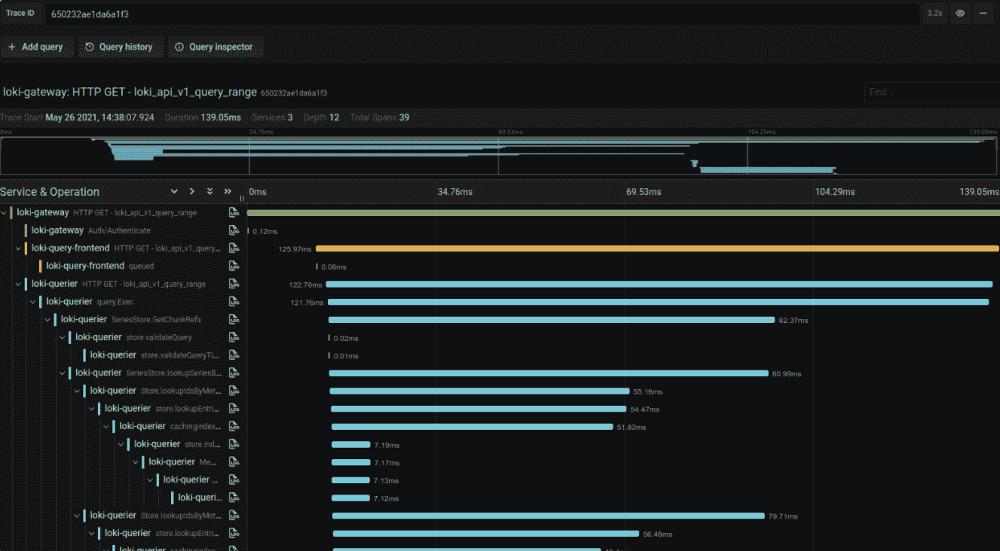

# Grafana 实验室推进开源可视化和可观察性

> 原文：<https://devops.com/grafana-labs-advances-open-source-visualization-and-observability/>

在今天的在线会议上，Grafana Labs 宣布,[8.0 版本的开源可视化软件现已广泛应用于开发运维团队。此外，Grafana Tempo](https://www.globenewswire.com/news-release/2021/06/08/2243907/0/en/Grafana-Labs-Debuts-Grafana-8-0-Tempo-1-0-at-GrafanaCONline.html) 的 1.0 版本也已正式推出，这是一个开源后端平台，用于收集在应用环境中推动可观察性所需的分布式跟踪。

与此同时，Grafana Labs 透露，Grafana Tempo 现在可以作为 Grafana Cloud 上的一项服务。

Grafana 的 8.0 版本增加了对其他类型可视化的支持，如流面板、状态时间线、状态历史、条形图和直方图，此外还有一个改进的统一警报系统，使 DevOps 团队能够通过通用用户界面查看和编辑 Grafana 和开源 Prometheus 监控平台生成的警报。为实现这一目标而采用的通知系统基于 Prometheus 警报管理器，该管理器提供分组、重复数据删除和通知静音等功能以及高级消息模板。

Grafana 的最新版本还提高了启动和图形渲染性能，这要归功于初始下载大小和图形渲染时间的大幅减少。

Grafana 的企业版也进行了更新，以提供对细粒度访问控制的支持，改进了后端数据源的缓存，并改进了报告功能，如可嵌入电子邮件的实时仪表板链接。

总体而言，Grafana Labs 声称现在有超过 750，000 个 Grafana 的活动安装，组织正在使用这些安装来创建可视化，以关联从多个后端源收集的数据。

除了为 Grafana 和 Grafana Tempo 做出贡献之外，该公司还在运营一项云服务，使运行在不同集群上的多个 Prometheus 实例可以从一个中央控制台进行访问。

Grafana 项目的创始人兼 Grafana Labs 的首席 Grafana 官 to rkel dega ard 表示，Grafana Tempo 有望进一步提高可观测性，这主要归功于它能够利用对象存储来捕捉完整的分布式轨迹。现在跟踪每个请求是可行的，而不仅仅是采样跟踪。Grafana Tempo 还兼容任何开源跟踪协议，如 Jaeger、Zipkin 和 OpenTelemetry，并可以通过托管的 Grafana 云服务与指标、日志和仪表板集成。

目前还不清楚组织采用分布式跟踪来提高应用程序可观察性的速度有多快，或者就此而言，跟踪可以在多大程度上消除对某些类型的指标或日志分析的需求。可以肯定的是，开发运维团队需要比以往更多的环境来主动管理复杂的 IT 环境。分布式跟踪使得跟踪应用程序服务之间的交互更加简单。挑战在于他们可能要求 IT 团队存储更多的数据。

当然，随着时间的推移，分布式跟踪将变得越来越普遍，因为开发人员更经常地基于微服务检测应用程序，这些微服务往往有许多依赖关系，在缺乏某种类型的分布式跟踪功能的情况下很难发现。当然，分布式跟踪已经以某种形式出现在应用程序性能管理(APM)平台中有一段时间了。现在的区别是，作为开源软件，它变得更容易实现。