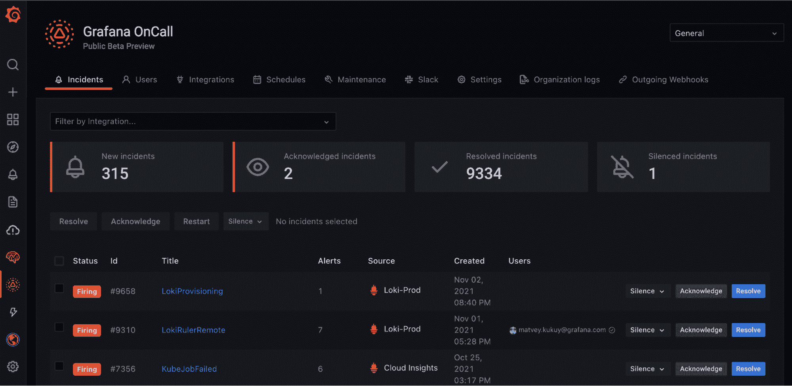

# Grafana 实验室扩展到事故管理领域

> 原文：<https://devops.com/grafana-labs-expands-into-incident-management-realm/>

在其在线 [ObservabilityCON 2021](https://grafana.com/about/events/observabilitycon/2021/) 会议期间，Grafana Labs 本周[预览了一个事件管理平台](https://www.globenewswire.com/news-release/2021/11/09/2330711/0/en/Grafana-Labs-Previews-Future-of-Observability-at-ObservabilityCON-2021.html)，此外还提供了其分布式跟踪工具的内部版本。

Grafana Labs 的产品副总裁 Tom Wilkie 表示，Grafana OnCall 事件管理平台是该公司已经使用广泛使用的开源 Grafana 仪表板提供的可观察性工具的自然延伸。该平台预计将于 2022 年全面上市，基于今年早些时候[收购 Amixr](https://grafana.com/blog/2021/11/09/announcing-grafana-oncall/?pg=blog) 获得的软件 Grafana Labs。

Grafana OnCall 统一了 Grafana、Prometheus 以及 Prometheus 社区创建的 Alertmanager 工具创建的所有警报，以简化平台生成的警报数量。Wilkie 指出，目标是减少 DevOps 团队在处理可追溯到单一根本原因的 IT 问题时可能经历的警报疲劳。

同时，Grafana Labs 使 Grafana Enterprise Traces 可用于内部 IT 环境。它基于 Grafana Tempo，这是一种云服务，可以使用廉价的对象存储资源存储和分析分布式跟踪。核心开源 Tempo 项目的最新版本也已经更新，增加了服务图表和搜索最近踪迹的能力。

Grafana Labs 本周还更新了开源日志管理平台 Loki，增加了对无序日志行的支持，每个日志流和每个租户的自定义日志保留策略，以及一个可以轻松清理日志数据的删除 API。Loki 的 2.4 版本还增加了额外的高可用性功能。

Grafana Labs 平台的其他更新包括对记录查询的支持，一组预建的仪表板，使用户能够快速钻取他们的 Prometheus 指标数据，从亚马逊网络服务(AWS)提供的 AWS CloudWatch 服务中使用指标的能力，监控 Kubernetes 集群的能力的改进，以及对该公司去年通过收购 k6 获得的开源负载测试工具的更新。

Wilkie 指出，Grafana Labs 还致力于扩大与微软 Azure 云服务的集成，以及与 AWS 的集成。

虽然可观测性平台提供商之间的竞争已经非常激烈，但 Wilkie 表示，基于开源仪表板的可观测性平台已经可以从 100 多个来源收集数据，这提供了一个独特的优势。Grafana 实验室平台的核心是一个集中式框架，用于收集主要由开源 Prometheus 监控平台生成的数据，该平台是在云本地计算基金会(CNCF)的支持下开发的。

虽然 Prometheus 最常用于 Kubernetes 环境，但它也开始在单片应用程序环境中受到重视；它提供了一种开源方法来定义一个事实上的标准，用于收集可观察性平台可以使用的度量和其他数据。

现在还不清楚 It 团队在多大程度上区分了监控和可观察性。监控侧重于预定义的指标，以确定特定平台或应用程序何时在预期范围内运行。可观察性将指标、日志和跟踪与仪器应用相结合，使问题的故障排除变得更加简单，而不仅仅依靠一组有限的预定义指标来监控特定的过程或功能。

不管 it 团队是否认为可观察性不同于监控，管理 IT 环境的能力显然正在快速提高。当然，挑战在于 IT 环境本身正变得日益复杂。