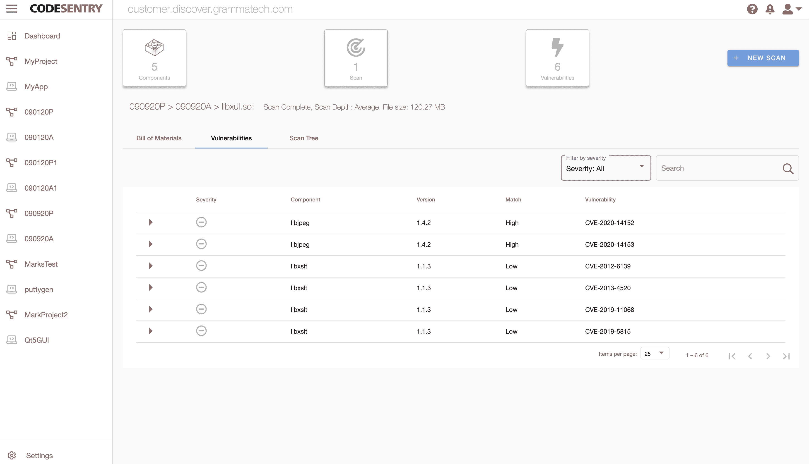

# GrammaTech 发现第三方代码中的漏洞

> 原文：<https://devops.com/grammatech-discovers-vulnerabilities-in-third-party-code/>

GrammaTech 今天发布了一个针对二进制代码的 [CodeSentry 软件组合分析(SCA)](https://news.grammatech.com/grammatech-introduces-codesentry-to-identify-security-blind-spots-in-third-party-code),它列出了定制应用中使用的第三方代码，并识别了已知的[漏洞](https://devops.com/?s=vulnerabilities)。

GrammaTech 的首席产品官 Vince Arneja 表示，今天的大部分定制应用程序都是由基于第三方开发的组件的二进制文件组成的，这些组件以开源、商业现货(COTS)或现有定制软件的形式出现。

CodeSentry 检测这些组件和与第三方代码相关的漏洞，包括网络组件、图形用户界面(GUI)组件或身份验证层。它使用深度二进制分析来创建详细的软件材料清单(SBOM)和已知漏洞的综合列表。

Arneja 表示，随着安全责任继续向开发者转移，需要 CodeSentry 等工具来更容易地识别二进制文件中的漏洞问题，因为许多开发者可能无法访问用于构建二进制文件的底层源代码。Arneja 说，CodeSentry 使用一系列匹配算法来收集版本号范围，创建 SBOM，并提供 CVE 和 CVSS 分数的链接，从而识别本地二进制文件中存在的组件。

CodeSentry 扩展了 GrammaTech 开发的算法，以检测应用程序中的组件，包括自然语言处理中使用的字符串。它将分量映射到多维向量，并将它们与从分量导出的向量进行比较。该工具的上传界面接受本机二进制文件、zip 文件和其他归档文件。一旦加载了这些文件，CodeSentry 就会分析将要运行的代码，而不是构建环境，以减少在构建环境或未实际使用的组件中产生的误报数量。

Arneja 指出，GrammaTech 明年打算通过软件即服务(SaaS)平台提供 CodeSentry。Arneja 说，GrammaTech 最终设想将 CodeSentry 作为 DevSecOps 工作流的一部分，由持续集成/持续交付(CI/CD)平台驱动，使用该公司提供的一套开放应用程序编程接口。

虽然这些天来人们非常关注将 DevOps 和网络安全工作流融合在一起，作为采纳最佳 DevSecOps 实践的努力的一部分，但最容易解决的漏洞问题是从一开始就不存在的问题。随着开发人员获得网络安全工具，应用程序中的漏洞数量将在未来几个月大幅减少。IT 领导者面临的挑战是确保开发人员能够访问这些工具，这反过来将最终提高网络安全团队对应用程序开发人员的信心水平，他们通常被视为网络安全团队试图解决的问题的主要原因。

无论 IT 组织如何实现这一目标，投资回报都可能是巨大的。在生产环境中部署应用程序后，IT 团队跟踪漏洞所花费的时间和精力是无法计算的，而修复这些漏洞的成本要高得多。