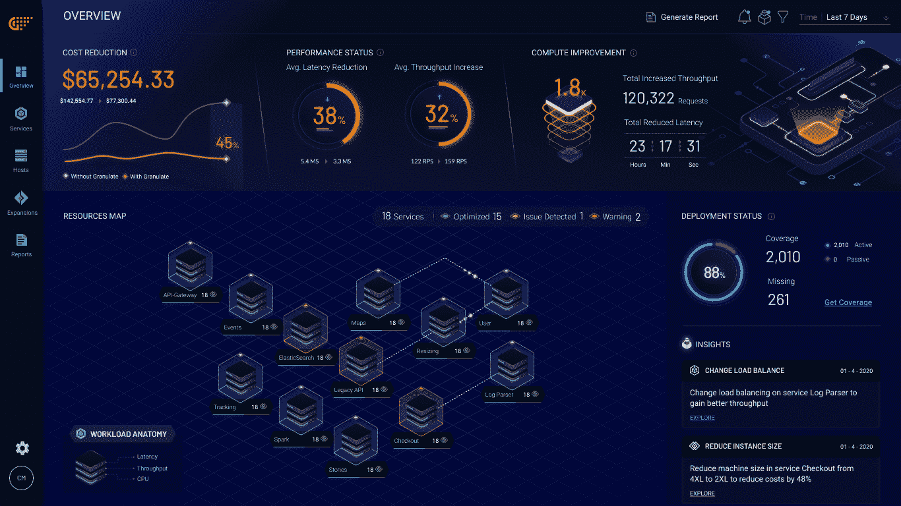

# Granulate 将 AI 应用于 Linux 服务器优化

> 原文：<https://devops.com/granulate-applies-ai-to-linux-server-optimization/>

grate 今天宣布，一个利用机器学习算法来优化在内部或云中运行的 Linux 服务器环境的平台现已正式推出。

该公司首席执行官阿萨夫·以斯拉(Asaf Ezra)表示，颗粒平台采用了被称为 gAgents 的代理，这些代理安装机器学习算法，以持续优化服务器环境中的部署。该公司还推出了 gCenter，这是一个门户网站，IT 团队可以通过它来管理这些代理的部署。

粒化代理自动学习任何应用程序的特定资源使用模式和数据流。通过分析 CPU 调度顺序、超额预订锁、内存、网络和磁盘访问模式，代理还可以识别超额预订的资源、瓶颈和优先机会。然后，它在操作系统级别定制有关 CPU、锁、缓存和网络访问的调度和优先级决策，以提高应用程序性能。

Ezra 表示，由 created 创建的代理将根据 IT 团队使用 gCenter 定义的参数自动优化服务器环境。他说，这种能力不仅使 IT 团队能够降低 60%的成本，还使响应时间缩短了 40%,并提高了整体吞吐量的 5X，而无需对应用程序代码进行任何更改。

据该公司称，PicsArt、Perion、AppsFlyer 和 Coralogix 的 IT 团队已经部署了超过 40，000 个 gAgent 实例。

gAgents 被设计成在任何 Linux 服务器上使用一个命令行就可以轻松安装。Ezra 说，一旦安装完毕，it 团队很快就会发现，他们可以显著减小集群规模，缩小机器规模。

随着新冠肺炎疫情带来的经济衰退，IT 团队面临着前所未有的降低成本的压力。然而，如果不依靠某种形式的人工智能来自动化 IT 运营(AIOps ), IT 环境往往会变得过于复杂而无法优化。

虽然许多 it 团队最初可能对人工智能的有效性持怀疑态度，但越来越明显的是，在某种程度上不依赖机器学习算法来优化 IT 环境是不可行的。

当然，挑战在于确保无论采用何种形式的人工智能都做出正确的优化决策。因此，大多数 IT 团队倾向于在最初启动小的 AIOps 项目，直到他们能够验证所做的决策是有效的。一旦建立了一定程度的信任，IT 团队曾经手动执行的许多繁琐任务要么被消除，要么至少大幅减少。

还不清楚各种形式的 AIOps 会对 It 工作产生什么影响。理论上，较小的 IT 团队应该能够管理较大的 IT 环境。然而，随着整体 [IT 环境变得更加自动化](https://devops.com/leveraging-automation-for-your-business/)，大多数组织似乎都在增加他们可以部署的应用数量，而不是减少职位。

不管你喜欢与否，它正变得越来越自动化。现在的问题是确定 IT 管理员和能够自我管理的机器之间的接口在哪里。