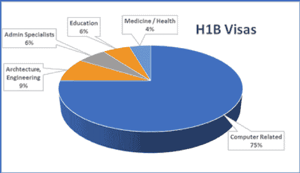
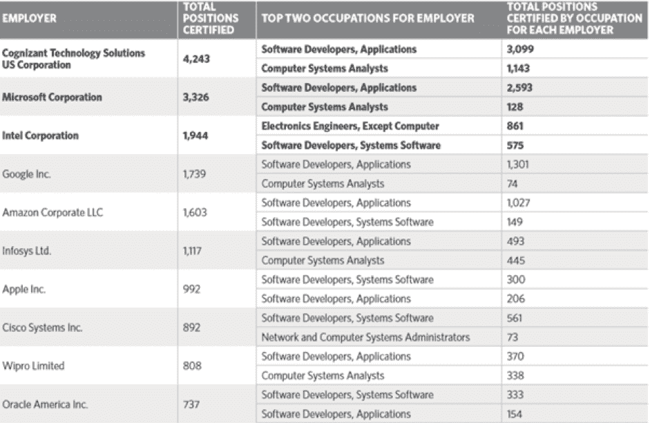

# H1B 签证和软件外包:你需要知道的

> 原文：<https://devops.com/h1b-visas-and-software-outsourcing-what-you-need-to-know/>

如果你的公司使用定制开发的软件——无论该软件是由内部员工还是第三方开发的——那么你应该关心一下 [H1B 签证项目](https://www.migrationexpert.com/work_visa/specialty_occupation_visa_h1b/)。你还应该知道哪些因素影响*如何*该计划的运作，以及*谁*可以利用 H1B 计划。可以说，没有任何当前的政治或政府政策话题比 H1B 签证对应用软件开发和整个 IT 社区有更直接的影响。

在本文中，我们希望帮助您了解:

*   什么是 H1B 签证项目——你为什么要关注它？
*   目前影响该计划的条件是什么？
*   外包软件开发的使用意味着什么？

# H1B 签证背景

H1B 签证项目是移民和国籍法的一部分。H1B 的目的是允许美国公司在某些“专业”职业中雇用外国公民。总体而言，H1B 签证是为了帮助美国公司雇佣拥有稀缺或“难以找到”技能的人才。换句话说，公司可以雇用非美国公民，因为公司认为没有足够数量的具有同等技能(同等成本)的美国公民作为候选人。签证的发放有特定的期限(多年)，个人可以续签，也可以不续签。

# H1B 签证抽奖

每年 4 月 1 日左右，美国雇主开始申请新的多年签证。美国政府同年 10 月批准并发放签证，来年有好处。例如，2018 年开始的新签证于 2017 年 10 月发放。签证是从“一堆”申请中随机挑选出来的，因此被称为“签证抽签”实际上，每年十月都有两种彩票选择:

1.  2 万份签证从一群候选人中发放，这些候选人*必须*拥有美国大学的硕士学位(或更高)。一旦 20，000 名候选人被选中，那么…
2.  75，000 个签证从剩余的候选人中发放，包括**和**任何有资格的人，但不是在“仅美国大师赛”抽签中选出的。需要明确的是，没有美国硕士学位的人只会进入第二次抽签。拥有美国硕士学位的人将同时参加这两次抽奖。

# 我们招聘的是什么技能？

好的，那么通过 H1B 计划被雇佣的人的技能组合是什么？IT 专业人员正在被雇佣——这是迄今为止获得签证的最大群体！美国公民和移民服务局每年都会发布一份年度报告。根据其 2016 年[年度报告，](https://www.uscis.gov/sites/default/files/USCIS/Resources/Reports%20and%20Studies/H-1B/h-1B-FY16.pdf)75%的 H1B 签证是为计算机相关工作签发的。

# 政治因素——不明朗的未来

2017 年 4 月 18 日，特朗普总统签署了“购买美国货，雇用美国人”的行政命令，为联邦机构建立了广泛的政策指导。政府机构被要求采取措施，在雇佣方面给予美国公民优惠待遇，在商业方面给予美国企业优惠待遇。特别是，美国移民部负责评估 H1B 签证计划的要素。许多人怀疑，2018 年将采取额外措施，进一步限制 H1B 签证计划。

# 针对中小企业的作弊游戏？

一些中小企业(SMB)的倡导者抱怨说，H1B 签证计划不公平地偏袒大企业。两个最常见的例子是:

1.  **加急处理** —公司可以支付签证申请加急处理的费用。根据大多数估计，这将把向“彩票池”提交申请的时间减少到几天，而标准时间为几个月。中小企业支持者认为这给了财力雄厚的大公司不公平的优势。
2.  填满投票箱——一家公司可以提交的申请数量没有实际限制。中小企业可能有一个候选人和一个他们寻求填补的职位。相比之下，大公司可能会提交并获得数千份签证。当你看到哪些公司每年收到的签证最多时，这种现象就更加明显了。根据美国劳工部最近发布的[报告，顶尖的签证接受者是顶尖的科技公司；他们中的许多人专门从事软件开发，甚至承包软件开发。](https://www.foreignlaborcert.doleta.gov/pdf/OFLC_Annual_Report_FY2016.pdf)

## 结论

考虑到这种情况的具体情况，以下是我们的关键要点:

1.  美国存在 IT 技能短缺，只能通过使用外包软件开发来补充。
2.  中小型企业可能处于双重劣势——在 H1B 签证抽签中，找到顶尖的美国公民人才*和*与科技行业巨头竞争。
3.  H1B 签证抽签的细节正在发生变化——这些变化不太可能通过签证项目带来更多(或更容易)的雇佣。
4.  离岸外包作为一种战略，可以帮助减轻在美国招聘人才的挑战，无论是美国公民还是 H1B 签证持有者，还可以最大限度地降低从美国国内寻找价格合理的外包软件开发人才的风险。

史蒂夫·梅扎克