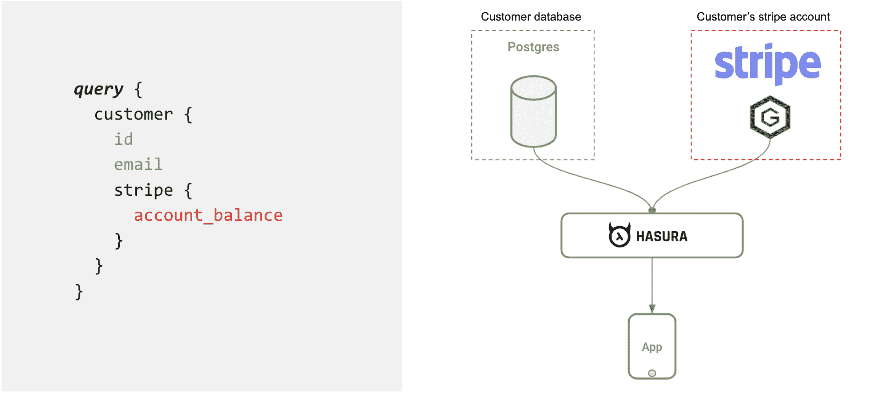

# Hasura 发布了基于 GraphQL 的远程连接工具的测试版

> 原文：<https://devops.com/hansura-launches-beta-of-graphql-based-remote-joins-tool/>

Hasura 今天宣布了远程连接的[公测版，它利用开源的应用编程接口(API)graph QL 查询语言来连接驻留在不同存储库中的不同数据源。](https://www.globenewswire.com/news-release/2020/06/08/2044975/0/en/Hasura-s-Data-Federation-Enables-Instant-Secure-Data-Access-Via-Unified-GraphQL-API.html)

公司首席执行官 Tanmai Gopal 表示，Remote Joins 扩展了该公司围绕[项目开发的 GraphQL 引擎，该项目现在由 Linux 基金会的一个分支 GraphQL 基金会](https://graphql.org/)主持。GraphQL 基金会的成员包括 Airbnb、亚马逊网络服务(AWS)、阿波罗、Coursera、Elementl、脸书、GitHub、IBM、Intuit Hasura、Paypal、Prisma、Shopify 和 Twitter。

GraphQL 最初是由脸书开发的，现在已经成为 REST APIs 的一个更简化的替代方案的基础。GraphQL 提供了对通过 API 可用的数据的完整描述，并按照类型和字段而不是传统的端点来组织。除了通过 API 更清楚地说明哪些数据是可用的，开发人员还可以使用类型来避免编写手动解析代码。

Hasura 现在将这一概念向前推进了一步，使 IT 组织能够将驻留在不同数据库和微服务中的数据连接起来，使这些数据能够像单个数据源一样被查询。核心 Hasura 引擎自动生成 GraphQL 引擎，这使得那些远程连接可以在几分钟内创建完成。

Gopal 表示，随着 IT 环境中微服务数量的持续增长，在基于微服务和传统单片应用的复杂现代应用组合中加入数据变得越来越困难。他说，Hasura engine 通过提供基于 GraphQL 类型系统数据访问和流工具来管理 API，可以应用于 GraphQL APIs 以及 REST APIs 或其他协议，从而解决了这个问题。

连接、授权逻辑和一致性检查都由 Hasura 引擎管理。Hasura 还提供数据变更管理、可观察性、审计、安全性和性能管理功能。Gopal 指出，这种方法使得数据源和 API 独立发展成为可能，同时仍然允许组织灵活地查询数据。

随着 DevOps 和 DataOps 流程不断融合，IT 组织将需要找到一种方法来推进应用程序和 API 开发，而不会导致数据访问成为主要瓶颈。太多的 DevOps 团队正在快速构建应用程序和 API，结果却发现自己在等待获得访问数据的权限。GraphQL 可以提供一个基础，IT 团队可以在此基础上更加协作地管理开发运维流程。

It 团队不太可能在一夜之间大规模替换现有的 REST APIs。然而，同样明显的是，REST APIs 可能无法让 it 环境像 GraphQL 那样高效地扩展，这也是脸书开发它的主要原因。当然，就 GraphQL 的采用而言，现在还为时尚早。然而，随着越来越多的 IT 团队面临更快创新的压力，对构建和管理 API 的更简化方法的兴趣可能会增加。